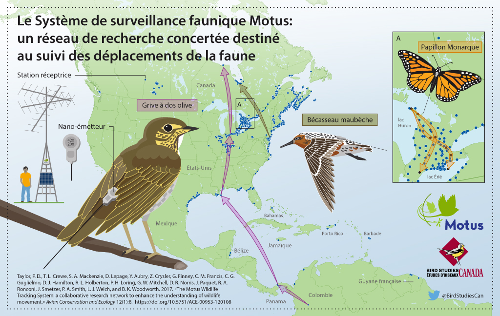

# Introduction {#introduction}
```{r tidyr1, echo = FALSE, message = FALSE, warning = FALSE}

library(knitr)
opts_chunk$set(tidy.opts=list(width.cutoff=50), tidy = TRUE)

```

```{r fig1, echo=FALSE, fig.align='center'}

```

 <br>

Le Système de surveillance faunique Motus ('Motus'; Taylor et al. 2017; <https://motus.org/?lang=fr>) est un réseau international de recherche collaborative composé de stations de radiotélémétrie automatisée qui assure le suivi des déplacements et du comportement d'animaux volants portant des émetteurs radio encodés numériquement. Motus a été élaboré à l'Université Acadia en 2012-2013. En 2014, une importante expansion de l'infrastructure a été rendue possible grâce à une subvention accordée par la Fondation canadienne pour l'innovation aux universités Western, de Guelph et Acadia. Depuis, le réseau Motus s'est étendu grâce à la collaboration entre des chercheurs indépendants et divers organismes (voir <https://motus.org/about/?lang=fr>). Il est maintenant géré en tant que programme d'Études d'Oiseaux Canada (<https://www.birdscanada.org/?lang=FR>) en partenariat avec l'Université Acadia. 

Motus se distingue des autres réseaux de télémétrie automatisée en ce que l’ensemble des chercheurs dans une région donnée (les Amériques ou l’Europe par exemple) utilisent une fréquence radio commune. Ainsi, les animaux portant un émetteur peuvent être détectés par n’importe quelle station réceptrice du réseau, ce qui élargit grandement la portée spatiale des sujets de recherche possibles. De plus, les utilisateurs de Motus partagent aussi une infrastructure de données et un portail Web. L’entreposage et l’archivage centralisés de toutes les données recueillies dans l’ensemble du réseau permettent aux utilisateurs d’accéder à toutes les données sur leurs émetteurs dont les signaux sont captés par n’importe quelle station réceptrice, et les responsables des récepteurs ont accès à l’ensemble des données captées par ceux-ci.

En outre, avec l'existence d’une infrastructure de données partagée, les utilisateurs peuvent bénéficier des fonctions R mises au point spécifiquement pour les données Motus par n’importe quel utilisateur du système. Le logiciel R de Motus décrit dans ce guide est en constante évolution. Le présent guide a pour but d’aider les utilisateurs à apprendre les différentes fonctionnalités du logiciel et de les inciter à contribuer à leur développement. Il montre également comment d’autres logiciels R, comme ggplot, peuvent être utilisés pour explorer, visualiser, transformer et analyser les données Motus. 

Le contenu de ce guide continuera d’évoluer et d’augmenter en fonction des besoins du réseau en matière d’analyse. Les personnes intéressées à ajouter des codes au logiciel R ou à enrichir ce guide peuvent faire parvenir leurs propositions à http://www.birdscanada.org/research/motus/?lang=FR.  

Taylor, P. D., T. L. Crewe, S. A. Mackenzie, D. Lepage, Y. Aubry, Z. Crysler, G. Finney, C. M. Francis, C. G. Guglielmo, D. J. Hamilton, R. L. Holberton, P. H. Loring, G. W. Mitchell, D. R. Noriis, J. Paquet, R. A. Ronconi, J. Smetzer, P. A. Smith, L. J. Welch et B. K. Woodworth. 2017. The Motus Wildlife Tracking System: a collaborative .research network to enhance the understanding of wildlife movement. Avian Conservation and Ecology 12(1):8. https://doi.org/10.5751/ACE-00953-120108.

## Ce que le présent guide ne montre pas {#whatBookCovers}

Le présent guide ne montre pas comment enregistrer des émetteurs radio auprès de Motus, gérer les émetteurs et les déploiements des stations réceptrices ou téléverser des données de détection brutes en vue de leur traitement. On peut accéder aux instructions pour ces opérations en cliquant sur l’option de menu Ressources au site Web de Motus: <https://motus.org/resources/?lang=fr>. N’oubliez pas d’enregistrer vos émetteurs **avant de les déployer** et de saisir les métadonnées sur les émetteurs et les stations en ligne sans tarder. Veuillez également consulter la Politique de collaboration de Motus et le Barème des frais d’enregistrement d’émetteurs à <https://motus.org/policy/?lang=fr>.

## Connaissances préalables {#prerequisites}

Nous tenons pour acquis que vous possédez une connaissance de base du langage et du logiciel R. Quel que soit votre degré de connaissance à cet égard, nous vous recommandons fortement de vous familiariser avec l’ouvrage de Garrett Grolemund et d’Hadley Wickham intitulé «R for Data Science» (<http://r4ds.had.co.nz/>). Cet ouvrage montre comment importer, visualiser et résumer des données en langage R en utilisant la collection tidyverse de logiciels R (<https://www.tidyverse.org/>). De plus, il fournit un cadre d’une valeur inestimable qui vous permettra d’organiser votre flux de travail afin de produire du code propre et reproductible (<http://r4ds.had.co.nz/workflow-projects.html>). Nous suivons l’exemple de ces auteurs en utilisant le cadre tidyverse tout au long du présent guide dans la mesure du possible.

## Ensemble de données utilisées comme exemples {#sampleData}

Tout au long du présent guide, nous utilisons un sous-ensemble de données recueillies dans le cadre du Programme de suivi des oiseaux de rivage de la baie James dans le but de montrer comment accéder aux données Motus, les gérer et les analyser en langage R. Nous vous recommandons de passer en revue le code présenté à titre d'exemple dans chaque chapitre avec ce sous-ensemble de données **avant** d’utiliser vos propres données, car vous aurez sans aucun doute besoin de modifier le code que nous fournissons pour traiter celles-ci le plus efficacement possible (chaque situation est différente).

Le Programme de suivi des oiseaux de rivage de la baie James a pour objet de surveiller et d’étudier les oiseaux de rivage qui font halte sur la côte de la baie James. Il est mené en collaboration par le ministère des Richesses naturelles et des Forêts de l’Ontario, Études d’Oiseaux Canada, l’Université Trent et le Service canadien de la faune (Environnement et Changement climatique Canada), conjointement avec une initiative de conservation de plus grande portée mobilisant les Premières Nations de la baie James et Nature Canada. Le Musée royal de l’Ontario était un partenaire associé au programme jusqu’en 2016. Le programme vise trois buts: 1) améliorer la capacité d’estimer les indices d’abondance et les tendances démographiques des espèces d’oiseaux de rivage qui font halte sur la côte ouest de la baie James; 2) étudier les profils des déplacements des oiseaux et leurs causes; et 3) déterminer l’importance relative des haltes migratoires et des habitats qu’elles renferment. Une fois réunis, les renseignements collectés contribueront à établir des mesures de conservation du Bécasseau maubèche et d’autres espèces d’oiseaux de rivage par des moyens de protection des habitats, comme la désignation au sein du Réseau de réserves pour les oiseaux de rivage dans l’hémisphère occidental (RRORHO). De plus amples renseignements peuvent être obtenus sur le site Web du Programme de suivi des oiseaux de rivage de la baie James à l’adresse <https://www.jamesbayshorebirdproject.com/> (en anglais) et sur sa page Facebook à <https://www.facebook.com/jamesbayshorebirdproject/> ou en communiquant avec le chef du programme:

Christian Friis
Wildlife Biologist
Canadian Wildlife Service, Environment and Climate Change Canada / Government of Canada 
christian.friis@canada.ca / Tel: 416.739.4908
 
Biologiste de la faune  
Service Canadien de la faune, Environnement et Changement Climatique Canada / Gouvernement du Canada 
christian.friis@canada.ca / Tél.: 416.739.4908 

## Remerciements {#acknowledgements}

Une partie du présent guide est adaptée du contenu de l’entrepôt de données github de John Brzustowski se rapportant au logiciel R de Motus, à l'adresse <https://github.com/jbrzusto/motus>.

Motus était à l’origine le réseau SensorGnome, conçu par Philip Taylor et John Brzustowski à l’Université Acadia. La première expansion du réseau a été financée par le biais d’une subvention de la Fondation canadienne pour l’innovation accordée aux universités Western (Christopher Guglielmo, Ph. D.), de Guelph (Ryan Norris, Ph. D.) et Acadia (Philip Taylor, Ph. D.). L’élaboration de l’interface Web de Motus et du logiciel R et la production du guide qui l’accompagne ont été rendues possibles grâce à une subvention accordée à Études d’Oiseaux Canada par CANARIE (<https://www.canarie.ca/fr/>). Motus poursuit sa croissance en tant que programme d’Études d’Oiseaux Canada grâce à la collaboration d’un grand nombre de chercheurs indépendants, d’organismes et de particuliers. Une liste non exhaustive des partenaires et collaborateurs de Motus est présentée à <https://motus.org/data/partners.jsp>. Si votre organisme devrait figurer sur cette liste mais ne s’y trouve pas, veuillez envoyer un courriel à motus@birdscanada.org.

Beaucoup d’intervenants ont travaillé de concert pour fédérer la technologie Motus, l’interface Web et le logiciel R. L’équipe centrale du programme Motus est formée des personnes suivantes: John Brzustowski, Tara Crewe, Zoe Crysler, Jeremy Hussell, Catherine Jardine, Denis Lepage, Stuart Mackenzie, Paul Morrill et Philip Taylor.