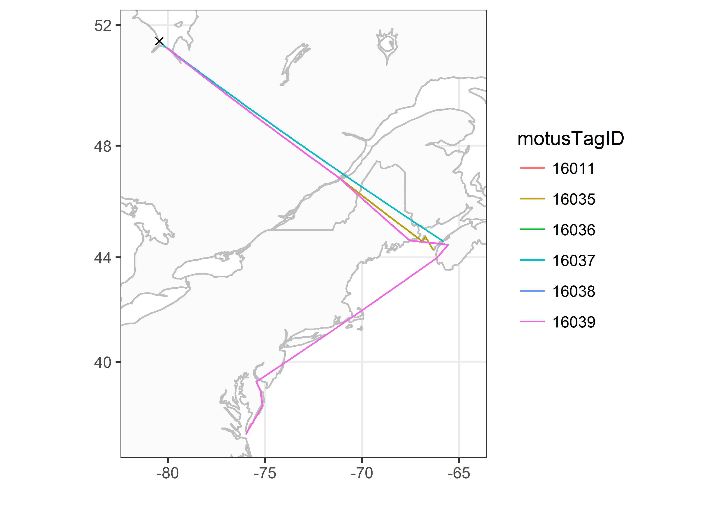

# Exploration des données avec le logiciel R de Motus {#exploreData}

```{r tidyr6, echo = FALSE, message = FALSE, warning = FALSE}

library(knitr)
opts_chunk$set(tidy.opts=list(width.cutoff=50), tidy = TRUE)

```

Une fois que vous avez résolu les problèmes reliés aux faux positifs, s’il y en a, et que vous avez supprimé les faux positifs, vous pouvez commencer à analyser votre ensemble de données nettoyées. Dans ce chapitre, nous présentons des procédures simples aves lesquelles vous pouvez vous familiariser pour visualiser l’ensemble de données nettoyées du projet 176 utilisé ici comme exemple. Vous pouvez modifier ces scripts pour travailler avec vos propres données. Pour obtenir des instructions plus détaillées sur le logiciel R, nous vous recommandons fortement de vous familiariser avec l’ouvrage de Garrett Grolemund et d’Hadley Wickham intitulé «R for Data Science» (<http://r4ds.had.co.nz/>).

## Chargement des logiciels requis

Suivez les instructions fournies dans le chapitre \@ref(loadingPackages) pour installer les logiciels suivants, si cela n'est pas déjà fait, avant de charger les données.

```{r loadpackages.6, message = FALSE, warning = FALSE}

library(motus)
library(tidyverse)
library(ggmap)

```


```{r setTimeZone2 }

Sys.setenv(TZ="GMT")

```


## Chargement des données

Si vous avez suivi les instructions du chapitre précédent (chapitre \@ref(dataCleaning)) et que vous travaillez avec le fichier «df.alltags.sub» dont les données ont été nettoyées, vous pouvez omettre cette étape et passer à la section \@ref(dataSummaries).  

Autrement, si vous avez enregistré vos données sous la forme d’un fichier RDS, vous pouvez les charger comme suit:

```{r importDataRDS, eval = FALSE}

df.alltags.sub <- readRDS("./data/dfAlltagsSub.rds") # Modifier le répertoire en sélectionnant le répertoire local.

```

Ou, si vous avez appliqué un filtre personnalisé à votre fichier .motus, vous pouvez charger les données .motus du projet 176 que vous avez téléchargées précédemment (voir le chapitre \@ref(accessingData) et les nettoyer maintenant. Actuellement, le principal avantage du filtre personnalisé est que vous l’appliquez au fichier .motus, ce qui vous procure plus de souplesse pour appliquer les fonctions dplyr pour gérer et filtrer les données (p. ex., vous pouvez choisir des variables à inclure dans les données qui sont différentes de celles que nous avons incluses dans le fichier RDS dans le chapitre \@ref(dataCleaning). Cette approche vous permet également d’intégrer plus facilement les nouvelles données ajoutées à votre base de données avec la fonction tagme. Étant donné que nous choisissons les mêmes variables et que nous filtrons les mêmes enregistrements, les opérations suivantes vous donnent le même ensemble de données que le fait l’instruction readRDS ci-dessus:

```{r importData, eval = FALSE}

# Chargez le fichier .motus.
proj.num = 176
sql.motus <- tagme(proj.num, update = TRUE, dir = "./data/")
tbl.alltags <- tbl(sql.motus, "alltags")

# Obtenez un objet table du filtre.
tbl.filter = getRunsFilters(sql.motus, "filtAmbigFalsePos")

# Filtrez et convertissez la table en une trame de données, avec quelques modifications.
df.alltags.sub <- left_join(tbl.alltags, tbl.filter, by = c("runID", "motusTagID")) %>%
  mutate(probability = ifelse(is.na(probability), 1, probability),
         recvLat = if_else((is.na(gpsLat)|gpsLat == 0), 
                           recvDeployLat, 
                           gpsLat),
         recvLon = if_else((is.na(gpsLon)|gpsLon == 0), 
                           recvDeployLon, 
                           gpsLon),
         recvAlt = if_else(is.na(gpsAlt), 
                           recvDeployAlt, 
                           gpsAlt)) %>%
  filter(probability > 0) %>%
  select(-noise, -slop, -burstSlop, -done, -bootnum, -codeSet, 
         -mfg, -nomFreq,-markerNumber, -markerType, -tagDeployComments, 
         -fullID, -deviceID,-recvDeployLat, -recvDeployLon, -recvDeployAlt, 
         -speciesGroup, -gpsLat,-gpsLon, - recvAlt, - recvSiteName) %>%
  collect() %>%
  as.data.frame() %>%
  mutate(ts = as_datetime(ts),  # Travaillez avec les dates APRÈS la transformation en un fichier plat.
         tagDeployStart = as_datetime(tagDeployStart),
         tagDeployEnd = as_datetime(tagDeployEnd))

```
```{r importDataDUPLICATE, echo = FALSE}
# Chargez le fichier .motus.
proj.num = 176
sql.motus <- tagme(proj.num, update = FALSE, dir = "./data/")
tbl.alltags <- tbl(sql.motus, "alltags")

# Obtenez un objet table du filtre.
tbl.filter = getRunsFilters(sql.motus, "filtAmbigFalsePos")

# Filtrez et convertissez la table en une trame de données, avec quelques modifications.
df.alltags.sub <- left_join(tbl.alltags, tbl.filter, by = c("runID", "motusTagID")) %>%
  mutate(probability = ifelse(is.na(probability), 1, probability),
         recvLat = if_else((is.na(gpsLat)|gpsLat == 0), recvDeployLat, gpsLat),
                             recvLon = if_else((is.na(gpsLon)|gpsLon == 0), recvDeployLon, gpsLon),
                             recvAlt = if_else(is.na(gpsAlt), recvDeployAlt, gpsAlt)) %>%
  filter(probability > 0) %>%
  select(-noise, -slop, -burstSlop, -done, -bootnum, -codeSet, -mfg, -nomFreq,
                             -markerNumber, -markerType, -tagDeployComments, -fullID, -deviceID,
                             -recvDeployLat, -recvDeployLon, -recvDeployAlt, -speciesGroup, -gpsLat,
                             -gpsLon, - recvAlt, - recvSiteName) %>%
  collect() %>%
  as.data.frame() %>%
  mutate(ts = as_datetime(ts),  # work with dates AFTER transforming to flat file
         tagDeployStart = as_datetime(tagDeployStart),
         tagDeployEnd = as_datetime(tagDeployEnd))
```

**Si votre projet est de très grande envergure, il conviendrait peut-être d’en convertir seulement une portion à la trame de données pour éviter des problèmes de mémoire.** La section \@ref(convertToFlat) présente en détail la marche à suivre pour filtrer la table avant de produire une trame de données.  

Ici nous le faisons en ajoutant un filtre à la commande ci-dessus. Dans le cas présent, nous créons une trame de données seulement pour l’émetteur (motusTagID) 16047, mais vous pouvez décider quelle est la meilleure façon de produire un sous-ensemble de données en fonction de vos besoins (p. ex. par espèce ou par année):

```{r importData2}

# Créez un sous-ensemble pour un seul émetteur, pour maintenir une trame de données de petite taille.
df.alltags.16047 <- df.alltags.sub %>%
                      filter(motusTagID == 16047) 
```

## Sommaires de données {#dataSummaries}

Nous verrons ici des commandes de base, en commençant par la fonction summary(), qui permet de voir une sélection de variables dans une trame de données:

```{r summaryAllTagsb}

sql.motus %>% 
  tbl("alltags") %>% 
  select(ts, motusTagID, runLen, speciesEN, tagDeployLat, tagDeployLon, 
         recvDeployLat, recvDeployLon) %>% 
  collect() %>%
  summary()

# Même sommaire pour les données sql filtrées
df.alltags.sub %>% 
  select(ts, motusTagID, runLen, speciesEN, tagDeployLat, tagDeployLon, 
         recvLat, recvLon) %>% 
  summary()
```

Le logiciel dplyr vous permet de résumer facilement les données par groupes, de manipuler les variables ou de créer de nouvelles variables en fonction de vos données.  

Nous pouvons manipuler des variables existantes ou en créer de nouvelles au moyen de la fonction mutate du logiciel dplyr. Ici, nous convertirons ts (estampille temporelle) à un format POSIXct puis nous créerons une nouvelle variable pour l’année et le jour de l’année (doy).

De plus, nous supprimerons l’ensemble de points où les degrés de latitude et de longitude sont manquants. Cela peut être utile dans certains contextes (par exemple si l’on connaît la position approximative du récepteur), mais ce;a peut aussi entraîner des avertissements ou des erreurs au moment du pointage sur un graphique ou une carte. 

```{r tagMutate}

df.alltags.sub <- df.alltags.sub %>%
  mutate(ts = as_datetime(ts, tz = "UTC"), # Convertissez ts au format POSIXct.
         year = year(ts), # Extrayez l'année depuis ts
         doy = yday(ts)) %>% # Extrayez le numéro du jour de l'année depuis ts.
  filter(!is.na(recvLat))
head(df.alltags.sub)

```

Nous pouvons aussi résumer l’information par groupes, dans le cas présent motusTagID, et appliquer différentes fonctions à ces groupes, par exemple pour obtenir le nombre total de détections (n) de chaque émetteur, le nombre de récepteurs qui ont détecté chaque émetteur, les premières et dernières dates de détection et le nombre total de jours où il y a eu au moins une détection:

```{r tagSummary}

tagSummary <- df.alltags.sub %>%
  group_by(motusTagID) %>% 
  summarize(nDet = n(),
            nRecv = length(unique(recvDeployName)),
            tsMin = min(ts),
            tsMax = max(ts),
            totDay = length(unique(doy)))

head(tagSummary)

```

Nous pouvons aussi former des groupements en fonction de multiples variables. En appliquant la même fonction que ci-dessus, mais en groupant par motusTagID et recvDeployName, nous obtiendrons de l’information pour chaque émetteur détecté par chaque récepteur. Comme nous groupons par recvDeployName, il y aura par défaut seulement un recvDeployName dans chaque groupe, de sorte que la variable nRecv sera 1 pour chaque ligne. Cela ne fournit pas beaucoup d’information, mais nous l’incluons pour montrer comment fonctionnent les groupements:

```{r tagRecvSum}

tagRecvSummary <- df.alltags.sub %>%
  group_by(motusTagID, recvDeployName) %>% 
  summarize(nDet = n(),
            nRecv = length(unique(recvDeployName)),
            tsMin = min(ts),
            tsMax = max(ts),
            totDay = length(unique(doy)))

head(tagRecvSummary)

```

## Graphiques de données {#dataPlotting}

Le graphique est un puissant outil de visualisation des profils de détection à grande et à petite échelles. Nous présentons ici une brève introduction à la production de graphiques au moyen de ggplot2. Nous vous recommandons de consulter l’ouvrage intitulé [Cookbook for R](http://www.cookbook-r.com/Graphs/) et l’aide-mémoire [ggplot2 cheatsheet](https://www.rstudio.com/wp-content/uploads/2015/03/ggplot2-cheatsheet.pdf) de rstudio pour obtenir de l’information plus détaillée sur les utilisations de ggplot2.  

Pour produire des graphiques à échelle grossière avec des fichiers volumineux, nous suggérons de commencer par arrondir les heures de détection à l’heure près ou au jour près afin de réduire le temps de traitement. Ici, nous arrondissons à l’heure près puis nous produisons un graphique de base des détections aux heures par émetteur (motusTagID):

```{r hourlyPlot}
df.alltags.sub.2 <- mutate(df.alltags.sub, 
                         hour = as.POSIXct(round(ts, "hour"))) %>% 
  select(motusTagID, port, tagDeployStart, tagDeployLat, tagDeployLon, 
         recvLat, recvLon, recvDeployName, antBearing, speciesEN, year, doy, hour) %>% 
  distinct()

p <- ggplot(data = df.alltags.sub.2, aes(hour, as.factor(motusTagID))) 
p + geom_point() + 
  ylab("MotusTagID") + xlab("Heure (arrondie à l'heure près)") + 
  theme_bw()
```
Concentrons-nous seulement sur les émetteurs déployés en 2016, auxquels nous pouvons attribuer une couleur pour chaque espèce:

```{r hourlyPlotSpecies}
p <- ggplot(data = filter(df.alltags.sub.2, year(tagDeployStart) == 2016), 
       aes(hour, as.factor(motusTagID), col = speciesEN)) 
p + geom_point() +
  ylab("MotusTagID") + xlab("Heure (arrondie à l'heure près)") +
  scale_colour_discrete(name = "Espèce") +
  theme_bw()
```
En commençant par ordonner en fonction de l’heure et attribuer une couleur aux motusTagID selon l’espèce, nous pouvons voir comment les émetteurs se sont déplacés en latitude:

```{r hourlyPlotLat, warnings = FALSE}

df.alltags.sub.2 <- arrange(df.alltags.sub.2, hour)

p <- ggplot(data = filter(df.alltags.sub.2, year(tagDeployStart) == 2016), 
       aes(hour, recvLat, col = as.factor(motusTagID), group = as.factor(motusTagID)))
p +  geom_point() +
  geom_path() +
  theme_bw() + xlab("Heure (arrondie à l'heure près)") + ylab ("Latitude du récepteur") +
  scale_colour_discrete(name = "MotusTagID")
```
Maintenant, examinons des graphiques plus détaillés de la variation des signaux. Nous utilisons toute la trame de données df.alltags.sub afin d’obtenir la puissance du signal pour chaque détection d’un émetteur particulier. Examinons les détections des signaux de l’émetteur 22897 à Niapiskau effectuées durant l’automne 2016; nous façonnons le graphique par nom de déploiement, dans l’ordre décroissant de la latitude:

```{r plot22897}

p <- ggplot(filter(df.alltags.sub, 
                   motusTagID == 22897, 
                   recvDeployName == "Niapiskau"), 
       aes(ts, sig)) 
p +  theme_bw() + 
  geom_point() + 
  xlab("Temps de l'année") + ylab("Puissance du signal") +
  facet_grid(recvDeployName~.)

```

Nous utilisons la fonction sunRiseSet accessible dans le logiciel R de Motus (voir \@ref(sunRiseSet)) pour obtenir les heures du lever et du coucher du soleil pour toutes les détections. Ensuite, nous nous concentrons sur une certaine trame de données et nous ajoutons cette information au graphique ci-dessus en ajoutant une instruction geom_vline() au code, ce qui a pour effet de produire une ligne jaune pour l’heure du lever du soleil et une ligne bleue pour l’heure du coucher du soleil:

```{r plotSunriset22897}
# Ajoutez les heures du lever et du coucher du soleil à la trame de données.
df.alltags.sub <- sunRiseSet(df.alltags.sub, lat = "recvLat", lon = "recvLon") 

p <- ggplot(filter(df.alltags.sub, motusTagID == 22897 & 
                     ts > ymd("2016-10-11") & ts < ymd("2016-10-17") & 
                     recvDeployName == "Niapiskau"), 
            aes(ts, sig))

p + theme_bw() + 
  geom_point() + 
  xlab("Temps de l'année") + ylab("Puissance du signal") +
  geom_vline(xintercept = df.alltags.sub$sunrise, col = "orange") + 
  geom_vline(xintercept = df.alltags.sub$sunset, col = "blue")

```
Nous constatons que durant la période en question, c’est pendant le jour que l’émetteur a été détecté le plus souvent, ce qui semble indiquer que l’oiseau était actif à la recherche de nourriture dans le secteur en question durant cette période.  

Les mêmes graphiques peuvent fournir de précieux renseignements sur les déplacements lorsque les récepteurs sont ordonnés géographiquement, ce que nous faisons pour l’émetteur 16039:
```{r latPlot1}
# Ordonnons d'abord sitelat par latitude (pour les points)
df.alltags.sub <- mutate(df.alltags.sub, 
                         recvDeployName = as.factor(as.character(reorder(recvDeployName, recvLat))))

p <- ggplot(filter(df.alltags.sub, motusTagID == 16039 & 
                     ts < ymd("2015-10-01")), 
       aes(ts, recvDeployName))

p + theme_bw() + 
  geom_point() + 
  xlab("Temps de l'année") + ylab("Nom du récepteur (ordonné par latitude)")
```

Nous nous concentrons sur une section de ce graphique et examinons les angles de relèvement des antennes pour déterminer les directions de vol à la hauteur des stations réceptrices:

```{r plot2}
p <- ggplot(filter(df.alltags.sub, motusTagID == 16039, 
                   ts > ymd("2015-09-14"), ts < ymd("2015-10-01")), 
            aes(ts, sig, col = as.factor(antBearing))) 
p + theme_bw() + 
  geom_point() + 
  xlab("Heure du jour") + ylab("Puissance du signal") +
  scale_color_discrete(name = "Angle de relèvement de l'antenne") +
  facet_grid(recvDeployName~.)
```

Ce graphique indique le profil type du passage d’un animal en migration: la puissance du signal de l’émetteur augmente puis diminue au moment où l’animal passe dans le faisceau des antennes.

## Cartes de données {#mappingData}

Pour générer des cartes de trajectoires d’émetteurs, nous utiliserons de nouveau des données résumées de manière à travailler avec une base de données beaucoup plus petite et à accélérer le traitement. Ici, nous résumerons les détections par date. Comme nous l’avons fait au chapitre \@ref(dataCleaning), nous créons une fonction simple pour résumer les données vu que nous devrons probablement répéter cette opération à maintes reprises. 

```{r fun.getpath2}

# Simplifiez les données en produisant un sommaire en fonction du runID. 
# Si vous voulez produire un sommaire à une échelle plus fine ou plus grossière, vous pouvez aussi créer d'autres groupes.  
# L'option de rechange la plus simple est une variable d'estampille temporelle arrondie; par exemple en utilisant 
# l'appel de fonction mutate(ts.h = plyr::round_any(ts, 3600). 
# Une autre option consiste à utiliser juste la date (p. ex. date = as_date(ts)).

# 
fun.getpath <- function(df) 
  {
  df %>%
    filter(tagProjID == proj.num, # Conservez seulement les émetteurs enregistrés dans le cadre du projet 176.
                           !is.na(recvLat) | !(recvLat == 0)) %>% 
    group_by(motusTagID, runID, recvDeployName, ambigID, 
             tagDeployLon, tagDeployLat, recvLat, recvLon) %>%
    summarize(max.runLen = max(runLen), ts.h = mean(ts)) %>%
    arrange(motusTagID, ts.h) %>%
    data.frame()
  } # Fin de l'appel de fonction

df.alltags.path <- fun.getpath(df.alltags.sub)
                    
```

```{r plotTagPaths.6}

df.alltags.sub.path <- df.alltags.sub %>%
                filter(tagProjID == proj.num) %>% # Conservez seulement les émetteurs enregistrés dans le cadre du projet 176.
                arrange(motusTagID, ts) %>%       # Ordonnez les données par estampille temporelle pour chaque émetteur (motustagID).
                mutate(date = as_date(ts)) %>%    # Créez une variable date.
                group_by(motusTagID, date, recvDeployName, ambigID, 
                         tagDeployLon, tagDeployLat, recvLat, recvLon)

df.alltags.path <- fun.getpath(df.alltags.sub.path)
```

### Utilisation de Google Maps {#googleMaps}

L’utilisation de Google Maps peut permettre de visualiser rapidement des trajectoires de vol et de choisir parmi plusieurs couches de base.  

La première étape consiste à créer une carte ayant un centre précis (types de carte: relief, plan, satellite ou hybride) et à choisir le niveau de zoom (nombre entier de 3 à 21, 3 correspondant au niveau du continent et 10 au niveau de la localité). Ensuite, nous ajoutons des points indiquant les positions des récepteurs et des lignes reliant les stations consécutives où chaque émetteur (motusTagID) a été détecté. Nous pouvons également ajouter des points pour toutes les stations réceptrices qui étaient actives durant une certaine période si nous avons déjà téléchargé toutes les métadonnées.

```{r googleMap, warning = FALSE, message = FALSE, fig.width=10, fig.height=10}

gmap <-  get_map(location = c(lon = -75, lat = 40), # Centrez la carte (lon/lat).
                 maptype = "satellite", # Choisissez le type de carte.
                 source = "google",
                 zoom = 4) # Entrez le niveau de zoom (nombre entier).

# Utilisez seulement les émetteurs dont nous avons examiné attentivement et filtré les détections (dans le chapitre précédent).
df.tmp <- filter(df.alltags.path, 
                           motusTagID %in% c(16011, 16035, 16036, 16037, 16038, 16039))
df.tmp <- arrange(df.tmp, ts.h) # Disposez par heure.
df.tmp <- as.data.frame(df.tmp)

p <- ggmap(gmap)
p + geom_point(data=df.tmp, 
               aes(recvLon, recvLat), pch=21, colour = "black", fill = "yellow") +
  geom_path(data=df.tmp, 
            aes(recvLon, recvLat, group=motusTagID, col = as.factor(motusTagID))) +
  theme_bw() + 
  scale_color_discrete(name="MotusTagID")

```

Nous produisons la même carte avec des points supplémentaires correspondant aux stations réceptrices qui étaient actives pendant une période déterminée:

```{r googleMapRecvs, warning = FALSE, message = FALSE, fig.width=10, fig.height=10}

# Obtenez les métadonnées sur les stations réceptrices.
tbl.recvDeps <- tbl(sql.motus, "recvDeps")
df.recvDeps <- tbl.recvDeps %>% 
                collect %>% 
                as.data.frame() %>% 
                mutate(tsStart = as_datetime(tsStart, tz = "UTC", origin = "1970-01-01"),
                       tsEnd = as_datetime(tsEnd, tz = "UTC", origin = "1970-01-01"))
# Dans le cas des déploiements sans date de fin, entrez une date de fin équivalant à un an plus tard.
df.recvDeps$tsEnd <-as.POSIXct(ifelse(is.na(df.recvDeps$tsEnd),
                                       as.POSIXct(format(Sys.time(), "%Y-%m-%d %H:%M:%S")) +
                                lubridate::dyears(1), df.recvDeps$tsEnd), tz = "UTC", origin = "1970-01-01")
# Obtenez les intervalles de fonctionnement pour tous les récepteurs déployés.
siteOp <- with(df.recvDeps, lubridate::interval(tsStart, tsEnd)) # Obtenez les intervalles de fonctionnement pour chaque déploiement.
# Fixez l'intervalle de temps (dates) qui vous intéresse.
dateRange <- lubridate::interval(as.POSIXct("2015-08-01"), as.POSIXct("2016-01-01"))
# Créez une nouvelle variable, «active», qui est établie à TRUE si le récepteur était actif à un moment donné pendant l'intervalle de temps que vous avez fixé, et à FALSE autrement.
df.recvDeps$active <- lubridate::int_overlaps(siteOp, dateRange) 

# Créez une carte montrant en rouge les positions des récepteurs qui étaient actifs pendant l'intervalle de temps fixé et en jaune les positions des récepteurs qui ont détecté des émetteurs.
p <- ggmap(gmap)
p + geom_point(data = subset(df.recvDeps, active == TRUE), ggplot2::aes(longitude, latitude), pch=21, colour = "black", fill = "red") +
  geom_point(data=df.tmp, aes(recvLon, recvLat), pch=21, colour = "black", fill = "yellow") +
  geom_path(data=df.tmp, aes(recvLon, recvLat, group=motusTagID, col = as.factor(motusTagID))) +
  theme_bw() + 
  scale_color_discrete(name="MotusTagID")
```

### Création de cartes muettes simples {#outlineMaps}

Nous chargeons les cartes de base.

```{r loadMaps.6b, eval = FALSE}

na.lakes <- map_data(map = "lakes")
na.lakes <- na.lakes %>% mutate(long = long- 360)

# Incluez toutes les Amériques pour commencer.
na.map <- map_data(map = "world2")
na.map <- na.map %>%
  filter(region %in% c("Canada", "USA")) %>%
           mutate(long = long- 360)

```

Ensuite, pour tracer les trajectoires, il faut fixer les limites de l’axe des x et de l’axe des y selon la position des récepteurs qui ont détecté des émetteurs. Selon vos données, il faudra peut-être modifier ces limites pour que les positions de déploiement des émetteurs soient incluses si les émetteurs n’ont pas été déployés à proximité de tours de stations où des émetteurs ont été détectés. Ensuite, à l’aide de ggplot, nous produisons la carte et traçons les trajectoires des émetteurs. Ici, nous utilisons la projection de Mercator et nous colorons les trajectoires différemment pour chaque émetteur (motusTagID), en incluant le point où il a été déployé:

```{r mapDetections, eval = FALSE}

# Fixez les limites de la carte selon la position des récepteurs qui ont détecté des émetteurs en vous assurant que les positions de déploiement des émetteurs soient incluses.
xmin <- min(df.tmp$recvLon, na.rm = TRUE) - 2
xmax <- max(df.tmp$recvLon, na.rm = TRUE) + 2
ymin <- min(df.tmp$recvLat, na.rm = TRUE) - 1
ymax <- max(df.tmp$recvLat, na.rm = TRUE) + 1
                
# map
ggplot(na.lakes, aes(long, lat))+ 
  geom_polygon(data = na.map, aes(long, lat, group=group), colour = "grey", fill="grey98")+
  geom_polygon(aes(group = group), colour = "grey", fill = "white")+
  coord_map(projection="mercator", xlim = c(xmin, xmax), ylim = c(ymin, ymax))+
  xlab("") + ylab("") + 
  theme_bw() + 
  geom_path(data = df.tmp, 
           aes(recvLon, recvLat, group = as.factor(motusTagID), colour = as.factor(motusTagID))) +
  geom_point(data = df.tmp, 
             aes(tagDeployLon, tagDeployLat), colour = "black", shape = 4) +
  scale_colour_discrete("motusTagID") 
```

```{r fig6.1, echo=FALSE, fig.align='center'}

```

Les fonctions dont il a été question dans le présent chapitre sont des exemples de la façon dont vous pouvez commencer à explorer vos données; il peut certainement exister d’autres façons de faire. L’annexe B ci-après présente des erreurs fréquentes qui peuvent survenir pendant le téléchargement et l’utilisation des fichiers sql .motus. ainsi que les solutions pour corriger ces erreurs.

