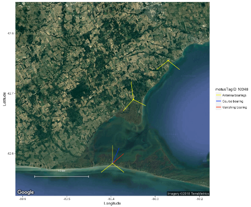

```{r tidyr7, echo = FALSE, message = FALSE, warning = FALSE}

library(knitr)
opts_chunk$set(tidy.opts=list(width.cutoff=50), tidy = TRUE)

```

# Directions estimées aux points de départ {#vanishingBearings}

*Le présent chapitre est une contribution d’Ana Morales et de Tara Crewe, qui ont utilisé les données recueillies par Morbey et al. (2017) (voir \@ref(sampleData)), avec un soutien financier accordé à Mme Morales dans le cadre d’un stage par l’intermédiaire de l’Université McGill au titre du Programme d’innovation environnementale FONCER du Conseil de recherches en sciences naturelles et en génie du Canada, avec la collaboration d’Études d’Oiseaux Canada (T.C.).*

L’estimation de la direction prise par un oiseau qui quitte une halte migratoire peut être un élément essentiel de certaines études de migrations. Dans le contexte des études faisant appel à la radiotélémétrie automatisée, la direction estimée au point de départ est souvent appelée «vanishing bearing» en anglais, c’est-à-dire la direction enregistrée au moment où l’on perd l’animal volant de vue après son départ (Sjöberg et Nilsson 2015). Il est particulièrement important de pouvoir se référer aux caractéristiques des signaux des émetteurs pour estimer la direction au point de départ d’un animal en migration aux endroits où il n’y a pas de stations réceptrices additionnelles permettant de suivre la trajectoire de vol après le départ depuis une halte migratoire.

Sjöberg et Nilsson (2015) ont calculé des directions aux points de départ en utilisant des statistiques circulaires ordinaires pour estimer la moyenne des azimuts d’antennes de stations réceptrices au cours des 5 à 10 dernières minutes de détection des signaux, l’azimut de chaque détection étant pondéré en fonction de la puissance du signal. En d’autres termes, chaque signal détecté était un vecteur pointant dans la direction de l’antenne de la station réceptrice, la longueur du vecteur étant représentée par la puissance du signal. Par conséquent, la longueur du vecteur est directement proportionnelle à la puissance du signal, et un signal puissant a plus de poids qu’un signal plus faible.

Le présent chapitre expose la marche à suivre pour estimer la direction au point de départ des oiseaux portant un émetteur en employant la méthode de Sjöberg et de Nilsson. Vous pouvez modifier les scripts présentés en tenant compte de vos propres données ou encore utiliser les données-échantillons fournies. Avant de commencer, il importe de considérer quelques hypothèses et faiblesses potentielles.

## Aspects à considérer {#thingsToBeAwareOf}

1) **La méthode susmentionnée repose sur l’hypothèse selon laquelle l’animal portant l’émetteur quitte l’emplacement général de la station réceptrice et s’en éloigne radialement.**

Il est vraiment important de noter que cette méthode **NE FONCTIONNERA PAS** sans que cette hypothèse soit confirmée. En effet, comme les individus portant un émetteur ne partent vraisemblablement pas de la position exacte de la station réceptrice, les valeurs de la direction de départ devraient être considérées comme des estimations grossières.

L’écart entre la direction estimée au point de départ et la direction réelle attribuable au fait que l’oiseau part d’un lieu qui n’est pas celui d’une station réceptrice est appelé erreur de parallaxe. On peut réduire au minimum l’erreur de parallaxe en analysant seulement les cas où l’on peut être convaincu, selon les caractéristiques de la puissance du signal de l’émetteur, que le point de départ de l’individu qui porte l’émetteur est passablement proche du lieu de la station réceptrice ayant capté le signal. À partir de données radar, Sjöberg et Nilsson (2015) ont estimé que l’erreur de parallaxe est de plus ou moins 10 degrés lorsque le point de départ de l’oiseau est proche de la station réceptrice.

On peut recourir à la télémétrie manuelle pour déterminer la position précise d’un individu pendant une halte. Faute de quoi une bonne façon de savoir si un individu a pris le départ depuis l’emplacement général d’une station réceptrice consiste à examiner le profil des détections des signaux de l’émetteur avant et pendant le départ. Si le point de départ de l’individu est proche de la station, les données indiqueront des profils clairs de détection propres à au moins deux antennes différentes établis avant et pendant le départ. Les graphiques suivants présentent des données sur les signaux provenant de parulines aux printemps 2014 et 2015 recueillies par Morbey et al. (2017). Ils montrent des exemples d’un émetteur: a) dont les signaux correspondent à une direction de départ claire et b) dont les signaux ne correspondent pas à une direction de départ claire. Des renseignements supplémentaires sur les données sont présentés dans les sections \@ref(sampleData) et \@ref(vanishingSample) ci-dessous.

a) **Bonne estimation de la direction de départ** – Nous constatons que l’oiseau est demeuré dans les environs de la station Old Cut (Observatoire d’oiseaux de Long Point, en Ontario) pendant la durée de son séjour, comme l’indique l’accroissement de la variation du signal pendant le jour et la baisse de la variation du signal pendant la nuit. Pour la nuit du départ, le signal de l’émetteur traduit la réduction habituelle de l’activité la nuit mais révèle une augmentation de l’activité vers 02:30, au moment du départ de l’oiseau. Peu de temps après, la station réceptrice Old Cut ne capte plus le signal, mais d’autres stations voisines prennent le relais pendant le vol de départ:

```{r vanishFig1, echo=FALSE, fig.align='center'}

knitr::include_graphics("images/vanishBearing_goodDetection.png")

```

b) **Estimation imprécise de la direction de départ** – L’oiseau n’a pas été détecté par la station Old Cut pendant un bon moment puis l’a été seulement au cours d’un apparent survol; les caractéristiques du signal ne permettent pas d’estimer avec précision la direction de départ à partir de la station. Dans ce cas, nous ne savons pas à quelle distance l’oiseau se trouvait de la station pendant le survol. Nous recommandons de ne pas utiliser des données recueillies dans des cas comme celui-ci pour estimer les directions de départ: 

```{r vanishFig2, echo=FALSE, fig.align='center'}

knitr::include_graphics("images/vanishBearing_badDetection.png")

```

2) **Plus les azimuts des antennes d’une station réceptrice sont proches l’un de l’autre, plus l’estimation de la direction de départ d’un animal suivi est précise.** 

À la station Old Cut, trois antennes étaient orientées dans des directions séparées de 120 degrés l’une de l’autre en 2014 et de 90 degrés en 2015 (approximativement vers l’est, le nord et l’ouest). Ces deux années-là, nous avons effectué une estimation grossière de directions de départ à partir de la moyenne des directions de vol de parulines déterminées par plusieurs stations au moment du départ. Cela nous a donné une direction de départ connue. Nous avons ensuite effectué des estimations de la direction au point de départ que nous avons comparées à cette dernière. 

La carte suivante montre la direction estimée grossièrement après le départ et la direction estimée au point de départ du vol d’une paruline qui est partie de la station Old Cut vers le nord au printemps 2014, quand les trois antennes étaient orientées dans des directions séparées de 120 degrés l’une de l’autre. La ligne rouge représente la direction estimée au point de départ de l’émetteur 277. La ligne bleue représente la direction estimée grossièrement après le départ basée sur les détections effectuées par d’autres stations (points rouges): 

```{r vanishFig3, echo=FALSE, fig.align='center'}



```

Dans l’exemple ci-dessous, la direction estimée grossièrement après le départ et la direction estimée au point de départ sont indiquées dans le cas d’une paruline qui est partie vers le nord au printemps 2015; à ce moment, les antennes de la station Old Cut étaient orientées dans des directions séparées de 90 degrés l’une de l’autre. Nous pouvons voir que la direction estimée au point de départ est très proche de la direction estimée grossièrement après le départ.

```{r vansihFig4, echo=FALSE, fig.align='center'}

knitr::include_graphics("images/vanishBearing2015.png")

```

Dans l’ensemble, l’écart moyen entre les directions estimées grossièrement après le départ et les directions estimées aux points de départ était plus grand en 2014 (n = 14 départs), lorsque les antennes étaient orientées dans des directions séparées de 120 degrés l’une de l’autre, qu’en 2015 (n = 12 départs), lorsque les antennes étaient orientées dans des directions séparées de 90 degrés l’une de l’autre: 

```{r vanishFig5, echo=FALSE, fig.align='center'}

knitr::include_graphics("images/vanishBearingDeviation.png")

```

Cela porte à croire que l’estimation des directions de départ est plus précise aux stations réceptrices où les azimuts des antennes sont proches l’un de l’autre. Si l’estimation des directions aux points de départ est un élément important de votre recherche, nous vous suggérons d’orienter les antennes dans des directions séparées de 60 degrés l’une de l’autre, comme l’ont fait Sjöberg et Nilsson (2015).

3) **En présence de valeurs de puissance du signal négatives, la pondération doit être normalisée.**

On ne peut pas utiliser de pondération négative pour le calcul de moyennes circulaires pondérées. Par conséquent, nous recommandons de normaliser les valeurs de la puissance du signal en soustrayant la valeur minimale du signal et en divisant la différence entre les valeurs minimale et maximale, c.-à-d. en utilisant «r sig.norm = (sig - min(sig))/(max(sig)-min(sig)), eval = FALSE». De plus, nous suggérons d’utiliser les valeurs minimale et maximale de la puissance du signal à une station pour **toutes les données ** recueillies par la station, de manière que toute la gamme des valeurs de puissance du signal potentielles soit utilisée dans l’équation de normalisation. Nous avons constaté que la normalisation basée sur l’utilisation des valeurs minimale et maximale de la puissance du signal pour un départ donné peut produire des directions de départ estimées erronées si la gamme des valeurs de puissance du signal est restreinte. On peut éviter cela en utilisant toute la gamme des valeurs de puissance du signal contenues dans la base de données du projet de recherche en question.

## Estimation des directions aux points de départ, étape par étape {#estimateBearings}

Voici la marche à suivre pour estimer les directions aux points de départ:

1. Charger les logiciels R requis.
2. Charger les données.
3. Choisir les individus pour lesquels les données recueillies à la station indiquent des directions de départ claires.
4. Obtenir l’heure du départ de chaque individu.
5. Estimer les directions aux points de départ.
6. Pointer la direction estimée au point de départ sur une carte.

### Charger les logiciels R requis. {#loadPackages7}

```{r vanishLoadPackages, warning = FALSE, message = FALSE}

library(circular)
library(tidyverse)
library(tidyr)
library(motus)
library(ggplot2)
library(jpeg)
# Oct 16, 2018: Note that the development version must be used as described in Chapter 2
library(ggmap)
#Make sure working on GMT 
Sys.setenv(TZ = "GMT")

```

### Charger les données. {#vanishingSample}

Les données utilisées ici sont les données de détection de trois Parulines à tête cendrée que Morbey et al. (2017) ont dotées d’un émetteur et remises en liberté au printemps 2015 à la station de recherche sur le terrain Old Cut de l’Observatoire d’oiseaux de Long Point en Ontario, au Canada.

Ces données sont incluses dans le fichier «vanishBearing.rda» fourni dans le logiciel R motusData. Pour y accéder, vous devez d’abord installer le logiciel motusData en suivant les instructions fournies dans la section \@ref(loadingPackages), *avant* d’exécuter le code dans le présent chapitre: 

```{r vanishLoadData, warning = FALSE, message = FALSE}

library(motusData) # Charger le logiciel motusData, qui contient les données nécessaires pour suivre les instructions présentées ici.

## Charger les données que nous fournissons sur trois parulines qui ont quitté la station Old Cut au printemps 2015.
## Nous effectuons également quelques manipulations ici afin de réordonner les niveaux du facteur recvSiteName et d’ordonner les données selon le moment du départ.

df.vanish <- vanishBearing %>%
  mutate(recvSiteName = reorder(recvSiteName, recvLat),
         motusTagID = as.factor(as.character(motusTagID))) %>% # Ordonner les sites selon la latitude.
  arrange(ts) # arrange by ts

```

### Choisir les individus pour lesquels les données recueillies à la station indiquent des directions de départ claires.

Premièrement, nous établissons des sous-ensembles de données sur chaque individu pour lesquels les données recueillies indiquent des directions de départ claires depuis la halte migratoire d’intérêt. En fait, les données fournies ici se rapportent seulement à trois départs d’oiseaux de la station Old Cut dont nous *savons* que les directions de départ étaient claires. Nous vous invitons néanmoins à effectuer les opérations propres à la présente étape quand même!

En choisissant seulement les individus pour lesquels les données recueillies à la station indiquent des directions de départ claires, nous réduisons au minimum le risque d’erreur de parallaxe en nous assurant que le point de départ des oiseaux était proche de la station. Pour ce faire, nous produisons d’abord des graphiques indiquant la latitude en fonction de la date de départ. Dans le cas présent, nous constatons que les oiseaux sont partis vers le nord et ont survolé plusieurs stations:

```{r vanishPlotLatvsSIG}

p1 <- ggplot(df.vanish, aes(ts, recvLat, colour= as.factor(recvSiteName))) + 
  geom_point(pch = 21) +
  facet_wrap(~motusTagID, scales = "free", ncol = 1) +
  theme_bw()

p1 
```

De plus, nous nous assurons que l’oiseau a été détecté par plusieurs antennes en même temps au moment de son départ. Si l’oiseau a été détecté par une seule antenne, la direction estimée au point de départ correspondra seulement au signal reçu par cette seule antenne. Nous produisons un graphique indiquant la puissance du signal en fonction de l’heure pour un sous-ensemble des données de manière à montrer les dernières heures de détection de l’oiseau à la station Old Cut. Essayons cela avec le sous-ensemble des données se rapportant à l’émetteur no 16823:


```{r vanishPlotTSvsSIG}

p1 <- ggplot(subset(df.vanish, motusTagID == 16823 & ts > "2015-05-30 00:00:00"), aes(ts, sig, colour= as.factor(port))) + 
  geom_point(pch = 21) +
  facet_grid(recvSiteName ~ .) +
  theme_bw()

p1 
```

Nous pouvons voir le profil typique de détection d’un oiseau partant d’un site: baisse de puissance (début de la période de repos) à environ 00:25 UTC suivie d’une augmentation de l’activité et du départ du site plus tard dans la nuit, après 03:00 UTC. Peu de temps après son départ, l’oiseau est détecté par cinq autres stations plus au nord. Étant donné que cet oiseau a été détecté avant et pendant son départ, nous pouvons supposer qu’il a pris son départ d’un point assez proche de la station Old Cut.

Avec vos propres données, produisez des graphiques comme ceux-ci pour chacun de vos oiseaux portant un émetteur. Et pour rendre l’estimation des directions de départ plus précise, enlevez les données sur les individus pour lesquels les données recueillies n’indiquent pas des directions de départ claires.

### Obtenir l’heure du départ de chaque individu.

Pour estimer la direction au point de départ à partir de la puissance des signaux captés au moment du départ, nous devons d’abord déterminer l’heure approximative à laquelle l’oiseau a amorcé son vol de départ. Pour l’instant, la meilleure façon de le faire est d’examiner manuellement chaque ensemble de données de détection sur chaque oiseau et d’obtenir l’heure approximative en pointant l’heure par rapport à la puissance du signal.

Toujours avec le sous-ensemble des données se rapportant à l’émetteur no 16823, déterminons l’heure du départ.

```{r vanishFindDepTime}

p2 <- ggplot(subset(df.vanish, motusTagID == 16823), aes(ts, sig, colour= as.factor(antBearing))) + 
  geom_point() +
  facet_grid(recvSiteName~.) +
  theme_bw()

p2

```

Nous pouvons voir l’ensemble complet des données de détection des signaux de l’émetteur 16823 à la station Old Cut ainsi que des données recueillies par d’autres stations après le départ de l’oiseau.

Ensuite, nous créons un sous-ensemble de données pour nous concentrer sur les dernières minutes de détection à la station Old Cut, soit le point de départ de l’oiseau. En zoomant, nous pouvons déterminer l’heure exacte du départ.

```{r vanishPlotTSvsSIG2}

p3 <- ggplot(subset(df.vanish, motusTagID == 16823 & ts > "2015-05-30 03:03:00" & ts < "2015-05-30 03:10:00"), 
             aes(ts, sig, colour= as.factor(antBearing))) + 
  geom_point() +
  #facet_grid(recvSiteName~.) +
  theme_bw()

p3
```

Dans ce cas, nous pouvons voir une augmentation à partir d’environ 03:04 du signal capté par les antennes orientées dans des directions séparées de 90 et de 120 degrés l’une de l’autre à la station Old Cut. La puissance du signal atteint son maximum à environ 03:04:59, après quoi elle diminue. Cela indique que l’oiseau était probablement au sud de la station quand il a pris son départ: la puissance du signal a augmenté et atteint son point culminant quand l’oiseau a traversé le faisceau des antennes puis a diminué à mesure qu’il s’est éloigné (vers le nord) de la station Old Cut. Nous avons choisi le moment où le signal était au maximum, soit 03:04:59, comme heure du départ de cet oiseau, de manière à exclure les détections de l’individu quand il s’approchait vraisemblablement de la station. Nous ne voulons pas que les signaux captés quand l’oiseau s’approchait de la station influent sur l’estimation de la direction au point de départ (de la station), car nous tenons pour acquis que l’oiseau s’éloigne radialement de la station.

Nous créons une trame de données avec les heures de départ pour chaque oiseau et son ID d’émetteur Motus (motusTagID) en vue de l’utiliser plus tard pour filtrer des données. Nous ajoutons les heures de départ pour les deux autres oiseaux dans l’ensemble de données. Si vous vous sentez d’attaque, vous pouvez essayer des graphiques comme celui-ci-dessus avec les données relatives aux émetteurs 16897 et 16791 pour voir comment nous en sommes arrivés à ces heures de départ:

```{r vanishCreateDepartureTable}

## Créer une trame de données et attribuer des noms d’en-têtes de colonnes.
dep.16823 <- as.data.frame(cbind(16823,"2015-05-30 03:04:59"))

## Créer des trames de données pour les deux autres émetteurs:
dep.16867 <- as.data.frame(cbind(16867,"2015-05-29 01:56:00"))
dep.16791 <- as.data.frame(cbind(16791, "2015-05-08 02:41:40"))

## Mettre le tout ensemble.
df.departTime <- rbind(dep.16823, dep.16867, dep.16791)
names(df.departTime) <- c("motusTagID", "ts_depart")

## Convertir en heures POSIX en utilisant le logiciel Lubridate.
df.departTime <- mutate(df.departTime, ts_depart = ymd_hms(ts_depart))

df.departTime

## Vous avez l’option d’enregistrer dans le format .rds pour conserver la structure temporelle (vous pourriez convertir dans le format .csv, mais dans ce cas la structure temporelle ne sera pas conservée).
## Non exécuté ici:

# saveRDS(df.departTime, file = "./data/departureTimes.RDS")

```

### Calculer les directions aux points de départ des individus pour lesquels les heures de départ sont connues.

Maintenant, nous produisons un sous-ensemble de données se rapportant à un individu afin de calculer sa direction estimée au point de départ.

Nous continuerons avec le même individu, qui portait l’émetteur 16823, en utilisant toutes les détections après l’heure de départ spécifiée, y compris celle-ci:


Maintenant que nous avons seulement les détections suivant le départ concernant l’oiseau qui nous intéresse, nous calculons sa direction au point de départ.

Premièrement, nous normalisons les valeurs de la puissance du signal, tel qu’indiqué précédemment, en utilisant les valeurs minimale et maximale de la puissance du signal observées dans toutes les données recueillies par la station réceptrice. S’il y a des différences dans la gamme des valeurs de puissance du signal détecté par les antennes d’une station réceptrice, vous voudrez peut-être normaliser antenne par antenne à la place. Nous n’avons pas accès à toute la base contenant les données de la station Old Cut, mais nous savons que les valeurs minimale et maximale de la puissance du signal enregistrées à cette station sont respectivement -78,0691 et -17,8707. 

Nous calculons ensuite une moyenne pondérée de l’angle de la direction de départ pendant toute la période du départ au moyen de la fonction circulaire. Les nombres -78,0691 et -17,8707 correspondent respectivement aux valeurs minimale et maximale enregistrées à la station Old Cut. Si vous utilisez vos propres données, assurez-vous d’utiliser en lieu et place les valeurs minimale et maximale de puissance du signal enregistrées à votre station (en utilisant toutes les données recueillies à votre station et non seulement le sous-ensemble des valeurs propres aux émetteurs que vous analysez).

```{r vanishSubsetIndividual, warning = FALSE, message = FALSE}

## Fusionner les données de la station Old Cut avec les heures de départ, créer un sous-ensemble de données et calculer la direction estimée au point de départ.

## Notez que nous utilisons le nom de la station réceptrice (recvSiteName) pour indiquer la station de départ qui nous intéresse. L’ID du déploiement (recvDeployID) pourrait mieux convenir dans le cas où la station a été déplacée ou a changé de nom au gré des déploiements.

depart.station <- "Old Cut"
min.sig <- -78.0691 # Normalement, les valeurs minimale et maximale de la puissance du signal devraient être tirées de l’ensemble des données brutes se rapportant à une station.
max.sig <- -17.8707

df.vanishBearing <- right_join(df.vanish, df.departTime, by = "motusTagID") %>% # Dans ce cas, la fonction «right-join» ne devrait pas prendre en compte les individus dont l’heure de départ ne correspond pas à df.departTime.
  filter(ts >= ts_depart,
         recvSiteName == depart.station) %>%
  distinct() %>%
  mutate(sig.norm = (sig - (min.sig))/((max.sig)-(min.sig)), 
         circ.bear = circular(antBearing, type = c("angles"), units = c("degrees"), rotation = c("clock"))) %>% 
  group_by(motusTagID, recvSiteName, recvLat, recvLon) %>% 
  summarise(vanish.bearing = weighted.mean(circ.bear, sig.norm, na.rm=FALSE, 
                                           control.circular=list(type = "angles", units = "degrees", template = "none", rotation = "clock")),
            minutes.used = as.duration(min(ts) %--% max(ts))) %>%
  as.data.frame()

```

La trame de données «df.vanish» résultante contient l’ID de l’émetteur Motus (motusTagID), la direction estimée au point de départ de l’émetteur (de l’individu), l’heure en secondes/minutes utilisée pour estimer la direction de départ ainsi que le nom et les coordonnées de la station réceptrice. Nous pouvons produire un graphique circulaire sur lequel les points indiquent les directions estimées aux points de départ et la flèche, la direction moyenne, comme suit:

```{r plotCircular}

plot.circular(df.vanishBearing$vanish.bearing, zero = pi/2) # Si vous avez beaucoup de directions/points, vous pouvez utiliser stack = TRUE.
arrows.circular(mean(df.vanishBearing$vanish.bearing), zero = pi/2)

```

### Pointer les valeurs des directions estimées aux points de départ sur une carte.

Le recours à Google Maps peut aussi être une très bonne façon de visualiser sur une carte la ou les directions de départ estimées de vos oiseaux. C’est ce que nous faisons ici pour montrer la station où l’oiseau a été détecté au moment du départ, les orientations des antennes ainsi que la direction estimée au point de départ.

Premièrement, choisissons un émetteur:

```{r vanishChooseTag}

tagID <- 16823

```

Ensuite, créons une carte ayant un centre précis et choisissons le type de carte Google («terrain», «roadmap», «satellite» ou «hybrid») (respectivement «relief», «plan», «satellite» ou «satellite avec légende» en français) et le niveau de zoom (nombre entier de 3 à 21, le nombre 3 correspondant au niveau du continent et le nombre 10 au niveau de la localité). Nous ajoutons des points jaunes pour indiquer les stations où l’oiseau a été détecté, des lignes jaunes pour représenter les azimuts d’antenne auxquels il y a eu détection et une ligne rouge pour représenter la direction estimée au point de départ:

```{r vanishMapping, warning = FALSE, message = FALSE}

## Nous obtenons d’abord une carte montrant la station qui nous intéresse, dans le présent cas la station Old Cut.
map.OC <-  get_map(location = c(lon = -80.399334, lat = 42.582185),
                        maptype = "satellite",
                        source = "google",
                        zoom = 11,
                        color="color")

## Faisons ce qui suit pour produire une échelle graphique:
bb <- attr(map.OC,"bb")
sbar <- data.frame(lon.start = c(bb$ll.lon + 0.1*(bb$ur.lon - bb$ll.lon)),
                   lon.end = c(bb$ll.lon + 0.25*(bb$ur.lon - bb$ll.lon)),
                   lat.start = c(bb$ll.lat + 0.1*(bb$ur.lat - bb$ll.lat)),
                   lat.end = c(bb$ll.lat + 0.1*(bb$ur.lat - bb$ll.lat)))
sbar$distance <- geosphere::distVincentyEllipsoid(c(sbar$lon.start,sbar$lat.start),
                                                  c(sbar$lon.end,sbar$lat.end))
scalebar.length <- 10
sbar$lon.end <- sbar$lon.start + 
  ((sbar$lon.end-sbar$lon.start)/sbar$distance)*scalebar.length*1000
ptspermm <- 2.83464567  # Nécessaire parce que geom_text utilise des millimètres et themes, des points.

## Pour pointer sur la carte les azimuts des antennes:
## Créer une trame de données contenant les valeurs des azimuts des antennes de la station qui ont détecté les signaux de l’émetteur d’intérêt.
df.stations <- df.vanish %>%
  filter(motusTagID == tagID) %>%
  select(recvSiteName, antBearing, port, recvLon, recvLat) %>%
  distinct()

arr.sc <- 0.03 # détermine la longueur des vecteurs pour les lignes des azimuts des antennes et des directions estimées aux points de départ.
rad <- function(x) {x * pi/180}

## Maintenant nous produisons la carte.
## Oct 16 2018: note that if you haven't already registered the google key for your current session you will need to:
## ggmap::register_google(key = "Your key here")
out.map <- ggmap(map.OC) +
    geom_point(data = df.stations, aes(recvLon,recvLat), size=1, colour = "yellow") +
    # Add antenna bearings
    geom_segment(data=df.stations, aes(x = recvLon, xend= recvLon + (sin(rad(antBearing))*arr.sc), 
                                         y = recvLat, yend = recvLat + (cos(rad(antBearing))*arr.sc)), colour= "yellow") +  
    
    # Ajouter les directions estimées aux points de départ.
    geom_segment(data = filter(df.vanishBearing, motusTagID == tagID), 
                 aes( x = recvLon, xend= recvLon + (sin(rad(vanish.bearing))*arr.sc),
                      y = recvLat, yend = recvLat + (cos(rad(vanish.bearing))*arr.sc), colour = motusTagID)) +
  
    # Ajouter l’échelle graphique.
    geom_segment(data = sbar,
                 aes(x = lon.start, xend = lon.end,
                     y = lat.start, yend = lat.end), 
                 col = "white",
                 arrow=arrow(angle = 90, length = unit(0.1, "cm"),
                             ends = "both", type = "open")) +
    geom_text(data = sbar,
              aes(x = (lon.start + lon.end)/2,
                  y = lat.start + 0.025*(bb$ur.lat - bb$ll.lat),
                  label = paste(format(scalebar.length), 'km')),
              hjust = 0.5,
              vjust = 0,
              size = 8/ptspermm, col = "white")  +
    xlab("Longitude")+
    ylab("Latitude")

out.map

```

La longueur des lignes jaunes et de la ligne rouge ne représente pas la dimension de la zone de détection des antennes ni la trajectoire exacte de l’oiseau. Dans le cas présent, les détections effectuées par deux autres stations corroborent l’estimation de la direction du vol de l’oiseau au point de départ.

Si vous le souhaitez, vous pouvez faire imprimer la carte dans un fichier, comme suit:

```{r vanishPrintMap, eval = FALSE}

tiff(file = paste(tagID, "vanishBearing.tiff", sep=""))
print(out.map)
dev.off()

```

## Bibliographie {#vanishingLitCited}

Morbey, Y.E., K.A. Jonasson, J.E. Deakin, A.T. Beauchamp et C.G. Guglielmo. 2017. Studies of migratory birds and bats in southern Ontario, 2014-2017 (Projects #20 and #50). Données obtenues du site Web du Système de surveillance faunique Motus d’Études d’Oiseaux Canada (http://www.motus-wts.org) le 1er mai 2018.

Sjöberg, S. et C. Nilsson. 2015. «Nocturnal migratory songbirds adjust their travelling direction aloft: evidence from a radiotelemetry and radar study». Biology Letters 11:20150337.
