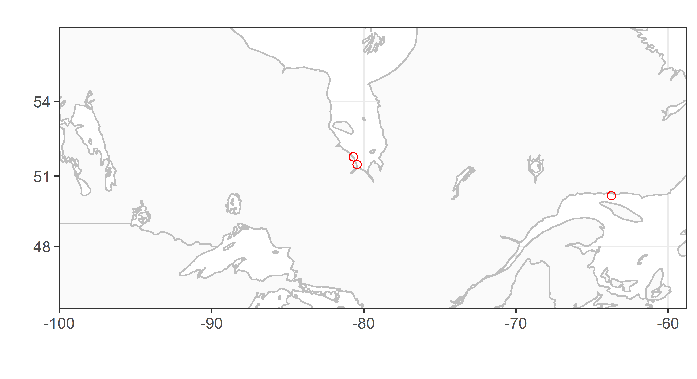

# Utilisation du langage R appliqué aux données du réseau de radiotélémétrie automatisée Motus  {-}

```{r coverimage, echo=FALSE, out.width="700px", fig.align='center'}
knitr::include_graphics("images/BSC_Motus_Logo.png")
```

Le présent guide Web a pour but de montrer aux utilisateurs de Motus (https://motus.org) comment se servir du langage de programmation statistique R (https://www.r-project.org/) pour importer les données de détection de signaux d’émetteurs dans le cadre d’un projet – ou à partir d’un récepteur – particulier; nettoyer les données et supprimer les faux positifs; explorer les données de détection par différents moyens de visualisation et sous forme de sommaires; transformer les données (par exemple en déterminant l’intervalle de temps depuis le lever/coucher du soleil ou la déclinaison magnétique); et exécuter diverses procédures d’analyse. Nous espérons que le contenu sera utile. Si vous avez des suggestions d’exemples supplémentaires à formuler, n’hésitez pas à nous le faire savoir en envoyant un courriel à motus@birdscanada.org.

Version 1.0   
Janvier 2018

<!--chapter:end:index.Rmd-->

# Introduction {#introduction}
```{r tidyr1, echo = FALSE, message = FALSE, warning = FALSE}

library(knitr)
opts_chunk$set(tidy.opts=list(width.cutoff=50), tidy = TRUE)

```

```{r fig1, echo=FALSE, fig.align='center'}
knitr::include_graphics("images/Motus-System-IG-finalSml.png")
```

 <br>

Le Système de surveillance faunique Motus ('Motus'; Taylor et al. 2017; <https://motus.org/?lang=fr>) est un réseau international de recherche collaborative composé de stations de radiotélémétrie automatisée qui assure le suivi des déplacements et du comportement d'animaux volants portant des émetteurs radio encodés numériquement. Motus a été élaboré à l'Université Acadia en 2012-2013. En 2014, une importante expansion de l'infrastructure a été rendue possible grâce à une subvention accordée par la Fondation canadienne pour l'innovation aux universités Western, de Guelph et Acadia. Depuis, le réseau Motus s'est étendu grâce à la collaboration entre des chercheurs indépendants et divers organismes (voir <https://motus.org/about/?lang=fr>). Il est maintenant géré en tant que programme d'Études d'Oiseaux Canada (<https://www.birdscanada.org/?lang=FR>) en partenariat avec l'Université Acadia. 

Motus se distingue des autres réseaux de télémétrie automatisée en ce que l’ensemble des chercheurs dans une région donnée (les Amériques ou l’Europe par exemple) utilisent une fréquence radio commune. Ainsi, les animaux portant un émetteur peuvent être détectés par n’importe quelle station réceptrice du réseau, ce qui élargit grandement la portée spatiale des sujets de recherche possibles. De plus, les utilisateurs de Motus partagent aussi une infrastructure de données et un portail Web. L’entreposage et l’archivage centralisés de toutes les données recueillies dans l’ensemble du réseau permettent aux utilisateurs d’accéder à toutes les données sur leurs émetteurs dont les signaux sont captés par n’importe quelle station réceptrice, et les responsables des récepteurs ont accès à l’ensemble des données captées par ceux-ci.

En outre, avec l'existence d’une infrastructure de données partagée, les utilisateurs peuvent bénéficier des fonctions R mises au point spécifiquement pour les données Motus par n’importe quel utilisateur du système. Le logiciel R de Motus décrit dans ce guide est en constante évolution. Le présent guide a pour but d’aider les utilisateurs à apprendre les différentes fonctionnalités du logiciel et de les inciter à contribuer à leur développement. Il montre également comment d’autres logiciels R, comme ggplot, peuvent être utilisés pour explorer, visualiser, transformer et analyser les données Motus. 

Le contenu de ce guide continuera d’évoluer et d’augmenter en fonction des besoins du réseau en matière d’analyse. Les personnes intéressées à ajouter des codes au logiciel R ou à enrichir ce guide peuvent faire parvenir leurs propositions à http://www.birdscanada.org/research/motus/?lang=FR.  

Taylor, P. D., T. L. Crewe, S. A. Mackenzie, D. Lepage, Y. Aubry, Z. Crysler, G. Finney, C. M. Francis, C. G. Guglielmo, D. J. Hamilton, R. L. Holberton, P. H. Loring, G. W. Mitchell, D. R. Noriis, J. Paquet, R. A. Ronconi, J. Smetzer, P. A. Smith, L. J. Welch et B. K. Woodworth. 2017. The Motus Wildlife Tracking System: a collaborative .research network to enhance the understanding of wildlife movement. Avian Conservation and Ecology 12(1):8. https://doi.org/10.5751/ACE-00953-120108.

## Ce que le présent guide ne montre pas {#whatBookCovers}

Le présent guide ne montre pas comment enregistrer des émetteurs radio auprès de Motus, gérer les émetteurs et les déploiements des stations réceptrices ou téléverser des données de détection brutes en vue de leur traitement. On peut accéder aux instructions pour ces opérations en cliquant sur l’option de menu Ressources au site Web de Motus: <https://motus.org/resources/?lang=fr>. N’oubliez pas d’enregistrer vos émetteurs **avant de les déployer** et de saisir les métadonnées sur les émetteurs et les stations en ligne sans tarder. Veuillez également consulter la Politique de collaboration de Motus et le Barème des frais d’enregistrement d’émetteurs à <https://motus.org/policy/?lang=fr>.

## Connaissances préalables {#prerequisites}

Nous tenons pour acquis que vous possédez une connaissance de base du langage et du logiciel R. Quel que soit votre degré de connaissance à cet égard, nous vous recommandons fortement de vous familiariser avec l’ouvrage de Garrett Grolemund et d’Hadley Wickham intitulé «R for Data Science» (<http://r4ds.had.co.nz/>). Cet ouvrage montre comment importer, visualiser et résumer des données en langage R en utilisant la collection tidyverse de logiciels R (<https://www.tidyverse.org/>). De plus, il fournit un cadre d’une valeur inestimable qui vous permettra d’organiser votre flux de travail afin de produire du code propre et reproductible (<http://r4ds.had.co.nz/workflow-projects.html>). Nous suivons l’exemple de ces auteurs en utilisant le cadre tidyverse tout au long du présent guide dans la mesure du possible.

## Ensemble de données utilisées comme exemples {#sampleData}

Tout au long du présent guide, nous utilisons un sous-ensemble de données recueillies dans le cadre du Programme de suivi des oiseaux de rivage de la baie James dans le but de montrer comment accéder aux données Motus, les gérer et les analyser en langage R. Nous vous recommandons de passer en revue le code présenté à titre d'exemple dans chaque chapitre avec ce sous-ensemble de données **avant** d’utiliser vos propres données, car vous aurez sans aucun doute besoin de modifier le code que nous fournissons pour traiter celles-ci le plus efficacement possible (chaque situation est différente).

Le Programme de suivi des oiseaux de rivage de la baie James a pour objet de surveiller et d’étudier les oiseaux de rivage qui font halte sur la côte de la baie James. Il est mené en collaboration par le ministère des Richesses naturelles et des Forêts de l’Ontario, Études d’Oiseaux Canada, l’Université Trent et le Service canadien de la faune (Environnement et Changement climatique Canada), conjointement avec une initiative de conservation de plus grande portée mobilisant les Premières Nations de la baie James et Nature Canada. Le Musée royal de l’Ontario était un partenaire associé au programme jusqu’en 2016. Le programme vise trois buts: 1) améliorer la capacité d’estimer les indices d’abondance et les tendances démographiques des espèces d’oiseaux de rivage qui font halte sur la côte ouest de la baie James; 2) étudier les profils des déplacements des oiseaux et leurs causes; et 3) déterminer l’importance relative des haltes migratoires et des habitats qu’elles renferment. Une fois réunis, les renseignements collectés contribueront à établir des mesures de conservation du Bécasseau maubèche et d’autres espèces d’oiseaux de rivage par des moyens de protection des habitats, comme la désignation au sein du Réseau de réserves pour les oiseaux de rivage dans l’hémisphère occidental (RRORHO). De plus amples renseignements peuvent être obtenus sur le site Web du Programme de suivi des oiseaux de rivage de la baie James à l’adresse <https://www.jamesbayshorebirdproject.com/> (en anglais) et sur sa page Facebook à <https://www.facebook.com/jamesbayshorebirdproject/> ou en communiquant avec le chef du programme:

Christian Friis
Wildlife Biologist
Canadian Wildlife Service, Environment and Climate Change Canada / Government of Canada 
christian.friis@canada.ca / Tel: 416.739.4908
 
Biologiste de la faune  
Service Canadien de la faune, Environnement et Changement Climatique Canada / Gouvernement du Canada 
christian.friis@canada.ca / Tél.: 416.739.4908 

## Remerciements {#acknowledgements}

Une partie du présent guide est adaptée du contenu de l’entrepôt de données github de John Brzustowski se rapportant au logiciel R de Motus, à l'adresse <https://github.com/jbrzusto/motus>.

Motus était à l’origine le réseau SensorGnome, conçu par Philip Taylor et John Brzustowski à l’Université Acadia. La première expansion du réseau a été financée par le biais d’une subvention de la Fondation canadienne pour l’innovation accordée aux universités Western (Christopher Guglielmo, Ph. D.), de Guelph (Ryan Norris, Ph. D.) et Acadia (Philip Taylor, Ph. D.). L’élaboration de l’interface Web de Motus et du logiciel R et la production du guide qui l’accompagne ont été rendues possibles grâce à une subvention accordée à Études d’Oiseaux Canada par CANARIE (<https://www.canarie.ca/fr/>). Motus poursuit sa croissance en tant que programme d’Études d’Oiseaux Canada grâce à la collaboration d’un grand nombre de chercheurs indépendants, d’organismes et de particuliers. Une liste non exhaustive des partenaires et collaborateurs de Motus est présentée à <https://motus.org/data/partners.jsp>. Si votre organisme devrait figurer sur cette liste mais ne s’y trouve pas, veuillez envoyer un courriel à motus@birdscanada.org.

Beaucoup d’intervenants ont travaillé de concert pour fédérer la technologie Motus, l’interface Web et le logiciel R. L’équipe centrale du programme Motus est formée des personnes suivantes: John Brzustowski, Tara Crewe, Zoe Crysler, Jeremy Hussell, Catherine Jardine, Denis Lepage, Stuart Mackenzie, Paul Morrill et Philip Taylor.

<!--chapter:end:01-Introduction.Rmd-->

# Chargement des logiciels R {#loadingPackages}
```{r tidyr2, echo = FALSE, message = FALSE, warning = FALSE}

library(knitr)
opts_chunk$set(tidy.opts=list(width.cutoff=50), tidy = TRUE)

```

Deux logiciels R ont été élaborés pour les utilisateurs de Motus:

1. motus: ce logiciel intègre des fonctions permettant de produire des sorties graphiques sommaires et de transformer (ajouter les heures du lever et du coucher du soleil) et d'analyser les données Motus.

2. motusClient: ce logiciel intègre des fonctions pour le téléchargement et la mise à jour des données de détection et des métadonnées sur le déploiement des émetteurs et des récepteurs à partir du serveur de Motus.

Les **utilisateurs** de Motus peuvent installer les versions stables les plus récentes des logiciels R à l’aide du code suivant. Comme c’est le cas pour tous les logiciels R, vous n'avez besoin d'installer les logiciels qu’une seule fois. Après l’installation, vous devez charger chaque logiciel (en utilisant la fonction library() ou require()) chaque fois que vous ouvrez une nouvelle session R. 

Veuillez noter que l’utilisation de certaines fonctionnalités du logiciel devtools peut nécessiter des versions à jour de R et de RStudio. Pour éviter les erreurs, veuillez-vous assurer d’utiliser les versions les plus récentes de [R](https://www.r-project.org/) et de [RStudio]() et mettre à jour vos logiciels R en utilisant update.pacakges() dans la console R.

Pour mettre à jour vos logiciels existants:

```{r update packages.1, eval = FALSE}

update.packages()                         

```

Commencez par installer les logiciels requis s’ils ne sont pas déjà installés. Notez que le logiciel motusClient, qu’il faut utiliser pour accéder aux données de détection dans le serveur de Motus, fait partie du logiciel motus (c.-à-d. que vous ne devriez avoir qu’à exécuter le code pour installer le logiciel motus, et le logiciel motusClient sera chargé automatiquement). Le code permettant d’installer le logiciel motusClient de manière indépendante est fourni ci-dessous, mais vous ne devriez pas avoir besoin de l’exécuter.

```{r install packages, eval = FALSE}

install.packages("devtools")
library(devtools)

# Installation du logiciel motus pour le téléchargement, la manipulation, la visualisation et l'analyse des données
install_github("MotusWTS/motus")

# Installation du logiciel motusClient pour le téléchargement des données
install_github("MotusWTS/motusClient")

library(motus)

```

Si vous devez mettre à jour un logiciel motus ou motusClient existant, vous devez spécifier 'force = TRUE':
```{r update packages.2, eval = FALSE}
# Réinstallation forcée du logiciel motus quand des mises à jour sont requises
install_github("MotusWTS/motus", force = TRUE)

# Réinstallation forcée du logiciel motusClient quand des mises à jour sont requises
install_github("MotusWTS/motusClient", force = TRUE)

library(motus)

```

Tout au long du guide, nous utilisons tidyverse, une collection de logiciels R consacrés à la science des données - y compris tidyr, dplyr, ggplot2 et lubridate - pour la gestion et la manipulation de dates. Vous trouverez de plus amples renseignements sur tidyverse à <https://www.tidyverse.org/> ou en parcourant (ou, mieux encore, en lisant attentivement) l’ouvrage de Garrett Grolemund et d’Hadley Wickham intitulé «R for Data Science» (<http://r4ds.had.co.nz/>). Pour la cartographie, nous utilisons aussi les logiciels rworldmap et ggmap, qui peuvent être installés à partir de CRAN, de la manière suivante:

```{r install tidyverse, eval = FALSE}

library(maps)

install.packages("tidyverse")
library(tidyverse)

install.packages("tidyr")
library(tidyr)

install.packages("rworldmap")
library(rworldmap)

install.packages("ggmap")
library(ggmap)

```
```{r loadAllPackages, echo = FALSE, warning = FALSE, message = FALSE}
library(motus)
library(maps)
library(tidyverse)
library(tidyr)
library(rworldmap)
library(ggmap)

```
Nous installons également le logiciel plyr, mais nous ne le chargeons pas. Nous l’utilisons directement pour nous servir de la pratique fonction round_any, mais s’il est chargé, il peut survenir des problèmes touchant les fonctions dplyr:

```{r install plyr, eval = FALSE}

install.packages("plyr")

```

## Traitement interne des données {#internalProcessing}

Lorsqu’un animal portant un émetteur se déplace dans la zone de détection d’une station Motus, les signaux (ou salves d'impulsions) émis sont captés par l’antenne ou les antennes de la station et enregistrés par un récepteur. Ces données de détection brutes sont téléversées dans la base de données Motus instantanément via une connexion Internet ou sont téléchargées depuis le récepteur puis téléversées dans la base de données Motus manuellement. En arrière-plan, les données de détection brutes sont lues et traitées au moyen de différentes fonctions pour produire le fichier de données de détection des émetteurs auquel les utilisateurs du logiciel R peuvent accéder (voir le chapitre \@ref(accessingData)). La plupart des utilisateurs n’auront pas besoin de recourir aux fonctions de traitement interne des données, mais une liste complète des fonctions intégrées dans le logiciel R du serveur de Motus est fournie sur GitHub (<https://github.com/jbrzusto/motusServer>). Pour voir le code sous-jacent à chaque fonction, on peut aller sur GitHub. On peut aussi taper ce qui suit dans la console R après avoir chargé le logiciel R; il suffit de remplacer «function.name» par le nom de la fonction R d’intérêt:

```{r function.name, eval = FALSE}

function.name() 

```

Dans le chapitre suivant, nous examinerons et chargerons des données.

<!--chapter:end:02-ChargementDesLogiciels.Rmd-->

# Accès aux données de détection {#accessingData}
```{r tidyr3, echo = FALSE, message = FALSE, warning = FALSE}

library(knitr)
opts_chunk$set(tidy.opts=list(width.cutoff=50), tidy = TRUE)

```

```{r dataImport, echo = FALSE, eval = TRUE}
# hidden data import so update can be set to FALSE
proj.num= 176
sql.motus <- tagme(176, update = FALSE, dir = "./data")   # Objet SQLite R relié au fichier .motus
tbl.alltags <- tbl(sql.motus, "alltags")  # Objet table virtuelle de la table alltags dans le
                                          # fichier sample.motus
df.alltags <- tbl.alltags %>%
                collect() %>%
                as.data.frame() %>%        # dataframe ("flat") object of the alltags table
                mutate(ts = as_datetime(ts, tz = "UTC", origin = "1970-01-01"))              

```

**Avant de télécharger vos données de détection, rendez-vous à la [page Web relative aux problèmes de données] (https://motus.org/data/issues) pour vérifier qu'il n'y a pas de problème en suspens en ce qui touche les métadonnées.**

## Types de bases de données {#databaseTypes}

Il existe deux types de bases de données de détection:

1. **base de données de récepteur**: comprend toutes les données de détection des signaux de n'importe quel émetteur enregistré captés par un récepteur particulier. Une base de données de récepteur porte un nom comme SG-1234BBBK5678.motus, ce nom correspondant au numéro de série du récepteur.

2. **base de données de projet**: comprend toutes les données de détection des signaux de vos émetteurs enregistrés captés dans l'ensemble du réseau Motus. Une base de données de projet porte un nom comme project-123.motus, le numéro correspondant à l'identifiant du projet Motus en question.

Ces deux types de bases de données correspondent au modèle de base du partage de données:

1. Vous obtenez toutes les données de détection des signaux de tous les émetteurs captés par *vos* récepteurs (c.-à-d. une base de données de récepteur pour chacun des récepteurs que vous avez déployés).

2. Vous obtenez toutes les données de détection des signaux de *vos* émetteurs captés par *n'importe quel* récepteur (c.-à-d. une base de données de projet pour chacun de vos projets Motus).

## Chargement des logiciels R pertinents {#loadPackages}

Avant de commencer à travailler avec des données, il faut charger les logiciels requis pour les opérations expliquées dans le présent chapitre. Si vous n'avez pas encore installé ces logiciels (à partir de  github et de CRAN), retournez au chapitre \@ref(loadingPackages) pour le faire.

```{r loadPackages, warning = FALSE, message = FALSE}

# logiciel «motus» requis depuis github
require(motus)

```

## Réglage de l'environnement système

Réglez le fuseau horaire de l'environnement système au temps universel coordonné (UTC), pour vous assurer de toujours travailler à cette échelle de temps. C'est une étape très importante qui devrait toujours faire partie de chaque séance de travail. Si vous ne faites pas ce réglage, deux problèmes peuvent se produire. Premièrement, les indications des heures dans la base de données de Motus sont en UTC, et si vous ne réglez pas l'environnement système à l'échelle de temps UTC, ces indications peuvent être modifiées par inadvertance pendant l'importation des données. Deuxièmement, si les signaux des émetteurs ont été captés dans différents fuseaux horaires, les indications des heures peuvent aussi être modifiées par inadvertance.

```{r setTimeZone1}

Sys.setenv(TZ="GMT")

```

## Importation de données de détection {#importDetections}

Pour importer des données de détection de signaux d'émetteurs dans le cadre de votre projet ou à partir de votre récepteur, vous devez avoir un identifiant numérique de projet ou un numéro de série de récepteur. 

Pour que le réseau Motus fonctionne correctement, il est important que les collaborateurs versent en temps opportun dans le serveur de Motus les données de détection provenant de leur(s) récepteur(s) et qu’ils assurent l’exactitude des métadonnées sur leurs émetteurs et récepteurs, et les tiennent à jour. Nous vous encourageons, après avoir téléchargé vos données depuis le serveur de Motus, à mettre à jour vos données de détection et vos métadonnées chaque fois que vous exécutez une analyse, car des collaborateurs peuvent ajouter des données de détection et des métadonnées n’importe quand et, si ces nouvelles données ne sont pas incluses, cela peut faire en sorte que vos données de détection soient incomplètes.

### Téléchargement des données d'un projet ou d'un récepteur pour la _première fois_

Lorsque vous téléchargez des données depuis le serveur de Motus pour la première fois, vous devez spécifier 'new = TRUE' et 'update = TRUE'. À moins que le répertoire dans lequel vous voulez enregistrer vos données soit indiqué spécifiquement dans l’appel de fonction, les données seront téléchargées dans le répertoire de travail courant. 

### Authentification de l'utilisateur {#userAuthentication}

Notez que la première fois que vous appellerez une fonction en vous servant du logiciel R de Motus, vous devrez entrer votre nom d’utilisateur et votre mot de passe motus.org dans la console R pour certifier votre droit d’accès aux données d’un projet. Cela se produira seulement une fois par session de travail avec le logiciel R. Si vous n’avez pas de nom d’utilisateur ni de mot de passe Motus, vous pouvez vous inscrire à <https://motus.org/data/user/new?lang=fr>. La permission d’accéder aux données d’un projet vous sera accordée par le personnel de Motus ou le chercheur principal engagé dans le projet en question.

Tout au long du présent guide, nous utiliserons des exemples de données (voyez la section \@ref(sampleData)) attribuées au projet 176 (Programme de suivi des oiseaux de rivage de la baie James). Pour accéder à ces données, vous devrez ouvrir une session en entrant votre nom d’utilisateur et votre mot de passe («motus.sample») dans la console R lorsque la fonction tagme() vous y invitera (voyez la section \@ref(downloadData)). Cela ressemblera à ce qui suit:

```{r fig3.1, echo=FALSE, fig.align='center'}
knitr::include_graphics("images/SampleLogin.png")
```


### Fermeture de session{#logout}

Une fois que vous aurez ouvert une session dans un compte utilisateur, vous ne pourrez pas accéder aux données d’un autre compte. Si vous avez besoin de fermer une session dans le compte courant pour accéder à d’autres données, vous pouvez exécuter le code ci-dessous.

```{r logout, eval = FALSE}

motusLogout()

```

### Téléchargement de données de détection {#downloadData}

Nous pouvons commencer. Notez qu’aucun récepteur n’est enregistré dans le cadre du projet 176, de sorte que le deuxième appel de fonction ne permettra pas d’obtenir des données. Toutefois, vous pouvez remplacer le numéro de série du récepteur par un véritable numéro de série enregistré dans le cadre de votre projet ou d’un de vos projets si vous avez ouvert une session dans votre propre compte (c.-à-d. non pas avec le mot de passe «motus.sample»; voyez la section \@ref(logout)). 

****Toutes les données téléchargées seront enregistrées dans votre répertoire de travail, sauf indication contraire dans l’appel de fonction tagme tel qu’indiqué ci-après.**

Veuillez noter que si vous téléchargez pour la première fois ('new = TRUE' dans l'appel de fonction tagme) un grand ensemble de données à partir du serveur de Motus, cela peut prendre beaucoup de temps, parfois quelques heures. Une fois que vous aurez effectué un premier téléchargement, le chargement d’un fichier .motus dans R avec la commande «'tagme(proj.num, update = TRUE)» se fera presque instantanément. L’indication du déroulement du téléchargement devrait s’afficher à la console; si vous ne la voyez pas, essayez de faire défiler la page vers le bas pendant que la fonction tagme est en cours d’exécution.

Dans l’éventualité où votre connexion au serveur de Motus ferait défaut avant la fin du téléchargement (à cause d’une mauvaise connexion Internet par exemple), utilisez «tagme(proj.num, update = TRUE)» pour poursuivre le téléchargement à partir du point d’interruption, en veillant à indiquer le répertoire de réception des données si vous n’utilisez pas le répertoire de travail.  


```{r tagme1, eval = FALSE}

getwd()         # Indiquez le répertoire de travail; utilisez la fonction setwd() pour le modifier.
proj.num <- 176 # Entrez 176 ou le numéro de votre projet.

sql.motus <- tagme(projRecv = proj.num, new = TRUE, update = TRUE)  # Pour la base de données du projet
sql.motus <- tagme(projRecv = "SG-123BBBK1234", update = TRUE, new = TRUE)  # Pour la base de données du récepteur

```

Si vous ne voulez pas utiliser le répertoire de travail, spécifiez un répertoire à créer et ouvrez une base de données de détection locale en utilisant «dir =»:

```{r tagme2, eval = FALSE}

sql.motus <- tagme(projRecv = proj.num, new = TRUE, update = TRUE, dir = "./data/") 

```

La fonction tagme() versera une copie de votre base de données de détection dans le répertoire de travail ou le répertoire que vous avez spécifié. Cette copie prendra la forme d’un fichier SQLite portant le suffixe .motus. 

### Ouverture et mise à jour d'une base de données de détection locale {#tagmeUpdate}

Pour ouvrir et mettre à jour une base de données de détection qui existe déjà (qui a déjà été téléchargée):

```{r tagme3, eval = FALSE}

sql.motus <- tagme(projRecv = proj.num, new = FALSE, update = TRUE, dir = "./data/") # Utilisez «dir =» pour spécifier un répertoire.

```

Si vous travaillez hors ligne et que vous voulez charger une base de données déjà téléchargée sans vous connecter au serveur, utilisez:

```{r tagme3.1, eval = FALSE}

sql.motus <- tagme(projRecv = proj.num, update = FALSE, dir = "./data/")

```

### Vérification de l'existence de nouvelles données {#tellme}

Pour vérifier si de nouvelles données sont disponibles sans télécharger ces données, vous pouvez utiliser la fonction tellme(). Vous verrez s’afficher une liste:

- **numHits**: nombre de nouvelles détections;
- **numBytes**: quantité approximative de données non comprimées à transférer, en mégaoctets;
- **numRuns**: nombre de séquences de nouvelles détections, c'est-à-dire de séries de détections continues par une antenne particulière de signaux provenant d'un émetteur;
- **numBatches**: nombre de lots de nouvelles données; 
- **numGPS** nombre d'enregistrements GPS de nouvelles données.

La fonction tellme () repose sur l'hypothèse qu'il existe déjà une copie locale de la base de données:

```{r tagme5, eval = FALSE}

tellme(projRecv = proj.num)                    # Si db est dans le répertoire de travail
tellme(projRecv = proj.num, dir = "./data/")   # Pour spécifier un autre répertoire

```

Pour vérifier combien de données sont disponibles pour un projet sans_que_vous_ayez une copie locale de la base de données, utilisez le paramètre «new»:

```{r tagme6, eval = FALSE}

tellme(projRecv = proj.num, new = TRUE)

```

### Imposition d'une mise à jour/réimportation de métadonnées sur des émetteurs et des récepteurs {#forceMeta}

Les métadonnées sur les émetteurs et les récepteurs sont automatiquement fusionnées avec les données de détection d'émetteurs lorsque ces dernières sont téléchargées. Toutefois, si vous voulez imposer la réimportation des métadonnées lorsque vous mettez à jour une base de données, vous pouvez utiliser la commande suivante:  

```{r tagme7, eval = FALSE}

sql.motus <- tagme(projRecv = proj.num, forceMeta = TRUE)

```

### Importation de l'ensemble des métadonnées sur les émetteurs et les récepteurs {#metadata}

Lorsque vous utilisez la fonction tagme() pour télécharger ou mettre à jour votre fichier .motus, vous obtenez les métadonnées sur:

1. tous les émetteurs enregistrés dans le cadre de votre projet dont des signaux ont été détectés; 
2. les émetteurs enregistrés dans le cadre d'autres projets qui sont associés à des détections de signaux ambigus (voyez le chapitre \@ref(dataCleaning)) dans vos données; 
3. les récepteurs qui ont détecté les signaux de vos émetteurs ainsi que les signaux ambigus.  

Dans de nombreux cas, vous voudrez accéder à toutes les métadonnées sur l’ensemble des émetteurs et des récepteurs partout dans le réseau (par exemple pour déterminer combien de vos émetteurs déployés n’ont pas été repérés ou pour localiser les stations avec et sans détections). Vous pouvez utiliser la fonction metadata() pour ajouter la totalité des métadonnées Motus à votre fichier .motus enregistré. Cette fonction n’a besoin d’être exécutée qu’une seule fois, mais nous vous suggérons de réimporter les métadonnées occasionnellement pour vous assurer que vous avez l’information la plus récente et à jour.

L’exécution de la fonction metadata () de la manière suivante aura pour effet d’ajouter les métadonnées appropriées provenant de l’ensemble du réseau (tous les émetteurs et les récepteurs) aux tables «recvDeps» et «'tagDeps» dans votre fichier .motus: 

```{r metadata1, eval = FALSE}

# Accéder aux métadonnées sur tous les émetteurs et les récepteurs dans le cadre de tous les projets dans le réseau.
metadata(sql.motus) 

```

Vous pouvez aussi charger les métadonnées reliées à un ou des projets spécifiques, de la manière suivante:

```{r metadata2, eval = FALSE}

# Accéder aux métadonnées sur les émetteurs et les récepteurs associés au projet 176.
metadata(sql.motus, projectIDs = 176) 

# Accéder aux métadonnées sur les émetteurs et les récepteurs associés aux projets 176 et 1.
metadata(sql.motus, projectIDs = c(176, 1)) 

```


## Structure des données {#databaseStructure}

Chaque base de données de détection est stockée sous la forme d’un fichier SQLite («dplyr::src_sqlite») portant le suffixe .motus. Nous avons choisi le format SQLite pour les raisons suivantes:

1. Il est souple; il autorise de nombreux formats de données.
2. Il est accessible à partir de nombreuses plates-formes logicielles (pas seulement à partir de R).
3. Il permet l'**adjonction**: la base de données peut être créée et mise à jour sur disque sans qu’il soit nécessaire de lire et de sauvegarder de nouveau tout le contenu de la base. Cela permet de gagner du temps et d’économiser de la mémoire lorsqu’on fait une recherche pour déterminer si de nouvelles données de détection sont disponibles pour un projet ou un récepteur donné.

Le fichier .motus contient une série de tables interdépendantes dans lesquelles les données sont stockées sous forme condensée pour économiser de la mémoire. Voici quelles sont ces tables:

1. antDeps: métadonnées sur les antennes, p. ex., hauteur, angle, type d'antenne;
2. batchRuns: métadonnées sur les runID et les batchID associés;
3. batches: données de détection pour un récepteur et un numéro de redémarrage de récepteur particuliers;
4. filters: métadonnées reliées à des filtres créés par l'utilisateur qui sont associés au récepteur en question;  
5. gps: métadonnées reliées à la position GPS du récepteur; 
6. hits: données de détection au niveau de chaque détection de signaux;
7. meta: métadonnées reliées au projet et au type de données (émetteurs par rapport aux récepteurs) qui sont inclus dans le fichier .motus;
8. projAmbig: métadonnées reliées aux projets pour lesquels il existe des détections ambiguës;
9. projBatch: métadonnées pour le nombre de détections contenues dans chaque lot;
10. projs: métadonnées reliées aux projets, p. ex., nom du projet, chercheur principal;
11. recvDeps: métadonnées reliées aux déploiements de récepteurs, p. ex., date du déploiement, lieu, caractéristiques du récepteur;
12. recvs: métadonnées reliées au numéro de série du récepteur et à l'identifiant d'appareil (deviceID) Motus associé;
13. runs: données de détection associées à une séquence de (détections continues d'un émetteur unique par un récepteur particulier);
14. runsFilters: liste de runIDs associés à des filtres créés par l'utilisateur et à des probabilités attribuées;  
15. species: métadonnées reliées aux espèces, p. ex., identifiant unique, nom scientifique, nom commun;
16. tagAmbig: métadonnées reliées aux émetteurs ambigus, p. ex., ambigID et motusTagID associés;
17. tagDeps: métadonnées reliées à des déploiements d'émetteurs, p. ex., date du déploiement, lieu et espèce;
18. tags: métadonnées reliées à des émetteurs, p. ex., identifiant unique, caractéristiques de l'émetteur(p. ex., cadence d'émission).

Vous pouvez visualiser la liste des tables, et les variables contenues dans ces tables, en utilisant les codes suivants:

```{r sqlTables, eval = FALSE}

# Indiquer le lieu et le nom du fichier du projet.
file.name <- dbConnect(SQLite(), "./data/project-176.motus") 

# Obtenir une liste des tables dans le fichier .motus spécifié ci-dessus.
dbListTables(file.name) 

# Obtenir une liste des variables contenues dans la table «species» dans le fichier .motus.
dbListFields(file.name, "species") 

```

En plus de ces tables, des tables «virtuelles» ou «vues» ont été créées à la suite de requêtes qui entraînent la fusion des données des différentes tables en une «vue» pratique contenant tous les champs dont vous pouvez avoir besoin. Les vues suivantes sont actuellement incluses dans chaque fichier .motus:

1. allambigs: liste en format long tous les motusTagID (jusqu'à 6) associés à chaque ambigID négatif;
2. alltags: fournit l'ensemble des données de détection pour tous les émetteurs et tous les émetteurs ambigus (en double) associés à votre projet. Les détections ambiguës sont répétées pour chaque motusTagID représenté par chaque ambigID. 

Étant donné que le fichier est un fichier dplyr::src_sqlite, toutes les fonctions dplyr peuvent être utilisées pour filtrer la base de données .motus et en présenter un sommaire sans avoir d’abord à enregistrer les données sous la forme d’un fichier *plat* (une trame de données bidimensionnelle typique). Le format SQL est très avantageux en présence d’un gros fichier – les requêtes effectuées dans ce format seront beaucoup plus rapides que celles effectuées sur une trame de données plate. 

On peut accéder à chaque table et chaque vue dans le fichier .motus en utilisant la fonction tbl(): 

```{r getTable}

# Obtenir la table des métadonnées sur les déploiements d'émetteurs pour le projet courant.
tbl.tagDeps <- tbl(sql.motus, "tagDeps")
     
```

La structure sous-jacente à ces tables est une liste de longueur 2:

```{r dfStructure, eval = FALSE}

str(tbl.tagDeps)

```

La première partie de la liste, «src», fournit de l’information sur la SQLiteConnection, entre autres sur l’emplacement de la base de données. La deuxième partie est une liste qui comprend la table sous-jacente. Dès lors, l’objet R «tagDeps» est une table *virtuelle* qui contient la structure de la base de données et l’information nécessaire pour la connexion avec les données sous-jacentes dans le fichier .motus. Tel qu’indiqué plus haut, cette méthode de stockage des données présente l’avantage d’économiser de la mémoire lorsqu’on accède à de très grosses bases de données, et les fonctions intégrées dans le logiciel dplyr peuvent être utilisées pour manipuler et résumer les tables avant de rassembler les résultats dans une trame de données «plate» typique.

Si vous voulez utiliser des fonctions familières pour accéder à des composantes de la trame de données sous-jacente, utilisez la fonction «collect». Par exemple, pour voir les noms des variables dans la table tagDeps:

```{r}

tbl.tagDeps %>% 
  collect() %>%
  names() # Présenter la liste des noms des variables dans la table.

```

La table *virtuelle* «alltags» contient les données de détection ainsi que toutes les variables dont la plupart des utilisateurs pourront avoir besoin à partir des tables .motus sous-jacentes. Cette table est accessible elle aussi à l’aide de la fonction dplyr tbl():  

```{r getAllTagsTable, eval = FALSE}

tbl.alltags <- tbl(sql.motus, "alltags") # Table virtuelle

```

La table suivante présente la liste des variables disponibles dans la vue «alltags». Vous trouverez une description complète de chaque champ dans l’annexe A.

```{r parameterTable.3, echo = FALSE, eval = FALSE}

tbl.alltags %>% 
      collect() %>%
      names()

```

## Vérification de la version de la base de données {checkVersion}

Lorsque vous appelez la fonction tagme pour charger la base de données SQLite, un processus permet de vérifier que la version de votre base de données correspond à la version la plus récente du logiciel motus et de stocker la version dans une nouvelle table appelée admInfo. Au fil du temps, des changements sont apportés qui nécessitent l’ajout de nouvelles tables ou vues ou de nouveaux champs dans la base de données. Si vous n’avez pas la version correcte de la base de données, il se pourrait que certains des exemples contenus dans le présent guide ne fonctionnent pas. Cette fonction permet de vérifier que votre base de données a été actualisée à la version courante du logiciel motus. Si vous n’avez pas la version courante, reportez-vous au chapitre \@ref(loadingPackages), qui fournit des instructions sur la mise à jour des logiciels motus et motusClient. Si le système affiche un avertissement, reportez-vous à l’annexe B.


```{r dbVersion, eval = FALSE}
checkVersion(sql.motus)

```

## Conversion d'une table SQLITE en une trame de données plate {#convertToFlat}

Pour convertir la vue «alltags» ou une autre table dans le fichier .motus en un format «plat» typique (c.-à-d. avec tous les enregistrements pour chaque champ entrés), utilisez les fonctions collect() et as.data.frame(). La sortie pourra ensuite subir d’autres manipulations ou être utilisée pour générer un fichier RDS de vos données à des fins d’archivage ou d’exportation. 

Nous suggérons le flux de travail suivant. Préparez un script qui effectue le téléchargement/la mise à jour de vos données, élimine les variables nécessaires et effectue un premier nettoyage s’il y a lieu, puis enregistrez les données résultantes sous la forme d’un fichier RDS. Nous suggérons d’utiliser le format RDS plutôt que le format CSV, car il conserve la structure sous-jacente des données (p. ex. les heures POSIX demeurent des heures POSIX). Toutefois, si vous voulez exporter vos données dans un autre programme, il pourrait être préférable d’utiliser le format CSV.  

Créer un fichier plat avec l’ensemble des champs peut exiger beaucoup de mémoire et peut ralentir le logiciel R considérablement lorsqu’il faut traiter de grands ensembles de données. Pour certaines combinaisons d’ensembles de données et d’ordinateurs, il peut être impossible d’utiliser directement des trames de données dans R. Si cela se produit, c’est l’étape de votre flux de travail où vous devriez examiner attentivement l’information dont vous avez besoin dans votre ensemble de données (par exemple comment les données sont agrégées) et la simplifier. Il est toujours possible de revenir au script dont il est question ici pour créer un nouveau fichier RDS avec des variables différentes ou avec des données agrégées à une échelle différente.  

Nous développons cette idée dans les sections qui suivent.  

Créez une trame de données ...

```{r collect, eval = FALSE}

df.alltags <- tbl.alltags %>% 
                collect() %>% 
                as.data.frame()  # Pour tous les champs dans la trame de données

```

... et examinez brièvement le fichier résultant. 

```{r quickLook, eval = FALSE}

names(df.alltags)     # Noms des champs
str(df.alltags)       # Examinez la structure de vos champs de données.
head(df.alltags)      # Examinez les 6 premières lignes de la trame de données.
summary(df.alltags)   # Sommaire de chaque colonne dans la trame de données

```

Notez que le champ de l'estampille temporelle (ts) est numérique; il indique le nombre de secondes écoulé depuis le 1er janvier 1970. Nous recommandons que, lorsque vous transformez vos tables en trames de données plates, vous formatiez l'estampille temporelle en utilisant le logiciel lubridate en fonction de cette estampille, par exemple:

```{r collect_TimeStamp, eval = FALSE}

df.alltags <- tbl.alltags %>% 
                collect() %>% 
                as.data.frame() %>%     # Pour tous les champs dans la trame de données
                mutate(ts = as_datetime(ts, tz = "UTC", origin = "1970-01-01"))

# tz = "UTC" n'est pas nécessaire ici si vous avez réglé votre environnement système à l'échelle de temps UTC (GMT)
# ... mais c'est un rappel utile!

```

Si vous voulez charger seulement une partie de votre table virtuelle complète (p. ex., certains champs, certains émetteurs ou tous les émetteurs se rapportant à un projet ou à une espèce spécifique), vous pouvez utiliser des fonctions dplyr pour filtrer les données avant de les réunir en une trame de données. Voici des exemples:  

1. Pour choisir certaines variables:

```{r collect1, eval = FALSE}

# Pour choisir un sous-ensemble de variables, dans le présent cas une liste unique d'identifiants d'émetteurs (tag ID) Motus à chaque récepteur et à chaque antenne.
df.alltagsSub <- select(tbl.alltags, recv, port, motusTagID) %>%
  distinct() %>% 
  collect() %>% 
  as.data.frame() 

```

2. Pour choisir certains identifiants d'émetteurs (tag ID):

```{r collect2, eval = FALSE}
# Filtrez pour inclure seulement les identifiants d'émetteurs Motus 16011 et 23316.
df.alltagsSub <- filter(tbl.alltags, motusTagID %in% c(16011, 23316)) %>% 
                  collect() %>% 
                  as.data.frame() %>%    
                  mutate(ts = as_datetime(ts, tz = "UTC", origin = "1970-01-01"))    

```

3. Pour choisir une espèce en particulier:

```{r collect3, eval = FALSE}

# Filtrez pour inclure seulement le Bécasseau maubèche (en utilisant la variable speciesID).
df.4670 <- filter(tbl.alltags, speciesID == 4670) %>%  
  collect() %>% 
  as.data.frame() %>%    
  mutate(ts = as_datetime(ts, tz = "UTC", origin = "1970-01-01"))  

# Filtrez pour inclure seulement le Bécasseau maubèche (en utilisant le nom commun anglais).
df.redKnot <- filter(tbl.alltags, speciesEN == "Red Knot") %>%   
  collect() %>% 
  as.data.frame() %>%    
  mutate(ts = as_datetime(ts, tz = "UTC", origin = "1970-01-01"))    

```

En utilisant la fonction dplyr(), vous pouvez aussi résumer votre table virtuelle avant de la convertir en un fichier plat. Par exemple, pour déterminer le nombre de détections différentes pour chaque émetteur à chaque récepteur:

```{r collectSum, eval = FALSE}

df.detectSum <- tbl.alltags %>% 
  group_by(motusTagID, recv) %>%
  tally() %>%
  collect() %>%
  as.data.frame() 

```

Dans les chapitres suivants, nous vous montrerons d'autres façons de travailler avec vos données et de les résumer.

## Exportation d'une trame de données «plate» sous la forme d'un fichier CSV ou RDS {#exportDetections}

Nous avons mentionné qu’un flux de travail approprié consiste à créer un script qui permet de traiter tous les problèmes de données et qui crée ensuite une trame de données (ou un espace de travail) qui peut être réutilisée. Si vous faites cela, vous pouvez rapidement amorcer une session d’analyse ou de visualisation à partir d’un point de départ connu (et cohérent). Nous utilisons un fichier RDS, qui conserve toutes les structures de données R associées, par exemple les estampilles temporelles.

```{r createRDS, eval = FALSE, message = FALSE, warning = FALSE}

# Enregistrez un fichier RDS.

saveRDS(df.alltags, "./data/df.alltags.RDS")  

# ou enregistrez comme fichier CSV, qui ne conserve pas les estampilles temporelles,
# mais qui peut être lu facilement par d'autres programmes.

write_csv(df.alltags, "./data/df.alltags.CSV")

```

## Convention de noms d'objets R

Dans le présent chapitre et tout au long du guide, nous nommons les objets R en fonction de leur structure et de la source des données que ces objets contiennent. Ainsi, les objets SQLite portent le préfixe «sql.», les objets de tables virtuelles, le préfixe «tbl.» et les objets de trames de données, le préfixe «df.». Le reste du nom de l’objet inclut le nom de la table .motus d’où proviennent les données. Dans le reste du guide, nous utiliserons et référencerons les formats de nommage ci-dessous; veuillez vous assurer de bien connaître ces formats avant de passer au prochain chapitre. Le code ci-dessous tient pour acquis que vous avez déjà téléchargé les données du projet 176 et que vous n’avez pas besoin de les mettre à jour; dans le cas contraire, reportez-vous à la section \@ref(downloadData), qui montre comment effectuer le téléchargement initial:

```{r namingConvention, eval = FALSE}

# Objet R SQLite, lié au fichier .motus:
sql.motus <- tagme(176, update = TRUE, dir = "./data")  

# Objet de la table virtuelle alltags dans le fichier .motus du projet 176:
tbl.alltags <- tbl(sql.motus, "alltags")  
df.alltags <- tbl.alltags %>%
                collect() %>%
                as.data.frame() %>%   # Objet de trame de données («plate») de la table alltags
                mutate(ts = as_datetime(ts, tz = "UTC", origin = "1970-01-01"))              

```
Dans le prochain chapitre, il sera question de métadonnées manquantes.

<!--chapter:end:03-AccèsAuxDonnéesDeDétection.Rmd-->

# Déploiements d'émetteurs et de récepteurs {#deployments}

```{r tidyr4, echo = FALSE, message = FALSE, warning = FALSE}

library(knitr)
opts_chunk$set(tidy.opts=list(width.cutoff=50), tidy = TRUE)

```

Avant de travailler avec vos données de détection, il convient d’abord de résumer et de visualiser les métadonnées relatives aux déploiements des émetteurs et des récepteurs enregistrés dans le cadre de votre projet. La production de sommaires, de graphiques et de cartes des données sur vos déploiements peut permettre de trouver des erreurs possibles dans les métadonnées sur les émetteurs et les récepteurs. De telles erreurs peuvent faire en sorte que les données de détection recueillies dans le cadre de votre projet soient incomplètes, tout comme les projets d’autres chercheurs dont des émetteurs ont été détectés par vos récepteurs. 

Le présent chapitre est un complément de la [page sur les problèmes de données]( https://motus.org/data/login) du site Web de Motus, qui présente pour chaque projet une liste des problèmes touchant les métadonnées (valeurs manquantes ou aberrantes), problèmes qu’il faut accepter ou ne pas prendre en compte. Veuillez traiter toutes les erreurs associées à votre projet qui sont indiquées dans la page des problèmes de données **avant** d’importer vos données par l’intermédiaire de R. Les indications fournies ici ne permettent pas de faire une vérification complète des métadonnées sur les déploiements de vos émetteurs et récepteurs, mais elles aideront à déceler les erreurs que les interrogations automatiques sur la page des problèmes de données n’ont pas permis de trouver.

Nous utilisons l’ensemble de données du Programme de suivi des oiseaux de rivage de la baie James (projet 176) à titre d’exemple tout au long du présent chapitre (voyez la section \@ref(sampleData)). Pendant que vous parcourez le code pour examiner vos propres déploiements, **si vous trouvez des erreurs ou des omissions dans vos métadonnées, veuillez les corriger; pour ce faire, rendez-vous à la page https://motus.org/.** Cliquez sur l’option «Gérer les données» et dans le menu, choisissez «Gérer vos émetteurs» pour corriger les métadonnées sur les déploiements d’émetteurs ou «Gérer vos récepteurs» pour corriger les métadonnées sur les récepteurs. Il est important de corriger en ligne les erreurs dans les métadonnées; ainsi, les erreurs sont corrigées à la source et les données corrigées sont archivées dans le serveur de Motus, de sorte que tous les utilisateurs ont accès aux métadonnées correctes sur les émetteurs et les récepteurs. Les métadonnées corrigées en ligne seront automatiquement corrigées dans vos fichiers de données de détection. Si vous avez déjà téléchargé vos données de détection, vous pouvez mettre à jour le fichier existant afin d’inclure les nouvelles métadonnées et données de détection (voyez les sections \@ref(forceMeta) et \@ref(tagmeUpdate)).

## Chargement des logiciels R pertinents et réglage de l'environnement de travail

Avant de commencer à travailler avec des données, il faut charger les logiciels requis pour les opérations expliquées dans le présent chapitre. Si vous n'avez pas encore installé ces logiciels (à partir de  github et de CRAN), retournez au chapitre \@ref(loadingPackages) pour le faire.

```{r loadPackages.4, eval = FALSE, warning = FALSE, message = FALSE}

library(tidyverse)
library(tidyr)
library(motus)

# Réglez le fuseau horaire de l'environnement système au temps universel coordonné (UTC), pour vous assurer de toujours travailler à cette échelle de temps.
Sys.setenv(TZ="GMT")

```

## Chargement du fichier .motus

Dans le présent chapitre, il est tenu pour acquis que vous avez déjà téléchargé le fichier .motus. Si ce n’est pas le cas, retournez au chapitre \@ref(accessingData), qui présente la marche à suivre pour ce faire. Pour mettre à jour le fichier existant et le charger dans R, utilisez la fonction tagme(); pour ce faire, il se peut que vous ayez à ouvrir une session tel qu’indiqué dans le chapitre précédent en entrant votre nom d’utilisateur **et** le mot de passe «motus.sample».

```{r loadDetections, eval = FALSE}

proj.num <- 176

sql.motus <- tagme(proj.num, update = TRUE, dir = "./data")

```

## Déploiements d'émetteurs {#tagDeployments}

Dans votre fichier .motus, lorsque vous utilisez la fonction tagme(), vous obtenez seulement les métadonnées sur tous les émetteurs dont les signaux ont été détectés dans le cadre de votre projet ainsi que les métadonnées sur les émetteurs ambigus associés dont les signaux ont été détectés dans le cadre d’autres projets et les métadonnées sur les récepteurs des stations où des signaux de vos émetteurs ont été détectés. Ici, nous:

1. téléchargerons les métadonnées complètes sur les émetteurs pour votre projet seulement;  
2. déterminerons combien d'émetteurs sont enregistrés dans le cadre de votre projet;  
3. déterminerons combien de ces émetteurs enregistrés ont été déployés;  
4. localiserons les émetteurs déployés;  
5. vérifierons si les métadonnées sur les déploiements d'émetteurs sont complètes et exactes.  

Voyons maintenant chacune de ces opérations dans l'ordre.

### Téléchargement des métadonnées complètes sur les émetteurs pour votre projet 

Si les métadonnées sont incomplètes ou s’il manque des enregistrements d’émetteurs, il se peut qu’il manque des données de détection. Il faut donc vérifier si tous les émetteurs enregistrés pour votre projet sont pris en compte et pas seulement ceux dont des signaux ont été détectés. Pour ce faire, nous utiliserons la fonction metadata() pour le projet 176, dont il est question plus en détail dans la section \@ref(metadata).

```{r metadata176, eval = FALSE}

metadata(sql.motus, projectIDs = proj.num)

```

### Détermination du nombre d'émetteurs enregistrés

Maintenant que nous avons l’ensemble des métadonnées sur les émetteurs pour notre projet, nous pouvons vérifier le nombre d’émetteurs enregistrés en chargeant la table «tags» dans le fichier .motus. Cette table contient les métadonnées sur chaque émetteur enregistré, dont son identifiant unique et de l’information sur le fabricant, le modèle, les fréquences nominale et décalée, la cadence d’émission et la durée de l’impulsion. La table «tags» ne fournit pas d’information sur le déploiement des émetteurs. Nous choisissons les métadonnées propres au Programme de suivi des oiseaux de rivage de la baie James (projet 176) et ne tenons pas compte des métadonnées associées à de possibles émetteurs en double utilisés pour d’autres projets:

```{r importTags, message = FALSE, warning = FALSE}

tbl.tags <- tbl(sql.motus, "tags") 
df.tags <- tbl.tags %>%
                filter(projectID == proj.num) %>%
                collect() %>%
                as.data.frame()

```

Le nombre de lignes dans la base de données «df.tags» équivaut au nombre d’émetteurs dans l’ensemble de données du Programme de suivi des oiseaux de rivage de la baie James qui sont enregistrés (projet 176; 18 émetteurs):

```{r nRegisteredTags}

nrow(df.tags) # Nombre d'émetteurs enregistrés dans la base de données

```
Vous pouvez voir les identifiants des émetteurs (motusTagID):

```{r, mtousTagIDs}
unique(df.tags$tagID)
```
Si des émetteurs enregistrés sont manquants, suivez les instructions fournies à <https://motus.org/tag-registration/?lang=fr>.

### Détermination du nombre d'émetteurs enregistrés qui ont été déployés

Pour vérifier quels émetteurs enregistrés ont été déployés, il faut utiliser la table de métadonnées «tagDeps» qui se trouve dans le fichier .motus. Cette table indique la date, l’heure et le lieu du déploiement ainsi que le nom d’espèce de l’animal portant l’émetteur. La base de données se rapporte au projet 176, et nous utilisons la fonction anti_join afin de déterminer pour quels émetteurs enregistrés il existe (ou n’existe pas) d’information sur le déploiement.

```{r importTagMeta.4, message = FALSE, warning = FALSE}

tbl.tagDeps <- tbl(sql.motus, "tagDeps") 
df.tagDeps <- tbl.tagDeps %>%
                filter(projectID == proj.num) %>%
                collect() %>%
                as.data.frame() %>% # dans le format df, les dates peuvent être formatées avec le logiciel lubridate
                mutate(tsStart = as_datetime(tsStart, tz = "UTC", origin = "1970-01-01"),
                       tsEnd = as_datetime(tsEnd, tz = "UTC", origin = "1970-01-01")) 

anti_join(df.tags, df.tagDeps, by = "tagID") 

```

Dans les données du programme de la baie James, il n’y a pas de métadonnées sur les déploiements manquantes pour les émetteurs enregistrés, ce qui porte à croire que tous les émetteurs ont été déployés. Si vous avez des émetteurs non déployés dans vos propres fichiers, vérifiez si c’est bien le cas dans vos dossiers; sans les métadonnées sur les déploiements, les données de détection reliées aux émetteurs enregistrés mais non déployés seront manquantes dans votre base de données de détection.

### Détermination du nombre de déploiements par émetteur {#checkNumberTagDeployments}

Un émetteur peut être déployé plus d’une fois. Par exemple, un émetteur déjà déployé peut avoir été récupéré puis déployé de nouveau sur un autre animal. Quand un émetteur est déployé plus d’une fois, les données de détection doivent être considérées indépendamment pour chaque déploiement. 

Tout au long du présent guide, nous utilisons «motusTagID» comme identifiant unique pour un déploiement. Toutefois, lorsqu’un émetteur est déployé plus d’une fois, l’identifiant «motusTagID» demeure inchangé d’un déploiement à l’autre. Il faut utiliser «tagDeployID» ou une combinaison de «motusTagID» et de «tagDeployID» pour distinguer les détections propres à chaque déploiement. 

Vérifions s’il y a plus d’un déploiement pour des émetteurs dans les données du programme de la baie James (en réalité, il n’y a pas de cas de plus d’un déploiement) puis voyons comment créer une variable combinée tagID/deployID pour l’utiliser à la place de l’identifiant «motusTagID» dans l’éventualité où il y aurait plus d’un déploiement d’un émetteur dans vos propres données:

```{r CheckMultipleDeploy}

df.alltags %>%
  select(motusTagID, tagDeployID) %>%
  filter(!(is.na(tagDeployID))) %>% # Enlever NA tagDeployID.
  distinct() %>%
  group_by(motusTagID) %>%
  mutate(n = n()) %>%
  filter(n > 1)

```

Si vous avez plus d’un déploiement pour un émetteur, nous vous recommandons de créer une variable combinée «motusTagDepID», que vous utiliserez à la place de «motusTagID» pour définir un déploiement unique d’un émetteur. Tout au long du présent guide, vous remplacerez donc «motusTagID» par «motusTagDepID»:

```{r createMotusTagDepID}

df.alltags <- df.alltags %>%
  mutate(motusTagDepID = paste(motusTagID, tagDeployID, sep = "."))

# et faire de même pour les métadonnées sur les émetteurs

df.tagDeps <- df.tagDeps %>%
  mutate(motusTagDepID = paste(tagID, deployID, sep = "."))


```


### Localisation des émetteurs déployés

La production d’une carte indiquant les lieux où vos émetteurs ont été déployés peut permettre de détecter d’éventuelles erreurs évidentes dans les indications des degrés de latitude ou de longitude que les interrogations effectuées en ligne au centre de messages sur les métadonnées n’auraient pas permis de saisir.

**a. Chargement des fichiers de cartes de base**

Chargez les fichiers de cartes de base à partir du logiciel rworldmap:

```{r loadMapsRecv1DUP, eval = FALSE, message = FALSE, warning = FALSE}

na.lakes <- map_data(map = "lakes")
na.lakes <- mutate(na.lakes, long = long- 360)

# Incluez l'ensemble des Amériques pour commencer.
na.map <- map_data(map = "world2")
na.map <- filter(na.map, region %in% c("Canada", "USA"))
                               
na.map <- mutate(na.map, long = long- 360)
                
# Selon la position, vous voudrez peut-être localiser des émetteurs dans d'autres pays des Amériques: «Mexico», «lakes»,«Belize», «Costa Rica», «Panama», «Guatemala», «Honduras», «Nicaragua», «El Salvador», «Colombia», «Venezuela», «Ecuador», «Peru», «Brazil», «Guyana»,«Suriname», «Bolivia», «French Guiana», «Jamaica», «Cuba», «Haiti», «Dominican Republic», «The Bahamas», «Turks and Caicos Islands», «Puerto Rico», «British Virgin Islands», «Montserrat», «Dominica», «Saint Lucia», «Barbados», «Grenada», «Trinidad and Tobago», «Chile», «Argentina», «Uruguay»

```

**b. Pointage des positions des émetteurs déployés**

Pointez les positions des émetteurs déployés à partir des données du programme de la baie James (projet 176): 

```{r mapRecvs1, eval = FALSE, message = FALSE, warning = FALSE}

# Fixez des limites à la carte en fonction des positions des détections, en vous assurant que la carte englobe ces positions.
xmin <- -100 #min(df.tagDeps$longitude, na.rm = TRUE) - 5
xmax <- max(df.tagDeps$longitude, na.rm = TRUE) + 5
ymin <- min(df.tagDeps$latitude, na.rm = TRUE) - 5
ymax <- max(df.tagDeps$latitude, na.rm = TRUE) + 5
                
# Pointez en utilisant ggplot.
ggplot(na.lakes, aes(long, lat)) + 
  geom_polygon(
    data = na.map, 
    aes(long, lat, group=group), colour = "grey", fill="grey98") + 
  geom_polygon(
    aes(group = group), colour = "grey", fill = "white") +
  coord_map(projection="mercator", 
            xlim = c(xmin, xmax), 
            ylim = c(ymin, ymax)) +
  xlab("") + ylab("") + 
  theme_bw() + 
  geom_point(data = filter(df.tagDeps, projectID == 176), 
             aes(longitude, latitude), cex = 2, pch = 1, colour = "red")

```

```{r fig4.1, echo=FALSE, fig.align='center'}

```

S'il y a une erreur dans la position d'un émetteur déployé, veuillez la corriger en ligne à <https://motus.org/data/>.

### Vérification de la complétude et de l'exactitude des métadonnées sur les déploiements d'émetteurs

Les métadonnées sur les émetteurs requises sont les suivantes : date/heure du début du déploiement, date/heure de la fin du déploiement (s’il y a lieu), latitude, longitude et espèce. L’absence d’information - en particulier les dates et les heures et les latitude et longitude - peut influer sur la durée de vie estimée de l’émetteur en cause; par conséquent, il faudra se demander si tagFinder «cherchera» l’émetteur au(x) moment(s) approprié(s). Cela peut aussi accroître le risque d’ambiguïtés causées par l’existence d’émetteurs en double dans le réseau. 

**a. Vérifier les gammes de valeurs des métadonnées**

Tout d’abord, il faut utiliser le sommaire (df.tagDeps) pour avoir une idée de la gamme des valeurs de chaque variable et pour vérifier s’il manque des valeurs (NA) ou s’il y a des valeurs aberrantes pour une ou des variables. Nous présentons ci-dessous le résumé d’un sous-ensemble des variables dans la base de données df.tagDeps. Il faut répondre à plusieurs questions: est-ce que la plage des valeurs des dates du début et de la fin du déploiement est raisonnable pour vos déploiements? y a-t-il des erreurs évidentes dans les dates et les heures des déploiements? est-ce que la gamme des latitudes et longitudes est raisonnable? est-ce que les valeurs identifiant les espèces sont correctes?  

```{r summaryTagMeta}

df.tagDeps %>%
      select(tagID, projectID, tsStart, tsEnd, speciesID, latitude, longitude) %>%
      summary()

```

Il ne manque pas de dates de début (tsStart), et les dates de début des déploiements vont de `r min(year(df.tagDeps$tsStart))` à `r max(year(df.tagDeps$tsStart))`, ce qui est raisonnable pour ce projet.  

Les identifiants d’espèces sont numériques et n’ont pas de signification particulière si l’on ne peut pas leur attribuer chacun un nom d’espèce, ce que nous ferons ci-après. Dans le cas présent, il n’y a pas de valeurs manquantes. 

**b. Vérifier que les identifiants d'espèces concordent avec vos données**

La table 'species' dans le fichier .motus associe chaque identifiant numérique d’espèce à un nom commun anglais, un nom commun français et un nom scientifique. Nous chargeons cette table et l’intégrons comme sous-ensemble de la suite d’identifiants numériques dans les métadonnées sur les émetteurs:

```{r checkSpecies}

# Générez la liste des identifiants d'espèces dans les métadonnées du projet 176.
sp.list <- unique(df.tagDeps$speciesID)  

# Métadonnées sur les espèces
tbl.species <- tbl(sql.motus, "species") 
tbl.species %>%
    filter(id %in% sp.list) %>%
    collect() %>%
    as.data.frame()

```

Cette opération génère la liste de toutes les espèces incluses dans les métadonnées sur les déploiements d’émetteurs pour le projet. Si des noms d’espèces sont inappropriés, cela s’explique probablement par une erreur de saisie de données au moment de l’attribution d’un déploiement à une espèce. Vous pouvez chercher les enregistrements dans vos métadonnées sur les émetteurs en utilisant le code suivant; ensuite, vous utilisez la variable deployID associée à l’entrée ou aux entrées pour trouver et mettre à jour en ligne l’enregistrement du déploiement dans vos métadonnées sur le projet:

```{r listMetaSpecies}

filter(df.tagDeps, speciesID == 4780)

```


**Rappelez-vous que les corrections des métadonnées doivent être apportées en ligne.**

## Vérification des métadonnées sur les récepteurs {#recvMetadata}

Il existe deux sources de métadonnées sur les récepteurs dans les données de détection Motus: les récepteurs enregistrés dans le cadre de votre projet et les récepteurs enregistrés dans le cadre de projets d’autres chercheurs. Vous pouvez accéder aux métadonnées sur tous les récepteurs du réseau, car les données négatives (par exemple, mon émetteur *n’a pas été* détecté à la station x même si cette station était active) sont souvent aussi importantes que les données positives. Cela vous permet aussi de connaître les positions où vos émetteurs ont été détectés par rapport à la répartition de l’ensemble des récepteurs partout dans le réseau Motus.

Les erreurs ou les omissions touchant les métadonnées sur les récepteurs que vous détectez dans votre fichier .motus peuvent être corrigées seulement pour les récepteurs enregistrés dans le cadre de votre propre projet. 

Les utilisateurs de Motus sont encouragés à entrer des métadonnées sur les récepteurs complètes et exactes pour le bénéfice de l’ensemble des utilisateurs du réseau. Si vous prévoyez d’avoir besoin d’information spécifique sur le déploiement de récepteurs ou d’antennes à des stations déployées par d’autres chercheurs, vous pouvez utiliser le forum de Motus (<https://motus.org/discussion/>) pour demander que ces derniers enregistrent l’information sur le déploiement dont vous avez besoin. Vous devez indiquer avec précision l’information qui vous intéresse et indiquer également quand et où dans le réseau vos émetteurs seront déployés et éventuellement détectés.
Ici, nous:


1. téléchargerons les métadonnées complètes sur les récepteurs dans l'ensemble du réseau;  
2. déterminerons combien de récepteurs sont enregistrés dans le cadre de votre projet;
3. déterminerons à quel(s) moment(s) les récepteurs enregistrés dans le cadre de votre projet ont été déployés;
4. localiserons les récepteurs déployés dans tout le réseau et dans le cadre de votre projet;
5. vérifierons si les métadonnées sur les déploiements de récepteurs sont complètes et exactes.

### Téléchargement des métadonnées sur tous les récepteurs dans le réseau

Plus loin dans le présent chapitre, nous produirons la carte indiquant la position de tous les récepteurs dans le réseau. Nous chargerons donc maintenant les métadonnées relatives à tous les projets plutôt que seulement celles propres au projet 176 comme nous l’avons fait précédemment. La fonction metadata() est décrite plus en détail dans la section \@ref(metadata).

```{r metadataall, eval = FALSE}
metadata(sql.motus)
```

### Détermination du nombre de récepteurs déployés dans le cadre de votre projet

Pour savoir quels récepteurs déployés sont enregistrés dans le cadre de votre projet (s'il y en a), importez les données sur les déploiements et faites-en un sous-ensemble de données et un sommaire:

```{r projectDeps}

tbl.recvDeps <- tbl(sql.motus, "recvDeps") 
df.projRecvs <- tbl.recvDeps %>%
                filter(projectID == proj.num) %>%
                collect() %>%
                as.data.frame() %>%
                mutate(tsStart = as_datetime(tsStart, tz = "UTC", origin = "1970-01-01"),
                       tsEnd = as_datetime(tsEnd, tz = "UTC", origin = "1970-01-01"))

summary(df.projRecvs)

```

Il y a `r nrow(df.projRecvs)` récepteurs déployés d’enregistrés dans le cadre du projet 176. Les valeurs de latitude et de longitude sont manquantes dans quatre cas et les valeurs des dates de fin sont manquantes dans six cas, ce qui porte à croire que les récepteurs en cause sont encore déployés. 

L’opération suivante permet de conserver seulement les variables qui nous intéressent (en enlevant celles dont nous n’avons pas besoin) et structure les enregistrements restants par identifiant de récepteur, par latitude et par date de début:

```{r checkRegisteredReceivers}

df.projRecvs %>%
  mutate(dateStart = date(tsStart)) %>% 
  select(-serno,-fixtureType, -macAddress, -tsStart, -tsEnd, -elevation, 
         -projectID, -status, -receiverType, -siteName) %>%
  arrange(deviceID, latitude, dateStart)

```

Le nombre de récepteurs déployés indiqué dans les métadonnées devrait correspondre au nombre réellement déployé sur le terrain. 

Si l’on examine les valeurs dans la colonne 'isMobile' qui correspondent aux quatre récepteurs déployés pour lesquels les valeurs de latitude et longitude sont manquantes, il est évident qu’il s’agit de récepteurs mobiles qui n’ont pas une position fixe (c.-à-d. qu’ils ont une valeur de 1). Étant donné que ces récepteurs sont mobiles, on ne s’attend pas à voir des coordonnées géographiques; l’indication demeure donc NA dans ces cas. Lorsque des coordonnées sont indiquées dans la table pour des récepteurs mobiles, celles-ci représentent le point de départ du déploiement.

### Détermination du moment du déploiement des récepteurs dans le cadre de votre projet

L’information sur le moment des déploiements peut être affichée sous forme de graphique. Les lignes horizontales dans le graphique ci-dessous correspondent à l’intervalle de temps pendant lequel a été déployé chaque récepteur (deviceID) enregistré dans le cadre du Programme de suivi des oiseaux de rivage de la baie James (projet 176). Dans le cas des deux récepteurs pour lesquels la date de fin est manquante, le code attribue une date de fin arbitraire correspondant à la date de fin la plus éloignée parmi celles des autres récepteurs plus un mois. Sans cette opération, l’information sur les déploiements sans dates de fin ne serait pas affichée. Les périodes de déploiement d’un récepteur donné ne devraient pas se chevaucher dans le temps:

```{r projectRecvDeploy, warnings = FALSE, messages = FALSE}

# Mettez les données dans un format long pour simplifier le pointage(ou utilisez geom_segment).

df.projRecvs.long <- select(df.projRecvs, deviceID, deployID, tsStart, tsEnd) %>% 
  tidyr::gather(when, ts, c(tsStart, tsEnd)) %>%
  mutate(ts = if_else(is.na(ts), max(ts, na.rm = TRUE) + duration(1, "month"), ts)) # fake end date 

ggplot(df.projRecvs.long, 
       aes(y = as.factor(deviceID), x = ts, colour = as.factor(deployID))) +
  geom_line(lwd=3) + 
  
  # Centrez plutôt sur la droite.
  geom_text(data=filter(df.projRecvs.long, when == "tsStart"), 
            aes(label=deployID), hjust="left", nudge_y = 0.2, size=3, angle = 45) +
  theme_bw() +
  ylab("Receiver ID") + 
  xlab("Year") + 
  theme(legend.position="none")

```
Si vous voulez obtenir de l’information plus détaillée pour une année donnée (ou pour toutes les années), vous pouvez générer un sous-ensemble de données et pointer celles-ci de nouveau sur un graphique ou utiliser le jour de l’année sur l’axe des x et ensuite faire la synthèse par année (facet_wrap). 

```{r}
ggplot(df.projRecvs.long, 
       aes(y = as.factor(deviceID), x = yday(ts), colour = as.factor(deployID))) +
  geom_line(lwd=3) + 
  
  # Centrez les étiquettes sur la gauche.
  geom_text(data=filter(df.projRecvs.long, when == "tsStart"), 
            aes(label=deployID), hjust="left", nudge_y = 0.4, size=3) +
  theme_bw() +
  ylab("Receiver ID") + 
  xlab("Day of year") + 
  theme(legend.position="none") + 
  facet_grid(year(ts) ~ ., scales="free")
  
```

### Localisation des récepteurs déployés

Les cartes assurent une meilleure représentation spatiale que les simples graphiques. Les opérations suivantes permettent de pointer la position des récepteurs Motus sur une carte de l’Amérique du Nord. Les récepteurs déployés dans le cadre du projet 176 (Programme de suivi des oiseaux de rivage de la baie James) sont indiqués en rouge.

**a. Charger les métadonnées sur tous les récepteurs**
```{r loadRecvDeps, message = FALSE, warning = FALSE}

df.recvDeps <- tbl.recvDeps %>%
                collect() %>%
                as.data.frame() %>%
                mutate(tsStart = as_datetime(tsStart, tz = "UTC", origin = "1970-01-01"),
                       tsEnd = as_datetime(tsEnd, tz = "UTC", origin = "1970-01-01"))

```

**b. Charger les fichiers des cartes de base**

```{r loadMapsRecv2, eval = FALSE, message = FALSE, warning = FALSE}

na.lakes <- map_data(map = "lakes")
na.lakes <- mutate(na.lakes, long = long- 360)

# Include all of the Americas to begin
na.map <- map_data(map = "world2")
na.map <- filter(na.map, region %in% c("Canada", "USA", "Mexico", "lakes", "Belize", "Costa Rica", "Panama", 
             "Guatemala", "Honduras", "Nicaragua", "El Salvador", "Colombia", "Venezuela", 
             "Ecuador", "Peru", "Brazil", "Guyana","Suriname", "Bolivia", "French Guiana", 
             "Jamaica", "Cuba", "Haiti", "Dominican Republic", "The Bahamas", 
             "Turks and Caicos Islands", "Puerto Rico", "British Virgin Islands", 
             "Montserrat", "Dominica", "Saint Lucia", "Barbados", "Grenada", "Trinidad and Tobago", 
             "Chile", "Argentina", "Uruguay", "Paraguay")) %>%
  mutate(long = long- 360)
                
```

**c. Pointer sur la carte la position des récepteurs dans les Amériques**
Carte montrant la position des récepteurs déployés dans l’ensemble du réseau (les «x» gris foncé) et des récepteurs déployés dans le cadre du Programme de suivi des oiseaux de rivage de la baie James (projet 176; les «x» rouges).

```{r mapRecvs2, eval = FALSE, message = FALSE, warning = FALSE}

# Fixez des limites à la carte en fonction des positions des détections, en vous assurant que la carte englobe ces positions.
xmin <- min(df.recvDeps$longitude, na.rm = TRUE) - 2
xmax <- -20 # Limitez aux Amériques (sauf quelques points en Europe).
ymin <- -60 #min(df.recvDeps$longitude, na.rm = TRUE) - 2
ymax <- max(df.recvDeps$latitude, na.rm = TRUE) + 2
                
# map
ggplot(na.lakes, aes(long, lat))+ 
  geom_polygon(data = na.map, aes(long, lat, group=group), 
               colour = "grey", fill="grey98") +
  geom_polygon(aes(group = group), colour = "grey", fill = "white")+
  coord_map(projection="mercator", xlim = c(xmin, xmax), ylim = c(ymin, ymax))+
  xlab("") + ylab("") + 
  theme_bw() + 
  geom_point(data = df.recvDeps, 
             aes(longitude, latitude, colour = as.logical(projectID == 176)), 
             cex = 0.8, pch = 4)+
  scale_colour_manual(values = c("grey30", "red"), name = "Project 176 Deployment") 

```  

```{r fig4.2, echo=FALSE, fig.align='center'}
knitr::include_graphics("images/mapRecvs2.png")
```

**d. Pointer sur la carte la position seulement des récepteurs déployés dans le cadre d'un projet**

Carte montrant la position des récepteurs déployés dans le cadre d’un projet. Les limites de la carte sur les axes des x (longitude) et des y (latitude) sont fixées à l’aide de la trame de données «df.projRecvs» qui a été créée précédemment. Seuls les récepteurs qui étaient actifs en 2016 figurent sur cette carte.

```{r mapProjRecvs, eval = FALSE, message = FALSE, warning = FALSE}

# Fixez des limites à la carte en fonction des positions des détections, en vous assurant que la carte englobe ces positions.
xmin <- min(df.projRecvs$longitude, na.rm = TRUE) - 2
xmax <- max(df.projRecvs$longitude, na.rm = TRUE) + 2
ymin <- min(df.projRecvs$latitude, na.rm = TRUE) - 1
ymax <- max(df.projRecvs$latitude, na.rm = TRUE) + 1
                
# map
ggplot(na.lakes, aes(long, lat))+ 
  geom_polygon(data = na.map, 
               aes(long, lat, group=group), colour = "grey", fill="grey98") +
  geom_polygon(aes(group = group), colour = "grey", fill = "white") +
  coord_map(projection="mercator", xlim = c(xmin, xmax), ylim = c(ymin, ymax)) +
#  coord_map(projection="mercator", xlim = c(xmin, xmax), ylim = c(50.154, 52.875)) +
  xlab("") + ylab("") + 
  theme_bw() + 
  geom_point(data = filter(df.projRecvs, 
                            year(tsStart) == 2016, 
                            !is.na(latitude)),  # remove mobile receivers
             aes(longitude, latitude, colour = as.factor(deviceID)), cex = 2, pch = 1)+
  scale_colour_discrete(name  =  "Receiver ID") 

```

```{r fig4.3, echo=FALSE, fig.align='center'}
knitr::include_graphics("images/mapProjRecvs.png")
```

### Vérification de la complétude et de l'exactitude des métadonnées sur les déploiements des récepteurs

Les utilisateurs de Motus se préoccupent principalement de savoir si les métadonnées sur les déploiements des récepteurs qui ont détecté des signaux de leurs émetteurs sont complètes, parce que cela peut avoir un effet direct sur l’interprétation des données de ces détections. Par exemple, si les valeurs de latitude ou de longitude sont manquantes, on ne saura pas quelle était la position de l’émetteur dont les signaux ont été détectés. De même, si l’information sur le type et/ou l’orientation de l’antenne est manquante, cela peut empêcher de bien estimer l’orientation du déplacement de l’émetteur ou son cap au moment du départ de l'animal portant l'émetteur. 

Dans de nombreux cas cependant, les métadonnées sur les déploiements des récepteurs *sans* information sur la détection des signaux des émetteurs peuvent quand même être utiles, par exemple pour estimer la probabilité de détection d’un animal qui passe dans la zone de détection d’une station réceptrice.

Dans la présente section, nous nous intéressons aux métadonnées sur les récepteurs enregistrés dans le cadre d’un projet particulier. Selon vos intérêts, les sommaires de métadonnées peuvent être appliqués à un plus grand groupe de récepteurs, par exemple à tous les récepteurs qui ont détecté des signaux d’émetteurs ou à tous les récepteurs dans une région déterminée (même s’ils n’ont pas détecté de signaux d’émetteurs).

**a. Chargement des données sur les récepteurs et les antennes**

```{r loadReceiverAntennaMetadata}

# Métadonnées sur TOUTES les antennes Motus déployées; 
# pour simplifier, conservez seulement les variables d'intérêt.
tbl.antDeps <- tbl(sql.motus, "antDeps") 
df.antDeps <- tbl.antDeps %>%
                select(deployID, port, antennaType, bearing, heightMeters) %>%
                collect() %>%
                as.data.frame()

# Métadonnées sur les récepteurs déployés; conservez les variables
# d'intérêt.
df.recvDeps <- df.recvDeps %>%
                    select(deployID, receiverType, deviceID, name, latitude, longitude, isMobile, tsStart, tsEnd, projectID, elevation) 

df.stationDeps <- left_join(df.recvDeps, df.antDeps, by = "deployID")

```

Faites de ces métadonnées un sous-ensemble des données sur les récepteurs enregistrés dans le cadre d'un projet:

```{r stationMetaProj}

df.stationDeps <- filter(df.stationDeps, projectID == proj.num)

```

**b. Examen de la gamme des valeurs des métadonnées** 

Utilisez la fonction summary() pour avoir une idée générale de la distribution des variables dans les données. 

```{r SummaryRecv}

summary(df.stationDeps)

```

Les valeurs de latitude et de longitude sont manquantes dans quatre cas associés au déploiement de récepteurs mobiles, comme nous l'avons vu précédemment. 

Les valeurs d’élévation sont manquantes dans 74 enregistrements sur 91, mais il s’agit d’un champ de données dont le contenu n’est pas obligatoire. On peut estimer l’élévation à partir d’autres sources ou directement dans R (par exemple, voyez <https://stackoverflow.com/questions/8973695/conversion-for-latitude-longitude-to-altitude-in-r>). 

Sur 91 enregistrements, les valeurs de l’angle de relèvement d’antenne sont manquantes dans 18 enregistrements et les valeurs de la hauteur d’antenne dans 4 enregistrements. Formez un sous-ensemble de données avec les enregistrements dans lesquels les valeurs de l’angle de relèvement d’antenne sont manquantes pour voir si cela peut être corrigé:

```{r antennaBearing}

filter(df.stationDeps, is.na(bearing)) %>%
  select(-elevation, -deviceID, -tsEnd)

```

Il ressort que les stations réceptrices pour lesquelles les valeurs de l’angle de relèvement d’antenne sont manquantes sont limitées à celles dont les antennes sont omnidirectionnelles ou aux récepteurs mobiles, si bien que l’absence de valeurs est compréhensible. On constate aussi que les quatre enregistrements dans lesquels les valeurs de hauteur d’antenne sont manquantes sont également associés aux quatre récepteurs mobiles. Par conséquent, l’absence de valeurs de hauteur d’antenne est elle aussi compréhensible, et il n’est pas nécessaire d’apporter des corrections.  

Rappelez-vous que les corrections relatives aux métadonnées manquantes doivent être apportées en ligne. Les métadonnées corrigées en ligne seront automatiquement corrigées dans vos fichiers de données de détection. Si vous avez déjà téléchargé vos données de détection, vous pouvez mettre à jour le fichier existant afin d’inclure les nouvelles métadonnées et données de détection (voyez les sections \@ref(forceMeta) et \@ref(tagmeUpdate)).

Dans le prochain chapitre, nous examinerons nos données à la recherche de faux positifs et nous enlèverons les données de détection des signaux d'émetteurs ambigus.

<!--chapter:end:04-DéploiementsDémetteursEtDeRécepteurs.Rmd-->

# Nettoyage des données {#dataCleaning}

```{r tidyr5, echo = FALSE, message = FALSE, warning = FALSE}

library(knitr)
opts_chunk$set(tidy.opts=list(width.cutoff=50), tidy = TRUE)

```

Il peut arriver que des données de détection d’émetteurs dans votre base soient incorrectes; les «erreurs» peuvent avoir trois causes.

Premièrement, les récepteurs peuvent détecter du bruit radioélectrique aléatoire (des parasites) qu’ils interprètent comme étant de véritables signaux provenant d’émetteurs. Le phénomène produit ce qu’on appelle des faux positifs.   

Deuxièmement, même si nous faisons tout pour l’éviter, il arrive parfois que des émetteurs en double émettent des signaux en même temps. Lorsque sont déployés en même temps deux émetteurs ayant le même identifiant, la même cadence d’émission et la même fréquence d’émission nominale, il se peut que les signaux captés proviennent de l’un ou de l’autre des émetteurs. Si cela se produit, il faut s’appuyer sur l’information contextuelle pour les départager (si possible). Les signaux en question sont appelés signaux d'émetteurs ambigus. 

Troisièmement, il peut arriver que deux émetteurs diffusent chacun un signal en même temps et, ce faisant, produisent par hasard un signal semblant provenir d’un troisième émetteur, qui est en fait inexistant. Cette situation survient la plupart du temps à des sites de repos d’oiseaux ou dans des colonies de nidification, où de nombreux émetteurs fonctionnent simultanément. Dans ces cas, on qualifie ces émetteurs de faux. Il n’est pas expressément question des faux émetteurs dans le présent chapitre; nous cherchons une façon de les détecter de manière globale et d’éliminer les données qui s’y rapportent. Il en est question ici parce que vous pourriez rencontrer des situations où des données de détection semblent très plausibles sans pourtant avoir de sens sur le plan biologique. Communiquez avec nous si vous croyez qu’il existe des données de détection de signaux de faux émetteurs dans votre base.

*Le présent chapitre a pour but* de vous fournir les outils dont vous avez besoin pour trouver les détections erronées dans vos données et les éliminer. Nous vous donnons ci-après des exemples de flux de travail permettant de traiter les faux positifs et les signaux d’émetteurs ambigus: 

1) Utiliser un filtre préliminaire pour supprimer toutes les détections faisant partie d’une séquence d'au moins 2. Une séquence est un groupe de détections consécutives des signaux d’un émetteur par une antenne et un récepteur donnés. En général, le risque est élevé qu’une séquence d'au moins 2 détections (c.-à-d. 2 salves d'impulsions) représente un faux positif. Nous recommandons généralement d’éliminer toutes les détections faisant partie d’une séquence d'au moins 2, sauf si celles-ci ont eu lieu à l’une de quelques stations «tranquilles» où il y a peu de bruit radioélectrique. Toutefois, comme il est probable que cette opération entraîne la perte de détections non erronées, nous recommandons également qu’après avoir effectué une analyse complète de vos données, vous réexaminiez les détections en cause une à une pour déterminer (habituellement selon le contexte) si elles peuvent être considérées comme acceptables.

2) Déterminer combien de vos détections d'émetteurs peuvent être des détections de signaux ambigus. 

3) Fournir un flux de travail pour examiner les détections individuellement et déterminer si elles font partie d'une séquence d'au moins 2 et si elles correspondent à des erreurs. 

4) Éliminer les erreurs dans vos données.


## Chargement des logiciels requis

Suivez les instructions dans le chapitre \@ref(loadingPackages) pour installer les logiciels suivants avant de charger les données, si cela n'est pas déjà fait.

```{r loadpackages.5, message = FALSE, warning = FALSE}

Sys.setenv(tz="GMT")

# library(devtools)
library(motus)
library(tidyverse)
library(lubridate)
# library(rworldmap) # pour la production de cartes

```

## Chargement des données de détection

Il est indiqué au chapitre \@ref(accessingData) que pour accéder à la base de données du projet 176 (données du Programme de suivi des oiseaux de rivage de la baie James), il faut entrer «motus.sample» dans la console R comme nom d’utilisateur et mot de passe à l’invite de la fonction tagme() du processus d’authentification de l’utilisateur. Nous tenons pour acquis que vous avez déjà effectué le téléchargement initial de ces données. 

En accédant à la table alltags, nous supprimons certaines variables non nécessaires pour réduire la taille globale de l’ensemble de données et rendre son utilisation plus facile. **C’est particulièrement important dans le cas des projets de grande envergure et complexes**; la section \@ref(convertToFlat) présente la marche à suivre pour visualiser les variables dans une table et pour filtrer les données et en faire des sous-ensembles avant de les réunir dans une trame de données. Nous créons ensuite les variables de latitude et de longitude des récepteurs («recvLat», «recvLon», «recvAlt») en nous basant sur les coordonnées enregistrées par leur GPS («gpsLat», «gpsLon», «gpdAlt»). Lorsque ces coordonnées ne sont pas disponibles, il faut utiliser celles qui sont contenues dans les métadonnées sur les récepteurs déployés («recvDeployLat», «recvDeployLon», «recvDeployAlt»). Nous utilisons les instructions «collect()» et «as.data.frame()» pour transformer la trame de données en un fichier «plat» puis nous transformons toutes les variables temporelles exprimées en secondes depuis le 1er janvier 1970 dans le format de type datetime (POSIXct). Enfin, nous créons des noms de récepteurs («receiver names») à partir des variables de latitude et de longitude propres aux récepteurs dans la base de données pour lesquels les valeurs de ces variables ne sont pas inscrites.

```{r importData5, eval = FALSE}

proj.num <- 176

# Charger les données de détection, choisir les variables, créer des variables de latitude et transformer 
# la trame de données en un fichier plat. De plus, nous intervenons pour les sites dont les données sur les récepteurs déployés 
# sont manquantes ou dont les récepteurs n'ont pas de nom. Quand plus d'utilisateurs auront examiné (et corrigé!) leurs métadonnées, 
# il devrait commencer à y avoir moins de données manquantes.
sql.motus <- tagme(proj.num, update = TRUE, dir = "./data/")
tbl.alltags <- tbl(sql.motus, "alltags")

df.alltags <- tbl.alltags %>% 
  mutate(recvLat = if_else((is.na(gpsLat)|gpsLat == 0), 
                           recvDeployLat, gpsLat), 
         recvLon = if_else((is.na(gpsLon)|gpsLon == 0), 
                           recvDeployLon, gpsLon), 
         recvAlt = if_else(is.na(gpsAlt), recvDeployAlt, gpsAlt)) %>%
  select(-noise, -slop, -burstSlop, -done, -bootnum, -mfgID, 
         -codeSet, -mfg, -nomFreq, -markerNumber, -markerType, 
         -tagDeployComments, -fullID, -deviceID, -recvDeployLat, 
         -recvDeployLon, -recvDeployAlt, -speciesGroup, -gpsLat, 
         -gpsLon, - recvAlt, - recvSiteName) %>%
  collect() %>%
  as.data.frame() %>%
  mutate(ts = as_datetime(ts), # Travailler avec les dates APRÈS avoir transformé la trame de données en un fichier plat.
         tagDeployStart = as_datetime(tagDeployStart),
         tagDeployEnd = as_datetime(tagDeployEnd), 
         recvLat = plyr::round_any(recvLat, 0.05),
         recvLon = plyr::round_any(recvLon, 0.05),
         recvDeployName = if_else(is.na(recvDeployName), 
                                  paste(recvLat, recvLon, sep=":"), 
                                  recvDeployName))

# Notez que dans l'instruction «select», vous pouvez simplement choisir les variables dont vous avez besoin,
# par exemple select(runID, ts, sig, freqsd, motusTagID, ambigID, runLen, tagProjID, 
#              tagDeployStart, tagDeployEnd, etc.)

```
```{r importData5b, echo = FALSE, eval = TRUE}

proj.num <- 176

# Importation de données cachées; la mise à jour (update) peut être réglée à FALSE
sql.motus <- tagme(proj.num, update = FALSE, dir = "./data/")
tbl.alltags <- tbl(sql.motus, "alltags")

df.alltags <- tbl.alltags %>% 
                mutate(recvLat = if_else((is.na(gpsLat)|gpsLat == 0), recvDeployLat, gpsLat),
                       recvLon = if_else((is.na(gpsLon)|gpsLon == 0), recvDeployLon, gpsLon),
                       recvAlt = if_else(is.na(gpsAlt), recvDeployAlt, gpsAlt)) %>%
                select(-noise, -slop, -burstSlop, -done, -bootnum, -mfgID, -codeSet, -mfg, -nomFreq,
                       -markerNumber, -markerType, -tagDeployComments, -fullID, -deviceID,
                       -recvDeployLat, -recvDeployLon, -recvDeployAlt, -speciesGroup, -gpsLat, 
                       -gpsLon, - recvAlt, - recvSiteName) %>%
                collect() %>%
                as.data.frame() %>%
                mutate(ts = as_datetime(ts),  # work with dates AFTER transforming to flat file
                       tagDeployStart = as_datetime(tagDeployStart),
                       tagDeployEnd = as_datetime(tagDeployEnd), 
                       recvLat = plyr::round_any(recvLat, 0.05), 
                       recvLon = plyr::round_any(recvLon, 0.05),
                       recvDeployName = if_else(is.na(recvDeployName), 
                                                paste(recvLat, recvLon, sep=":"), recvDeployName))

# Notez que dans l'instruction «select», vous pouvez simplement choisir les variables dont vous avez besoin,
# par exemple select(runID, ts, sig, freqsd, motusTagID, ambigID, runLen, tagProjID, 
#              tagDeployStart, tagDeployEnd, etc.)

```

## Vérifications préliminaires des données

Avant de filtrer les données, il faut produire quelques sommaires et graphiques de données.

### Sommaires de données de détection d'émetteurs

Premièrement, déterminez quels émetteurs ont été détectés et combien sont caractérisés par une séquence d'au moins 2 détections. Il y a plusieurs raisons pour lesquelles il se peut que des émetteurs déployés ne soient pas détectés:

1) L’émetteur n’a pas été activé correctement au moment du déploiement. Pour éviter cela, il faut toujours s’assurer que l’émetteur est activé en utilisant un récepteur portatif pour vérifier l’émission avant de fixer l’émetteur sur l’animal et de remettre celui-ci en liberté. 

2) Il se peut qu’un animal portant un émetteur activé correctement ne soit pas passé dans la zone de détection d’une station réceptrice. La conception des études comprenant l’installation des récepteurs à des endroits stratégiques en fonction des objectifs du projet peut augmenter la probabilité de détection des émetteurs.  

3) S’il y a des métadonnées sur les émetteurs déployés qui sont manquantes ou incorrectes dans la base de données Motus, il se peut que l’algorithme de traitement des données ne «voie» pas les émetteurs en question au moment où ils ont été déployés, ou à quelque moment que ce soit. Il faut s’assurer que les métadonnées sur les émetteurs sont entrées correctement. 

Avant de poursuivre, **vérifiez si vous avez des émetteurs qui ont été déployés plus d’une fois**, tel que décrit dans la section \@ref(checkNumberTagDeployments). Si c’est le cas, vous devrez utiliser «tagDeployID» ou une combinaison de «motusTagID» et de «tagDeployID» pour distinguer les détections propres à chaque déploiement (l’un ou l’autre des identifiants d'émetteurs peut faire l’affaire, mais en les combinant, vous saurez quel identifiant est associé à chaque déploiement). 

Dans le projet 176, tous les émetteurs ont été déployés seulement une fois chacun. Nous utiliserons donc «motusTagID» comme identifiant unique pour un émetteur déployé dans tout le code R tout au long du présent guide. 

L'opération suivante montre que 18 émetteurs déployés dans le cadre du projet 176 ont été détectés et que beaucoup sont caractérisés par une séquence d'au moins 2 détections (TRUE):

```{r ntagsDetections}

df.alltags %>%
  filter(tagProjID == proj.num) %>% # sous-ensemble devant inclure seulement les émetteurs enregistrés dans le cadre du projet
  mutate(rl.gt.2 = runLen == 2) %>%
  group_by(motusTagID, rl.gt.2) %>%
  tally() %>%
  spread(key = rl.gt.2, value=n)

```

Dans certains cas, il peut s’agir de détections valides, mais nous jugeons qu’il est plus simple de les retirer de l’analyse, pour y revenir éventuellement. Nous filtrons donc en fonction d’une séquence de détections (runLen) supérieure à 2 pour la plupart des opérations subséquentes. Enregistrons les données filtrées dans un bloc pour l’ajouter à nos autres filtres plus tard. 

```{r filterRunLen2}

df.alltags.sub <- filter(df.alltags, 
                         runLen > 2)

df.block.0 <- filter(df.alltags, 
                     runLen == 2) %>% 
  select(motusTagID, runID) %>%
  distinct()

```

La meilleure façon d’obtenir une première représentation des données consiste à les pointer sous forme de graphiques. Nous vous montrerons plus tard comment pointer les données de détection sur une carte, mais nous préférons adopter d’abord une approche plus simple, soit le pointage selon la latitude et la longitude. Toutefois, il faut d’abord simplifier les données. Autrement, nous risquerions de tenter de répartir des milliers ou des millions de points, ce qui peut prendre beaucoup de temps. Nous simplifierons les données en créant une petite fonction qui nous servira de nouveau à de futures étapes.

Notez qu’il faut enlever environ 150 détections qu’il est impossible de localiser parce qu’il n’y a aucune référence géographique associée aux métadonnées sur les récepteurs qui ont capté les signaux. Faites une simple vérification pour déterminer si les récepteurs en cause vous appartiennent; dans l’affirmative, **vous devez corriger les métadonnées en ligne**! 

```{r check for missing lat/lon}

filter(df.alltags.sub, is.na(recvLat)) %>%
  select(recvLat, recvLon, recvDeployName, recvDeployID, recv, recvProjID, recvProjName) %>%
  distinct()

```

**Simplification des données en vue du pointage**

```{r fun.getpath, eval = TRUE}

# Simplifiez les données en produisant un sommaire en fonction du runID. 
# Si vous voulez produire un sommaire à une échelle plus fine ou plus grossière, vous pouvez aussi créer d'autres groupes.  
# L'option de rechange la plus simple est une variable d'estampille temporelle arrondie; par exemple en utilisant
# l'appel de fonction mutate(ts.h = plyr::round_any(ts, 3600). 
# Une autre option consiste à utiliser juste la date (p. ex. date = as_date(ts)).

# 
fun.getpath <- function(df) 
  {
  df %>%
    filter(tagProjID == proj.num, # Conservez seulement les émetteurs enregistrés dans le cadre du projet 176.
           !is.na(recvLat) | !(recvLat == 0)) %>% # Rejette les données sans indication de longitude/latitude
    group_by(motusTagID, runID, recvDeployName, ambigID, 
             tagDeployLon, tagDeployLat, recvLat, recvLon) %>%
    # Production d'un sommaire par runID pour obtenir la séquence de détections maximale et la référence (estampille) temporelle moyenne:
    summarize(max.runLen = max(runLen), ts.h = mean(ts)) %>% 
    arrange(motusTagID, ts.h)
  } # Fin de l'appel de fonction

df.alltags.path <- fun.getpath(df.alltags.sub)
                    
```

Nous commencerions par localiser un sous-ensemble d’émetteurs en fonction de la latitude ou de la longitude afin d’avoir un aperçu des problèmes possibles. Ici, pour simplifier l’exemple, nous pointons la position de seulement six émetteurs. Pour l’instant, nous évitons d’examiner les émetteurs ambigus. 

```{r plot1.5}

p <- ggplot(data = filter(df.alltags.path, 
                          motusTagID %in% c(16011, 16035, 16036, 16037, 16038, 16039)), 
            aes(ts.h, recvLat)) 
p + geom_point() + 
  geom_path() + 
  theme_bw() +
  facet_wrap(~motusTagID, scales = "free", ncol=2) + 
  theme(axis.text.x = element_text(angle = 45, vjust = 1, hjust=1))

```

Nous voyons tout de suite qu’il pourrait y avoir un problème, car la position indiquée de certains émetteurs est à environ 44 degrés de latitude en hiver, ce qui est possible mais non probable dans le cas des oiseaux visés par le Programme de suivi des oiseaux de rivage de la baie James (projet 176). Examinons ces émetteurs de plus près en vérifiant les séquences de détections dans la trame de données qui sont associées aux détections effectuées en décembre et en janvier.

```{r examineRuns}

filter(df.alltags.sub, month(ts) %in% c(12, 1),
       motusTagID %in% c(16036, 16038, 16039)) %>% 
  group_by(recvDeployName, month(ts), runLen) %>%
  summarize(n = length(ts), 
            n.tags = length(unique(motusTagID)))

```

Ces détections correspondent à des positions dans les Provinces maritimes du Canada (l’île de Sable, en Nouvelle-Écosse, et l’île Grand Manan, au Nouveau-Brunswick) et sont caractérisées par des séquences de 3 détections. Elles indiquent la présence probable de faux positifs. Commençons un compte des séquences précises en cause afin de les réunir pour effectuer un filtrage plus tard. 

Si cela vous intéresse, vous pouvez exécuter de nouveau le code ci-dessus, mais avec la trame de données complète (df.alltags) contenant des séquences d'au moins 2 détections. Vous constaterez qu’il existe à ces positions d’autres détections de faux positifs qui sont déjà éliminées par filtrage en fonction d’une séquence d’au moins 2 détections (runLen > 2). Ces détections supplémentaires montrent une nouvelle fois qu’il y avait du bruit radioélectrique à ces positions pendant ces mois précis (décembre et janvier), ce qui a causé certaines détections de faux positifs.

Vous pourriez aussi être intéressés d’une manière plus générale à déterminer quelles données sont caractérisées seulement par de courtes séquences de détections. Par exemple, le code suivant indique la séquence de détections maximale à tous les sites par mois (pour les séquences d’au moins 2 détections [runLen > 2]).

```{r noisySites}

df.alltags.sub %>%
  mutate(month = month(ts)) %>%
  group_by(recvDeployName, month) %>%
  summarize(max.rl = max(runLen)) %>%
  spread(key=month, value=max.rl)

```

Vous pouvez aussi produire une liste des sites où la séquence de détections maximale ne dépasse jamais 4 (par exemple), ce qui peut parfois (mais pas toujours!) indiquer qu’il s’agit simplement de faux positifs.

```{r noisySites2}

df.alltags.sub %>%
  mutate(month = month(ts)) %>%
  group_by(recvDeployName, month) %>%
  summarize(max.rl = max(runLen)) %>%
  filter(max.rl < 5) %>%
  spread(key=month, value=max.rl)

```

Il est impossible de passer en revue ici tous les problèmes possibles. Nous vous encourageons fortement à explorer vos données minutieusement avant de prendre des décisions éclairées quant à savoir quelles détections sont improbables ou indéterminées. Dans le reste du présent chapitre, nous vous montrerons comment recueillir l’information sur les séquences de détections et les appliquer à vos données avant l’analyse.

Pour commencer, créons une trame de données contenant les motusTagID et les runID correspondant aux faux positifs indiqués précédemment.

Ensuite, produisons de nouveau le graphique avec les données nouvellement filtrées.

```{r createRunsFilter1}

# Créez le filtre.
df.block.1 <- filter(df.alltags.sub, month(ts) %in% c(12, 1),
                     motusTagID %in% c(16036, 16038, 16039)) %>%
  select(motusTagID, runID) %>%
  distinct()

# Utilisez la fonction que nous avons créée précédemment pour produire une nouvelle trame de données «path» en vue de créer le graphique.
df.alltags.path <- fun.getpath(filter(df.alltags.sub, 
                                      motusTagID %in% c(16011, 16035, 16036, 16037, 16038, 16039), 
                                      !(runID %in% df.block.1$runID)))

p <- ggplot(data = df.alltags.path, aes(ts.h, recvLat)) 
p + geom_point() + 
  geom_path() + 
  theme_bw() +
  facet_wrap(~motusTagID, scales = "free", ncol=2) + 
  theme(axis.text.x = element_text(angle = 45, vjust = 1, hjust=1))

```

Nous pouvons voir que la majorité des détections qui restent semblent maintenant avoir plus de sens. Les émetteurs 16035, 16037 et 16039 ont été détectés pendant la migration dans ce qui semble être une progression latitudinale raisonnable dans le temps, et les trois autres émetteurs n’ont pas été détectés très loin du lieu de leur déploiement. 

Nous vous encourageons à explorer le reste des émetteurs dans ce groupe pour déterminer s’il y a d’autres faux positifs. 

## Recherche et examen de détections ambiguës {#ambigs}

Avant d’aller plus loin, nous devons vérifier s’il y a des détections ambiguës d’émetteurs. S’il y en a, nous devons les examiner et créer d’autres filtres pour les éliminer de notre base de données. 

**Est-ce que vous avez des émetteurs associés à des détections ambiguës?**

La fonction «clarify()» du logiciel R motusClient permet de produire un sommaire des ambiguïtés dans les données de détection. Chaque ambigID se rapporte à une sélection de détections qui pourraient correspondre à au moins un motusTagID (jusqu’à concurrence de 6), lesquels sont indiqués dans les champs id1 à id6:

```{r checkForAmbigs}

clarify(sql.motus)

```

Nous pouvons voir qu’il y a dans cet ensemble de données six émetteurs associés à des détections ambiguës. Les détections associées à cinq des six «ambigID» pourraient correspondre à un de deux émetteurs et celles associées à un «ambigID» (-171), à un de trois émetteurs. Les champs «fullID» indiquent les noms des projets associés aux émetteurs en double (p. ex., «SampleData», «Selva» et «Niles»), ainsi que les caractéristiques des émetteurs (identifiant du fabricant, cadence d’émission et fréquence d’émission).

Obtenons un vecteur et produisons des graphiques pour voir où il pourrait y avoir des problèmes. 

```{r examineAmbigs}

df.ambigTags <- select(df.alltags.sub, ambigID, motusTagID) %>%
  filter(!is.na(ambigID)) %>%
  distinct() 

```

En utilisant notre fonction «getpath», nous créerons des trajectoires et nous pointerons les détections sur des graphiques. Nous ajouterons de l’information dans les graphiques pour indiquer où (dans le temps) les émetteurs sont effectivement ambigus. Nous pourrons alors inspecter l’ensemble (ou des parties) de chaque graphique pour déterminer si nous pouvons attribuer sans ambiguïté selon le contexte la détection d’un émetteur ambigu à un déploiement particulier.  

```{r plotAmbigs}
df.alltags.path <- fun.getpath(filter(df.alltags.sub, 
                                      motusTagID %in% df.ambigTags$motusTagID, 
                                      tagProjID == proj.num)) %>%
  # Créez une variable booléenne pour les détections ambiguës:
  mutate(Ambiguous = !(is.na(ambigID))) 

# Pour pointer tous les émetteurs ambigus se rapportant à un même projet ensemble sur le même graphique, nous devons créer
# une nouvelle variable «ambig tag» que nous appelons «newID» 

ambigTags.2 <- filter(df.alltags.sub) %>%
  select(ambigID, motusTagID) %>%
  filter(!is.na(ambigID)) %>%
  distinct() %>%
  group_by(ambigID) %>%
  summarize(newID = paste(unique(ambigID), toString(motusTagID), sep = ": ")) %>%
  left_join(df.ambigTags, by="ambigID")

# et la fusionner avec «df.alltags.path».
df.alltags.path <- left_join(df.alltags.path, ambigTags.2, by="motusTagID") %>%
  arrange(ts.h)

p <- ggplot(data = df.alltags.path, aes(ts.h, recvLat, group = Ambiguous, colour=Ambiguous)) 
p + geom_point() + 
  geom_path() + 
  theme_bw() +
  facet_wrap(~newID, scales = "free", ncol=2) + 
  theme(axis.text.x = element_text(angle = 45, vjust = 1, hjust=1))
```

Occupons-nous d’abord des cas faciles. 

**ambigID -337: motusTagID 10811 et 16011**

```{r ambig337a}
filter(df.alltags.sub, ambigID == -337) %>%
  group_by(motusTagID, tagDeployStart, tagDeployEnd, tagDeployLat, tagDeployLon) %>%
  tally()
```
Le graphique montre que l’émetteur ambigu -337 est ambigu seulement au début du déploiement.

En examinant le sommaire des données sur les déploiements des émetteurs, nous constatons qu’il y avait seulement 4 détections, à la latitude exacte du déploiement de l’émetteur 16011 et juste avant les détections non ambiguës du motusTagID 16011. Dès lors, le problème ici est seulement que la queue de la trajectoire de déploiement de l’émetteur 10811 chevauche légèrement la trajectoire de déploiement de l’émetteur 16011. Nous pouvons affirmer en toute confiance que ces détections sont reliées au motusTagID 16011 et supprimer les détections ambiguës attribuées à l’autre émetteur.

Nous créerons une autre trame de données pour assurer le suivi de ces séquences de détections. 

```{r ambig337b}
# Nous voulons trouver les détections associées au motusTagID que nous souhaitons
# ultimement SUPPRIMER de la trame de données. 
df.block.2 <- filter(df.alltags.sub, 
                     ambigID == -337,
                     motusTagID == 10811) %>% 
  select(motusTagID, runID) %>%
  distinct()
```

**ambigID -134: motusTagIDs 22905 et 23319**

```{r ambig134a}
filter(df.alltags.sub, ambigID == -134) %>%
  group_by(motusTagID, tagDeployStart, tagDeployEnd, tagDeployLat, tagDeployLon, month(ts)) %>%
  tally()
```

Ici, la situation est semblable à la précédente, mais un peu plus complexe. Deux émetteurs identiques ont été déployés peu de temps l’un après l’autre au même endroit. Examinons un graphique simple. 

```{r ambig134b}
filter(df.alltags.sub, motusTagID %in% c(22905, 23319), month(ts) == 10) %>%
  ggplot(aes(ts, sig, group=recvDeployName, colour=recvDeployName)) + 
   geom_point() + 
   theme_bw() +
   xlab("Time") + ylab("Signal strength") +
   facet_grid(recvLon~.)
```

Il semble que les détections à deux sites proches l’un de l’autre se chevauchent. De l’information supplémentaire fournie par les chercheurs sur le terrain pourrait nous permettre de dénouer l’intrigue, mais à la seule vue des données la situation n’est pas claire.

Nous examinons également les détections non ambiguës de l’émetteur -134 effectuées à la mi-avril. Comme c’est très tôt pour qu’un Bécasseau maubèche passe au-dessus du sud de l’Ontario, il y a lieu de s’interroger sur ces détections. 

L’utilisation du filtre suivant révèle l’existence de deux séquences distinctes de 3 détections séparées par un intervalle de 3 jours. Si nous inspectons le reste de ce lot (c.-à-d. si nous examinons aussi les séquences d'au moins 2 détections dans la trame de données originale) ... 

```{r ambig134c}
filter(df.alltags, batchID == 79646) %>% select(runLen, recvDeployName) %>%
  group_by(runLen, recvDeployName) %>%
  tally()
```

... nous constatons qu’il y a beaucoup de faux positifs à cette tour à peu près au même moment (dans le même lot), de sorte que les séquences de 3 détections sont vraisemblablement de faux positifs. Nous supprimerons donc de la base de données toutes les détections de cet émetteur ambigu. 

```{r ambig134d}
# Nous voulons trouver les détections associées au motusTagID que nous souhaitons 
# ultimement SUPPRIMER de la trame de données. 

df.block.3 <- filter(df.alltags.sub, 
                     ambigID == -134) %>% 
  select(motusTagID, runID) %>%
  distinct()
```

**ambigID -171: motusTagIDs 22778, 22902 et 22403**

Les détections ambiguës reliées à cet émetteur, effectuées dans la région des Grands Lacs, pourraient aussi être reliées au motusTagID 22778 enregistré dans le cadre du projet RBrownAMWO ou au motusTagID 24303 enregistré dans le cadre du projet Neonics. Examinons ces détections de plus près.

Premièrement, trouvez la date et le lieu du déploiement de chaque émetteur. 

```{r ambig171a}
filter(df.alltags, ambigID == -171) %>% 
  filter(!is.na(tagDeployStart)) %>%
  select(motusTagID, tagProjID, start=tagDeployStart, end=tagDeployEnd, 
         lat=tagDeployLat, lon=tagDeployLon, species=speciesEN) %>%
  distinct() %>%
  arrange(start)
```

Et pointez sur des graphiques les détections ambiguës. 

```{r ambig171b}
df.ambig.171 <- filter(df.alltags.sub, ambigID == -171)

p <- ggplot(data=df.ambig.171, aes(ts, sig, colour=as.factor(port)))
p + 
  geom_point() + 
  geom_smooth(method="loess", se=FALSE) + 
  theme_bw() +
  facet_wrap(as_date(ts) ~ recvDeployName, scales = "free_x") +
  theme(axis.text.x = element_text(angle = 45, vjust = 1, hjust=1))
```

Nous voyons qu’il y a un grand nombre de détections ambiguës le 10 mai 2017 à Old Cut (Long Point, lac Érié, Ontario), ce qui s’expliquerait par la présence d’un oiseau qui «flâne» dans les environs. Il s’agit presque certainement de détections des signaux de l'émetteur 24303, qui a été déployé à Old Cut le 10 mai 2017. Les détections ultérieures ont été effectuées le 18 mai près d’Old Cut (siège d’Études d’Oiseaux Canada, Port Rowan, Ontario) puis au nord d’Old Cut (Hagersville, Ontario). Ces détections correspondent au départ en migration d’un oiseau. Notez en particulier les courbes dans les graphiques du centre et de droite qui correspondent à une hausse puis une baisse de la puissance du signal, ce qui indiquerait qu’un oiseau passe en volant dans le faisceau d’une antenne.

Comme ces détections sont reliées à un autre projet, nous supprimons simplement toutes les détections de cet émetteur ambigu de notre base de données. 

```{r ambig174c}
# Nous voulons trouver les détections associées au motusTagID que nous souhaitons 
# ultimement SUPPRIMER de la trame de données.


df.block.4 <- filter(df.alltags.sub, 
                     ambigID == -171) %>% 
  select(motusTagID, runID) %>%
  distinct()
```

**ambigID -114: motusTagIDs 22897 et 24298**

Examinons maintenant les ambiguïtés se rapportant à l’émetteur -114.

```{r ambig114a}

filter(df.alltags, ambigID == -114) %>% 
  filter(!is.na(tagDeployStart)) %>%
  select(motusTagID, tagProjID, start=tagDeployStart, end=tagDeployEnd, 
         lat=tagDeployLat, lon=tagDeployLon, species=speciesEN) %>%
  distinct() %>%
  arrange(start)

```

Ici encore, nous formons un sous-ensemble de données que nous pointons sur un graphique. Comme un premier graphique semble indiquer que toutes les détections se rapportent à un vol migratoire, nous produisons un graphique quelque peu différent du précédent qui illustre mieux cette situation. 

```{r ambig114b}

df.ambig.114 <- filter(df.alltags.sub, ambigID == -114) %>%
  mutate(LatLonStationName = paste(recvLat, recvLon, recvDeployName, sep=": "))

p <- ggplot(data = df.ambig.114, 
            aes(ts, sig, colour=LatLonStationName)) 

p + geom_point() + 
  theme_bw() 

```

Notez que les détections correspondent à un départ en migration à partir du secteur de Long Point (station d’Old Cut, lac Érié, Ontario) environ une semaine après le déploiement de l’émetteur ambigu 24298 au même endroit. Dans ce cas aussi, il semble que les détections ambiguës peuvent être supprimées de la base de données car elles sont reliées à un autre projet. 

```{r ambig114c}

df.block.5 <- filter(df.alltags.sub, 
                     ambigID == -114) %>% 
  select(motusTagID, runID) %>%
  distinct()

```

**ambigID -106: motusTagIDs 17021 et 17357**

Ces deux émetteurs posent un problème intéressant. Il y a seulement une courte période de chevauchement, entre la mi-août et la mi-septembre 2015. Un des émetteurs a été fixé sur une Grive à joues grises en Colombie et l’autre sur un Bécasseau à croupion blanc, qui était associé au projet 176 (Programme de suivi des oiseaux de rivage de la baie James). 

```{r ambig106a}

filter(df.alltags, ambigID == -106) %>% 
  filter(!is.na(tagDeployStart)) %>%
  select(motusTagID, tagProjID, start=tagDeployStart, end=tagDeployEnd, 
         lat=tagDeployLat, lon=tagDeployLon, species=speciesEN) %>%
  distinct() %>%
  arrange(start)

```

Nous pointons les détections ambiguës sur des graphiques pour examiner la période de chevauchement. 

```{r ambig106b}

df.ambig.106 <- filter(df.alltags.sub, ambigID == -106)

p <- ggplot(data=df.ambig.106, aes(ts, sig, colour=paste(recvLat, recvLon, recvDeployName, sep=": ")))

p + geom_point() + 
  scale_colour_discrete(name="Lat/Lon and\nStation Name") +
  theme_bw() +
  facet_wrap(~as_date(ts), scales = "free_x")

```

Les séquences de détections sont longues dans les deux ensembles, qui semblent valides (hausse puis baisse de la puissance du signal). Les deux ensembles de détections sont séparés d’environ une journée; il se peut donc qu’ils correspondent à deux oiseaux différents ou encore au vol de départ du Bécasseau à croupion blanc depuis sa halte migratoire. Utilisons la fonction siteTrans (dans le logiciel motus; voir la section \@ref(siteTrans)) pour examiner le vol entre Netitishi et MDR/Seal (dans le golfe du Maine).

```{r ambig106c}
df.ambig.106 %>% filter(motusTagID == 17021) %>% # Choisissez seulement l'identifiant d'un des deux émetteurs ambigus.
siteTrans(latCoord = "recvLat", lonCoord = "recvLon") %>%
  ungroup() %>%
  filter(rate < 60) %>% # Supprimez les détections simultanées des signaux provenant de Seal et de MDR.
  mutate(total.time = as.numeric(round(seconds_to_period(tot_ts)))) %>%
  select(start=recvDeployName.x, end=recvDeployName.y, date=ts.x, "rate(m/s)" = rate, 
         dist, total.time = total.time, bearing)
```

Ces détections sont à plus de 1200 km l’une de l’autre, mais la vitesse du vol (17 m/s) correspond à celle d’un Bécasseau à croupion blanc. Étant donné que la durée de vie prévue de l’émetteur porté par la Grive à joues grises était proche de sa fin, nous pouvons raisonnablement affirmer que ces détections sont reliées au projet 176 et supprimer les détections ambiguës associées au motusTagID 17021. 

```{r ambig106d}
df.block.6 <- filter(df.alltags.sub, 
                     ambigID == -106, 
                     motusTagID == 17021) %>% 
  select(motusTagID, runID) %>%
  distinct()
```

**ambigID -56: motusTagIDs 22867 et 23316**

Ces deux émetteurs ont aussi été déployés dans le cadre du même projet. 

```{r ambig56a}

filter(df.alltags, ambigID == -56) %>% 
  filter(!is.na(tagDeployStart)) %>%
  select(motusTagID, tagProjID, start=tagDeployStart, end=tagDeployEnd, 
         lat=tagDeployLat, lon=tagDeployLon, species=speciesEN) %>%
  distinct() %>%
  arrange(start)

```

L’émetteur 23316 a été déployé dans le cadre du Programme de suivi des oiseaux de rivage de la baie James (projet 176) environ trois semaines après l’émetteur 22867, dont le lieu de déploiement se trouvait loin à l’ouest. 

```{r ambig56b}

df.ambig.56 <- filter(df.alltags.sub, ambigID == -56) %>%
  mutate(sig = ifelse(sig > 0, sig * -1, sig))

p <- ggplot(data=df.ambig.56, 
            aes(recvLon, ts, colour=paste(recvLat, recvLon, recvDeployName, sep=": ")))
p + geom_point() + 
  theme_bw() +
  scale_colour_discrete(name="Lat/Lon and\nStation Name") 
```
Nous voyons sur le graphique qu’un émetteur est détecté constamment près de la longitude -65, près du lieu de déploiement de l’émetteur 23316. Après la date du début du déploiement, cet émetteur était également présent à -65 pendant et après les détections effectuées loin à l’ouest. Selon toute probabilité, toutes les détections effectuées à -65 se rapportent à l’émetteur 23316. Toutefois, il est également clair que l’explication de l’ambiguïté se trouve dans la période du 9 au 11 octobre, de sorte que nous devons nous concentrer sur cette partie de l’ensemble de données. 

```{r ambig56c}

ts.begin <- ymd_hms("2016-10-06 00:00:00")
ts.end <- ymd_hms("2016-10-12 23:00:00")
p <- ggplot(data=filter(df.ambig.56, 
                        ts > ts.begin, 
                        ts < ts.end),
            aes(ts, recvLon, colour=paste(recvLat, recvLon, recvDeployName, sep=": ")))
p + geom_point() + 
  theme_bw() +
  scale_colour_discrete(name="Lat/Lon and\nStation Name") 

```

Nous pouvons constater que l’émetteur ambigu a été détecté constamment à Niapiskau et Grand Île avant et après la période durant laquelle il a aussi été détecté au nord et à l’ouest (à Washkaugou et à Piskwamish) et ensuite au sud (NBNJ, SHNJ et CONY). Nous pouvons examiner cette transition en filtrant la portion des détections non proches de Niapiskau et de nouveau en utilisant la fonction siteTrans du logiciel motus. 

```{r ambig56d}
# L’autre émetteur est un double.
df.56.tmp <- filter(df.ambig.56, !(recvLat == 50.2), motusTagID == 22867) 

siteTrans(df.56.tmp, latCoord = "recvLat", lonCoord = "recvLon") %>%
  ungroup() %>%
  filter(rate < 60) %>% # get rid of simultaneous detections
  mutate(total.time = as.numeric(round(seconds_to_period(tot_ts)))) %>%
  select(start=recvDeployName.x, 
         end=recvDeployName.y, 
         date=ts.x, "rate(m/s)" = rate, 
         dist, total.time = total.time, bearing)

```

Le Bécasseau maubèche a effectué un vol de 14,5 heures entre Washkaugou et SHNJ à la vitesse de 24 m/s, ce qui est plausible. Les chercheurs engagés dans le projet peuvent avoir d’autres données pour soutenir ou réfuter l’hypothèse (par exemple, l’observation de l’individu encore présent à Niapiskau après que le vol a été enregistré), mais il semble probable que, tandis qu’un émetteur est demeuré à différents points aux environs de la longitude -65, un autre émetteur porté par un individu qui a effectué les vols migratoires susmentionnés a été détecté. Nous pouvons produire un autre graphique plus détaillé de la puissance du signal pour examiner de plus près ces vols migratoires potentiels:

```{r ambig56e}

df.56.tmp <- filter(df.alltags.sub, ambigID == -56, recvLon < -70)

p <- ggplot(data=df.56.tmp, aes(ts, sig, colour=paste(recvLat, recvLon, recvDeployName, sep=": ")))
p + geom_point() + 
  theme_bw() +
  scale_colour_discrete(name="Lat/Lon and\nStation Name") + 
  facet_wrap(~as_date(ts), scales = "free_x")

```

Le graphique présente les profils typiques de passages en vol correspondant à la hausse puis à la baisse de la puissance du signal. Cela, ajouté aux profils de détection généraux et aux connaissances sur l’espèce, nous mène à croire que les détections ambiguës peuvent être raisonnablement divisées entre deux individus, l’un détecté en continu aux environs de la longitude -65 (émetteur 23316) et l’autre en migration vers le sud-ouest pendant la même période (émetteur 22867).

Pour résoudre le problème, nous devons créer deux filtres, l’un qui exclut les détections ambiguës de l’émetteur 22867 et l’autre qui exclut certaines détections de l’émetteur 23316. Dans le cas présent, l’approche la plus facile consiste à filtrer en fonction du motusTagID et du recvDeployName. 

```{r ambigDetectionsFor56}

# L’émetteur 23316 était seulement à «Grande Île» et à «Niapiskau» et l’émetteur 22867 n’a jamais été détecté 
# à ces deux endroits. Nous excluons donc toutes les détections non effectuées à «Grande Île» et à «Niapiskau» pour motusTag
# 23316 et nous faisons l’inverse pour l’émetteur 22867. 

df.block.7 <- filter(df.alltags.sub, 
                     ambigID == -56, 
                     motusTagID == 23316, 
                     !(recvDeployName %in% c("Grand-Ile", "Niapiskau"))) %>% 
  select(motusTagID, runID) %>%
  distinct()

df.block.8 <- filter(df.alltags.sub, 
                     ambigID == -56, 
                     motusTagID == 22867, 
                     recvDeployName %in% c("Grand-Ile", "Niapiskau")) %>% 
  select(motusTagID, runID) %>%
  distinct()

```

## Vérification de la validité des séquences d'au moins 2 détections

Au début du présent chapitre, nous avons supprimé toutes les détections faisant partie d’une séquence d’au moins 2, car on considère comme très probable qu’elles correspondent à de faux positifs. Maintenant que nous avons nettoyé les données et que nous avons un bon niveau de confiance quant aux détections qu’il reste, vous pourriez décider de revenir en arrière et d’examiner de plus près ces détections faisant partie d’une séquence d’au moins 2. Vous pourriez le faire, par exemple, en réexécutant les différents graphiques décrits dans ce chapitre (en commençant par les graphiques des coordonnées géographiques [latitude et longitude] en fonction du temps) pour voir si certaines de ces détections peuvent être considérées comme acceptables dans le contexte des positions correspondant aux détections acceptées. Il revient à l’utilisateur de déterminer quelles détections sont raisonnables en fonction de la biologie et du comportement de chaque animal portant un émetteur.

## Filtrage des données

### Filtrer et enregistrer le résultat dans le format RDS

Pour filtrer les données, nous pouvons simplement joindre de nouveau les trames de données df.block aux données originales en utilisant une fonction left_join() puis les éliminer des données:

```{r filterToRDS, message = FALSE, warning = FALSE}

# Combinez les trames de données df.block en une seule
# et ajoutez une probabilité de 0 pour les enregistrements filtrés. 
df.block.all <- bind_rows(df.block.0, df.block.1, df.block.2, df.block.3,
                          df.block.4, df.block.5, df.block.6, df.block.7, df.block.8) %>%
                mutate(probability = 0)

 
df.alltags.sub <- left_join(df.alltags, df.block.all, by = c("runID", "motusTagID")) %>%
  # Attribuez une probabilité de 1 aux enregistrements qui ne seront pas filtrés.
  mutate(probability = ifelse(is.na(probability), 1, probability)) %>% 
  filter(probability > 0)

```

Maintenant, enregistrons la trame de données locale sous la forme d’un fichier RDS, que nous utiliserons dans le prochain chapitre. Comme il a été mentionné dans la section \@ref(exportDetections), le format RDS conserve la structure des données R, y compris les estampilles temporelles. Le format RDS présente également l’avantage que les sorties d’un flux de travail déterminé sont enregistrées sous la forme d’un fichier plat, auquel on peut accéder de nouveau au moyen d’une simple instruction readRDS.

```{r saveRDS, eval = FALSE}

saveRDS(df.alltags.sub, file = "./data/dfAlltagsSub.rds")

```

Et pour lire les données de nouveau:

```{r readRDS, eval = FALSE}

df.alltags.sub <- readRDS("./data/dfAlltagsSub.rds")

```

### Enregistrer un filtre personnalisé dans la base de données motus et l’appliquer aux données

Comme options de rechange à l’enregistrement des données sous la forme d’un fichier dans le format RDS, le logiciel R Motus intègre des fonctionnalités vous permettant d’enregistrer vos filtres directement dans votre fichier .motus. Une fois que vous aurez enregistré les filtres dans votre base de données, vous pouvez utiliser la fonction left_join() tel qu’indiqué précédemment sans avoir à recourir à des trames de données ou à un fichier RDS pour stocker vos données. Pour obtenir de plus amples renseignements sur les fonctions permettant de travailler avec des filtres Motus, reportez-vous à l’annexe D. 

```{r saveFilter, eval=FALSE}

# Combinez les trames de données df.block en une seule
# et ajoutez une probabilité de 0 pour les enregistrements filtrés.  
df.block.all <- bind_rows(df.block.0, df.block.1, df.block.2, df.block.3, 
                          df.block.4, df.block.5, df.block.6, df.block.7, df.block.8) %>%
  mutate(probability = 0)

# Créez un nouveau filtre appelé filtAmbigFalsePos et intégrez-y les données de la trame df.block.all.
tbl.filter = writeRunsFilter(sql.motus, "filtAmbigFalsePos", df = df.block.all, delete=TRUE)

# Obtenez un objet table duquel les enregistrements filtrés à partir de tbl.filter.1 ont été retirés.
tbl.alltags.sub <- left_join(tbl.alltags, tbl.filter, by = c("runID", "motusTagID")) %>%
  mutate(probability = ifelse(is.na(probability), 1, probability)) %>%
  filter(probability > 0)

```


<!--chapter:end:05-NettoyageDesDonnées.Rmd-->

# Exploration des données avec le logiciel R de Motus {#exploreData}

```{r tidyr6, echo = FALSE, message = FALSE, warning = FALSE}

library(knitr)
opts_chunk$set(tidy.opts=list(width.cutoff=50), tidy = TRUE)

```

Une fois que vous avez résolu les problèmes reliés aux faux positifs, s’il y en a, et que vous avez supprimé les faux positifs, vous pouvez commencer à analyser votre ensemble de données nettoyées. Dans ce chapitre, nous présentons des procédures simples aves lesquelles vous pouvez vous familiariser pour visualiser l’ensemble de données nettoyées du projet 176 utilisé ici comme exemple. Vous pouvez modifier ces scripts pour travailler avec vos propres données. Pour obtenir des instructions plus détaillées sur le logiciel R, nous vous recommandons fortement de vous familiariser avec l’ouvrage de Garrett Grolemund et d’Hadley Wickham intitulé «R for Data Science» (<http://r4ds.had.co.nz/>).

## Chargement des logiciels requis

Suivez les instructions fournies dans le chapitre \@ref(loadingPackages) pour installer les logiciels suivants, si cela n'est pas déjà fait, avant de charger les données.

```{r loadpackages.6, message = FALSE, warning = FALSE}

library(motus)
library(tidyverse)
library(ggmap)

```


```{r setTimeZone2 }

Sys.setenv(TZ="GMT")

```


## Chargement des données

Si vous avez suivi les instructions du chapitre précédent (chapitre \@ref(dataCleaning)) et que vous travaillez avec le fichier «df.alltags.sub» dont les données ont été nettoyées, vous pouvez omettre cette étape et passer à la section \@ref(dataSummaries).  

Autrement, si vous avez enregistré vos données sous la forme d’un fichier RDS, vous pouvez les charger comme suit:

```{r importDataRDS, eval = FALSE}

df.alltags.sub <- readRDS("./data/dfAlltagsSub.rds") # Modifier le répertoire en sélectionnant le répertoire local.

```

Ou, si vous avez appliqué un filtre personnalisé à votre fichier .motus, vous pouvez charger les données .motus du projet 176 que vous avez téléchargées précédemment (voir le chapitre \@ref(accessingData) et les nettoyer maintenant. Actuellement, le principal avantage du filtre personnalisé est que vous l’appliquez au fichier .motus, ce qui vous procure plus de souplesse pour appliquer les fonctions dplyr pour gérer et filtrer les données (p. ex., vous pouvez choisir des variables à inclure dans les données qui sont différentes de celles que nous avons incluses dans le fichier RDS dans le chapitre \@ref(dataCleaning). Cette approche vous permet également d’intégrer plus facilement les nouvelles données ajoutées à votre base de données avec la fonction tagme. Étant donné que nous choisissons les mêmes variables et que nous filtrons les mêmes enregistrements, les opérations suivantes vous donnent le même ensemble de données que le fait l’instruction readRDS ci-dessus:

```{r importData, eval = FALSE}

# Chargez le fichier .motus.
proj.num = 176
sql.motus <- tagme(proj.num, update = TRUE, dir = "./data/")
tbl.alltags <- tbl(sql.motus, "alltags")

# Obtenez un objet table du filtre.
tbl.filter = getRunsFilters(sql.motus, "filtAmbigFalsePos")

# Filtrez et convertissez la table en une trame de données, avec quelques modifications.
df.alltags.sub <- left_join(tbl.alltags, tbl.filter, by = c("runID", "motusTagID")) %>%
  mutate(probability = ifelse(is.na(probability), 1, probability),
         recvLat = if_else((is.na(gpsLat)|gpsLat == 0), 
                           recvDeployLat, 
                           gpsLat),
         recvLon = if_else((is.na(gpsLon)|gpsLon == 0), 
                           recvDeployLon, 
                           gpsLon),
         recvAlt = if_else(is.na(gpsAlt), 
                           recvDeployAlt, 
                           gpsAlt)) %>%
  filter(probability > 0) %>%
  select(-noise, -slop, -burstSlop, -done, -bootnum, -codeSet, 
         -mfg, -nomFreq,-markerNumber, -markerType, -tagDeployComments, 
         -fullID, -deviceID,-recvDeployLat, -recvDeployLon, -recvDeployAlt, 
         -speciesGroup, -gpsLat,-gpsLon, - recvAlt, - recvSiteName) %>%
  collect() %>%
  as.data.frame() %>%
  mutate(ts = as_datetime(ts),  # Travaillez avec les dates APRÈS la transformation en un fichier plat.
         tagDeployStart = as_datetime(tagDeployStart),
         tagDeployEnd = as_datetime(tagDeployEnd))

```
```{r importDataDUPLICATE, echo = FALSE}
# Chargez le fichier .motus.
proj.num = 176
sql.motus <- tagme(proj.num, update = FALSE, dir = "./data/")
tbl.alltags <- tbl(sql.motus, "alltags")

# Obtenez un objet table du filtre.
tbl.filter = getRunsFilters(sql.motus, "filtAmbigFalsePos")

# Filtrez et convertissez la table en une trame de données, avec quelques modifications.
df.alltags.sub <- left_join(tbl.alltags, tbl.filter, by = c("runID", "motusTagID")) %>%
  mutate(probability = ifelse(is.na(probability), 1, probability),
         recvLat = if_else((is.na(gpsLat)|gpsLat == 0), recvDeployLat, gpsLat),
                             recvLon = if_else((is.na(gpsLon)|gpsLon == 0), recvDeployLon, gpsLon),
                             recvAlt = if_else(is.na(gpsAlt), recvDeployAlt, gpsAlt)) %>%
  filter(probability > 0) %>%
  select(-noise, -slop, -burstSlop, -done, -bootnum, -codeSet, -mfg, -nomFreq,
                             -markerNumber, -markerType, -tagDeployComments, -fullID, -deviceID,
                             -recvDeployLat, -recvDeployLon, -recvDeployAlt, -speciesGroup, -gpsLat,
                             -gpsLon, - recvAlt, - recvSiteName) %>%
  collect() %>%
  as.data.frame() %>%
  mutate(ts = as_datetime(ts),  # work with dates AFTER transforming to flat file
         tagDeployStart = as_datetime(tagDeployStart),
         tagDeployEnd = as_datetime(tagDeployEnd))
```

**Si votre projet est de très grande envergure, il conviendrait peut-être d’en convertir seulement une portion à la trame de données pour éviter des problèmes de mémoire.** La section \@ref(convertToFlat) présente en détail la marche à suivre pour filtrer la table avant de produire une trame de données.  

Ici nous le faisons en ajoutant un filtre à la commande ci-dessus. Dans le cas présent, nous créons une trame de données seulement pour l’émetteur (motusTagID) 16047, mais vous pouvez décider quelle est la meilleure façon de produire un sous-ensemble de données en fonction de vos besoins (p. ex. par espèce ou par année):

```{r importData2}

# Créez un sous-ensemble pour un seul émetteur, pour maintenir une trame de données de petite taille.
df.alltags.16047 <- df.alltags.sub %>%
                      filter(motusTagID == 16047) 
```

## Sommaires de données {#dataSummaries}

Nous verrons ici des commandes de base, en commençant par la fonction summary(), qui permet de voir une sélection de variables dans une trame de données:

```{r summaryAllTagsb}

sql.motus %>% 
  tbl("alltags") %>% 
  select(ts, motusTagID, runLen, speciesEN, tagDeployLat, tagDeployLon, 
         recvDeployLat, recvDeployLon) %>% 
  collect() %>%
  summary()

# Même sommaire pour les données sql filtrées
df.alltags.sub %>% 
  select(ts, motusTagID, runLen, speciesEN, tagDeployLat, tagDeployLon, 
         recvLat, recvLon) %>% 
  summary()
```

Le logiciel dplyr vous permet de résumer facilement les données par groupes, de manipuler les variables ou de créer de nouvelles variables en fonction de vos données.  

Nous pouvons manipuler des variables existantes ou en créer de nouvelles au moyen de la fonction mutate du logiciel dplyr. Ici, nous convertirons ts (estampille temporelle) à un format POSIXct puis nous créerons une nouvelle variable pour l’année et le jour de l’année (doy).

De plus, nous supprimerons l’ensemble de points où les degrés de latitude et de longitude sont manquants. Cela peut être utile dans certains contextes (par exemple si l’on connaît la position approximative du récepteur), mais ce;a peut aussi entraîner des avertissements ou des erreurs au moment du pointage sur un graphique ou une carte. 

```{r tagMutate}

df.alltags.sub <- df.alltags.sub %>%
  mutate(ts = as_datetime(ts, tz = "UTC"), # Convertissez ts au format POSIXct.
         year = year(ts), # Extrayez l'année depuis ts
         doy = yday(ts)) %>% # Extrayez le numéro du jour de l'année depuis ts.
  filter(!is.na(recvLat))
head(df.alltags.sub)

```

Nous pouvons aussi résumer l’information par groupes, dans le cas présent motusTagID, et appliquer différentes fonctions à ces groupes, par exemple pour obtenir le nombre total de détections (n) de chaque émetteur, le nombre de récepteurs qui ont détecté chaque émetteur, les premières et dernières dates de détection et le nombre total de jours où il y a eu au moins une détection:

```{r tagSummary}

tagSummary <- df.alltags.sub %>%
  group_by(motusTagID) %>% 
  summarize(nDet = n(),
            nRecv = length(unique(recvDeployName)),
            tsMin = min(ts),
            tsMax = max(ts),
            totDay = length(unique(doy)))

head(tagSummary)

```

Nous pouvons aussi former des groupements en fonction de multiples variables. En appliquant la même fonction que ci-dessus, mais en groupant par motusTagID et recvDeployName, nous obtiendrons de l’information pour chaque émetteur détecté par chaque récepteur. Comme nous groupons par recvDeployName, il y aura par défaut seulement un recvDeployName dans chaque groupe, de sorte que la variable nRecv sera 1 pour chaque ligne. Cela ne fournit pas beaucoup d’information, mais nous l’incluons pour montrer comment fonctionnent les groupements:

```{r tagRecvSum}

tagRecvSummary <- df.alltags.sub %>%
  group_by(motusTagID, recvDeployName) %>% 
  summarize(nDet = n(),
            nRecv = length(unique(recvDeployName)),
            tsMin = min(ts),
            tsMax = max(ts),
            totDay = length(unique(doy)))

head(tagRecvSummary)

```

## Graphiques de données {#dataPlotting}

Le graphique est un puissant outil de visualisation des profils de détection à grande et à petite échelles. Nous présentons ici une brève introduction à la production de graphiques au moyen de ggplot2. Nous vous recommandons de consulter l’ouvrage intitulé [Cookbook for R](http://www.cookbook-r.com/Graphs/) et l’aide-mémoire [ggplot2 cheatsheet](https://www.rstudio.com/wp-content/uploads/2015/03/ggplot2-cheatsheet.pdf) de rstudio pour obtenir de l’information plus détaillée sur les utilisations de ggplot2.  

Pour produire des graphiques à échelle grossière avec des fichiers volumineux, nous suggérons de commencer par arrondir les heures de détection à l’heure près ou au jour près afin de réduire le temps de traitement. Ici, nous arrondissons à l’heure près puis nous produisons un graphique de base des détections aux heures par émetteur (motusTagID):

```{r hourlyPlot}
df.alltags.sub.2 <- mutate(df.alltags.sub, 
                         hour = as.POSIXct(round(ts, "hour"))) %>% 
  select(motusTagID, port, tagDeployStart, tagDeployLat, tagDeployLon, 
         recvLat, recvLon, recvDeployName, antBearing, speciesEN, year, doy, hour) %>% 
  distinct()

p <- ggplot(data = df.alltags.sub.2, aes(hour, as.factor(motusTagID))) 
p + geom_point() + 
  ylab("MotusTagID") + xlab("Heure (arrondie à l'heure près)") + 
  theme_bw()
```
Concentrons-nous seulement sur les émetteurs déployés en 2016, auxquels nous pouvons attribuer une couleur pour chaque espèce:

```{r hourlyPlotSpecies}
p <- ggplot(data = filter(df.alltags.sub.2, year(tagDeployStart) == 2016), 
       aes(hour, as.factor(motusTagID), col = speciesEN)) 
p + geom_point() +
  ylab("MotusTagID") + xlab("Heure (arrondie à l'heure près)") +
  scale_colour_discrete(name = "Espèce") +
  theme_bw()
```
En commençant par ordonner en fonction de l’heure et attribuer une couleur aux motusTagID selon l’espèce, nous pouvons voir comment les émetteurs se sont déplacés en latitude:

```{r hourlyPlotLat, warnings = FALSE}

df.alltags.sub.2 <- arrange(df.alltags.sub.2, hour)

p <- ggplot(data = filter(df.alltags.sub.2, year(tagDeployStart) == 2016), 
       aes(hour, recvLat, col = as.factor(motusTagID), group = as.factor(motusTagID)))
p +  geom_point() +
  geom_path() +
  theme_bw() + xlab("Heure (arrondie à l'heure près)") + ylab ("Latitude du récepteur") +
  scale_colour_discrete(name = "MotusTagID")
```
Maintenant, examinons des graphiques plus détaillés de la variation des signaux. Nous utilisons toute la trame de données df.alltags.sub afin d’obtenir la puissance du signal pour chaque détection d’un émetteur particulier. Examinons les détections des signaux de l’émetteur 22897 à Niapiskau effectuées durant l’automne 2016; nous façonnons le graphique par nom de déploiement, dans l’ordre décroissant de la latitude:

```{r plot22897}

p <- ggplot(filter(df.alltags.sub, 
                   motusTagID == 22897, 
                   recvDeployName == "Niapiskau"), 
       aes(ts, sig)) 
p +  theme_bw() + 
  geom_point() + 
  xlab("Temps de l'année") + ylab("Puissance du signal") +
  facet_grid(recvDeployName~.)

```

Nous utilisons la fonction sunRiseSet accessible dans le logiciel R de Motus (voir \@ref(sunRiseSet)) pour obtenir les heures du lever et du coucher du soleil pour toutes les détections. Ensuite, nous nous concentrons sur une certaine trame de données et nous ajoutons cette information au graphique ci-dessus en ajoutant une instruction geom_vline() au code, ce qui a pour effet de produire une ligne jaune pour l’heure du lever du soleil et une ligne bleue pour l’heure du coucher du soleil:

```{r plotSunriset22897}
# Ajoutez les heures du lever et du coucher du soleil à la trame de données.
df.alltags.sub <- sunRiseSet(df.alltags.sub, lat = "recvLat", lon = "recvLon") 

p <- ggplot(filter(df.alltags.sub, motusTagID == 22897 & 
                     ts > ymd("2016-10-11") & ts < ymd("2016-10-17") & 
                     recvDeployName == "Niapiskau"), 
            aes(ts, sig))

p + theme_bw() + 
  geom_point() + 
  xlab("Temps de l'année") + ylab("Puissance du signal") +
  geom_vline(xintercept = df.alltags.sub$sunrise, col = "orange") + 
  geom_vline(xintercept = df.alltags.sub$sunset, col = "blue")

```
Nous constatons que durant la période en question, c’est pendant le jour que l’émetteur a été détecté le plus souvent, ce qui semble indiquer que l’oiseau était actif à la recherche de nourriture dans le secteur en question durant cette période.  

Les mêmes graphiques peuvent fournir de précieux renseignements sur les déplacements lorsque les récepteurs sont ordonnés géographiquement, ce que nous faisons pour l’émetteur 16039:
```{r latPlot1}
# Ordonnons d'abord sitelat par latitude (pour les points)
df.alltags.sub <- mutate(df.alltags.sub, 
                         recvDeployName = as.factor(as.character(reorder(recvDeployName, recvLat))))

p <- ggplot(filter(df.alltags.sub, motusTagID == 16039 & 
                     ts < ymd("2015-10-01")), 
       aes(ts, recvDeployName))

p + theme_bw() + 
  geom_point() + 
  xlab("Temps de l'année") + ylab("Nom du récepteur (ordonné par latitude)")
```

Nous nous concentrons sur une section de ce graphique et examinons les angles de relèvement des antennes pour déterminer les directions de vol à la hauteur des stations réceptrices:

```{r plot2}
p <- ggplot(filter(df.alltags.sub, motusTagID == 16039, 
                   ts > ymd("2015-09-14"), ts < ymd("2015-10-01")), 
            aes(ts, sig, col = as.factor(antBearing))) 
p + theme_bw() + 
  geom_point() + 
  xlab("Heure du jour") + ylab("Puissance du signal") +
  scale_color_discrete(name = "Angle de relèvement de l'antenne") +
  facet_grid(recvDeployName~.)
```

Ce graphique indique le profil type du passage d’un animal en migration: la puissance du signal de l’émetteur augmente puis diminue au moment où l’animal passe dans le faisceau des antennes.

## Cartes de données {#mappingData}

Pour générer des cartes de trajectoires d’émetteurs, nous utiliserons de nouveau des données résumées de manière à travailler avec une base de données beaucoup plus petite et à accélérer le traitement. Ici, nous résumerons les détections par date. Comme nous l’avons fait au chapitre \@ref(dataCleaning), nous créons une fonction simple pour résumer les données vu que nous devrons probablement répéter cette opération à maintes reprises. 

```{r fun.getpath2}

# Simplifiez les données en produisant un sommaire en fonction du runID. 
# Si vous voulez produire un sommaire à une échelle plus fine ou plus grossière, vous pouvez aussi créer d'autres groupes.  
# L'option de rechange la plus simple est une variable d'estampille temporelle arrondie; par exemple en utilisant 
# l'appel de fonction mutate(ts.h = plyr::round_any(ts, 3600). 
# Une autre option consiste à utiliser juste la date (p. ex. date = as_date(ts)).

# 
fun.getpath <- function(df) 
  {
  df %>%
    filter(tagProjID == proj.num, # Conservez seulement les émetteurs enregistrés dans le cadre du projet 176.
                           !is.na(recvLat) | !(recvLat == 0)) %>% 
    group_by(motusTagID, runID, recvDeployName, ambigID, 
             tagDeployLon, tagDeployLat, recvLat, recvLon) %>%
    summarize(max.runLen = max(runLen), ts.h = mean(ts)) %>%
    arrange(motusTagID, ts.h) %>%
    data.frame()
  } # Fin de l'appel de fonction

df.alltags.path <- fun.getpath(df.alltags.sub)
                    
```

```{r plotTagPaths.6}

df.alltags.sub.path <- df.alltags.sub %>%
                filter(tagProjID == proj.num) %>% # Conservez seulement les émetteurs enregistrés dans le cadre du projet 176.
                arrange(motusTagID, ts) %>%       # Ordonnez les données par estampille temporelle pour chaque émetteur (motustagID).
                mutate(date = as_date(ts)) %>%    # Créez une variable date.
                group_by(motusTagID, date, recvDeployName, ambigID, 
                         tagDeployLon, tagDeployLat, recvLat, recvLon)

df.alltags.path <- fun.getpath(df.alltags.sub.path)
```

### Utilisation de Google Maps {#googleMaps}

L’utilisation de Google Maps peut permettre de visualiser rapidement des trajectoires de vol et de choisir parmi plusieurs couches de base.  

La première étape consiste à créer une carte ayant un centre précis (types de carte: relief, plan, satellite ou hybride) et à choisir le niveau de zoom (nombre entier de 3 à 21, 3 correspondant au niveau du continent et 10 au niveau de la localité). Ensuite, nous ajoutons des points indiquant les positions des récepteurs et des lignes reliant les stations consécutives où chaque émetteur (motusTagID) a été détecté. Nous pouvons également ajouter des points pour toutes les stations réceptrices qui étaient actives durant une certaine période si nous avons déjà téléchargé toutes les métadonnées.

```{r googleMap, warning = FALSE, message = FALSE, fig.width=10, fig.height=10}

gmap <-  get_map(location = c(lon = -75, lat = 40), # Centrez la carte (lon/lat).
                 maptype = "satellite", # Choisissez le type de carte.
                 source = "google",
                 zoom = 4) # Entrez le niveau de zoom (nombre entier).

# Utilisez seulement les émetteurs dont nous avons examiné attentivement et filtré les détections (dans le chapitre précédent).
df.tmp <- filter(df.alltags.path, 
                           motusTagID %in% c(16011, 16035, 16036, 16037, 16038, 16039))
df.tmp <- arrange(df.tmp, ts.h) # Disposez par heure.
df.tmp <- as.data.frame(df.tmp)

p <- ggmap(gmap)
p + geom_point(data=df.tmp, 
               aes(recvLon, recvLat), pch=21, colour = "black", fill = "yellow") +
  geom_path(data=df.tmp, 
            aes(recvLon, recvLat, group=motusTagID, col = as.factor(motusTagID))) +
  theme_bw() + 
  scale_color_discrete(name="MotusTagID")

```

Nous produisons la même carte avec des points supplémentaires correspondant aux stations réceptrices qui étaient actives pendant une période déterminée:

```{r googleMapRecvs, warning = FALSE, message = FALSE, fig.width=10, fig.height=10}

# Obtenez les métadonnées sur les stations réceptrices.
tbl.recvDeps <- tbl(sql.motus, "recvDeps")
df.recvDeps <- tbl.recvDeps %>% 
                collect %>% 
                as.data.frame() %>% 
                mutate(tsStart = as_datetime(tsStart, tz = "UTC", origin = "1970-01-01"),
                       tsEnd = as_datetime(tsEnd, tz = "UTC", origin = "1970-01-01"))
# Dans le cas des déploiements sans date de fin, entrez une date de fin équivalant à un an plus tard.
df.recvDeps$tsEnd <-as.POSIXct(ifelse(is.na(df.recvDeps$tsEnd),
                                       as.POSIXct(format(Sys.time(), "%Y-%m-%d %H:%M:%S")) +
                                lubridate::dyears(1), df.recvDeps$tsEnd), tz = "UTC", origin = "1970-01-01")
# Obtenez les intervalles de fonctionnement pour tous les récepteurs déployés.
siteOp <- with(df.recvDeps, lubridate::interval(tsStart, tsEnd)) # Obtenez les intervalles de fonctionnement pour chaque déploiement.
# Fixez l'intervalle de temps (dates) qui vous intéresse.
dateRange <- lubridate::interval(as.POSIXct("2015-08-01"), as.POSIXct("2016-01-01"))
# Créez une nouvelle variable, «active», qui est établie à TRUE si le récepteur était actif à un moment donné pendant l'intervalle de temps que vous avez fixé, et à FALSE autrement.
df.recvDeps$active <- lubridate::int_overlaps(siteOp, dateRange) 

# Créez une carte montrant en rouge les positions des récepteurs qui étaient actifs pendant l'intervalle de temps fixé et en jaune les positions des récepteurs qui ont détecté des émetteurs.
p <- ggmap(gmap)
p + geom_point(data = subset(df.recvDeps, active == TRUE), ggplot2::aes(longitude, latitude), pch=21, colour = "black", fill = "red") +
  geom_point(data=df.tmp, aes(recvLon, recvLat), pch=21, colour = "black", fill = "yellow") +
  geom_path(data=df.tmp, aes(recvLon, recvLat, group=motusTagID, col = as.factor(motusTagID))) +
  theme_bw() + 
  scale_color_discrete(name="MotusTagID")
```

### Création de cartes muettes simples {#outlineMaps}

Nous chargeons les cartes de base.

```{r loadMaps.6b, eval = FALSE}

na.lakes <- map_data(map = "lakes")
na.lakes <- na.lakes %>% mutate(long = long- 360)

# Incluez toutes les Amériques pour commencer.
na.map <- map_data(map = "world2")
na.map <- na.map %>%
  filter(region %in% c("Canada", "USA")) %>%
           mutate(long = long- 360)

```

Ensuite, pour tracer les trajectoires, il faut fixer les limites de l’axe des x et de l’axe des y selon la position des récepteurs qui ont détecté des émetteurs. Selon vos données, il faudra peut-être modifier ces limites pour que les positions de déploiement des émetteurs soient incluses si les émetteurs n’ont pas été déployés à proximité de tours de stations où des émetteurs ont été détectés. Ensuite, à l’aide de ggplot, nous produisons la carte et traçons les trajectoires des émetteurs. Ici, nous utilisons la projection de Mercator et nous colorons les trajectoires différemment pour chaque émetteur (motusTagID), en incluant le point où il a été déployé:

```{r mapDetections, eval = FALSE}

# Fixez les limites de la carte selon la position des récepteurs qui ont détecté des émetteurs en vous assurant que les positions de déploiement des émetteurs soient incluses.
xmin <- min(df.tmp$recvLon, na.rm = TRUE) - 2
xmax <- max(df.tmp$recvLon, na.rm = TRUE) + 2
ymin <- min(df.tmp$recvLat, na.rm = TRUE) - 1
ymax <- max(df.tmp$recvLat, na.rm = TRUE) + 1
                
# map
ggplot(na.lakes, aes(long, lat))+ 
  geom_polygon(data = na.map, aes(long, lat, group=group), colour = "grey", fill="grey98")+
  geom_polygon(aes(group = group), colour = "grey", fill = "white")+
  coord_map(projection="mercator", xlim = c(xmin, xmax), ylim = c(ymin, ymax))+
  xlab("") + ylab("") + 
  theme_bw() + 
  geom_path(data = df.tmp, 
           aes(recvLon, recvLat, group = as.factor(motusTagID), colour = as.factor(motusTagID))) +
  geom_point(data = df.tmp, 
             aes(tagDeployLon, tagDeployLat), colour = "black", shape = 4) +
  scale_colour_discrete("motusTagID") 
```

```{r fig6.1, echo=FALSE, fig.align='center'}
knitr::include_graphics("images/mapDetections.png")
```

Les fonctions dont il a été question dans le présent chapitre sont des exemples de la façon dont vous pouvez commencer à explorer vos données; il peut certainement exister d’autres façons de faire. L’annexe B ci-après présente des erreurs fréquentes qui peuvent survenir pendant le téléchargement et l’utilisation des fichiers sql .motus. ainsi que les solutions pour corriger ces erreurs.


<!--chapter:end:06-ExplorationDesDonnéesAvecLeLogicielRDeMotus.Rmd-->

# (APPENDIX) Appendix {-} 

# Appendix - alltags structure {#appendixA}

```{r tidyr7, echo = FALSE, message = FALSE, warning = FALSE}

library(knitr)
opts_chunk$set(tidy.opts=list(width.cutoff=50), tidy = TRUE)
require(pander)
```

The following variables are included in each 'alltags' view in the SQLite file:

```{r parameterTable.A, echo = FALSE}
param.table <- dplyr::select(read.csv("./data/DatabaseParameters.csv", stringsAsFactors=FALSE), 1:2)
pander(param.table, split.cell = 50, split.table = Inf) 
```

<!--chapter:end:07-AnnexeA.Rmd-->

# Annexe B - Dépannage {#Annexe B}

```{r tidyr8, echo = FALSE, message = FALSE, warning = FALSE}

library(knitr)
opts_chunk$set(tidy.opts=list(width.cutoff=50), tidy = TRUE)

```

Vous devez toujours vous assurer en premier lieu d’utiliser la plus récente version du logiciel motus (voyez la section \@ref(checkVersion.B)) et d’avoir installé, chargé et mis à jour tous les logiciels requis (voyez le chapitre \@ref(loadingPackages)).  

Pendant que vous tentez de télécharger des données avec le logiciel motus, il se peut que vous rencontriez des erreurs, dont un bon nombre sont vraisemblablement causées par une interruption de la connexion Internet. **Assurez-vous toujours d’être connecté à l’Internet lorsque vous utilisez la fonction tagme() avec l’option «update = TRUE»**. On peut résoudre la plupart des problèmes en fermant le logiciel motus ou en relançant le logiciel R puis en reprenant le téléchargement avec la fonction tagme(). Si vous rencontrez encore des erreurs et que vous ne pouvez pas télécharger vos données, il se peut que le serveur soit temporairement hors ligne. Au besoin, communiquez avec nous à motus@birdscanada.org.

## Fermeture du logiciel motus {#motusLogout}
```{r motusLogout, eval = FALSE}
motusLogout()
```

## Reprise du téléchargement de données {#resumeDownload}

Pour reprendre le téléchargement de vos données, exécutez la fonction tagme() de nouveau, mais sans inclure «new = TRUE»:

```{r tagmeResume, eval = FALSE}
tagme(project.num, update = TRUE, dir = ...)
```

## Messages d'erreur courants et solutions

### Je reçois le message «Auto-disconnecting SQLiteConnection» une ou plusieurs fois après avoir utilisé la fonction tagme().

Si vous recevez ce message une fois que le téléchargement est terminé, n'en tenez pas compte. Si vous le recevez pendant qu’un téléchargement est en cours, la connexion sera généralement maintenue et le téléchargement se poursuivra. Toutefois, si le téléchargement s’arrête, il vous suffit d’exécuter la fonction tagme() de nouveau. Si cela ne donne pas de résultat, nous vous suggérons de fermer le logiciel motus ou de redémarrer le logiciel R (voyez les sections \@ref(motusLogout) et \@ref(resumeDownload)).

### Je reçois le message «Internal Server Error» pendant que j'utilise la fonction tagme (..., update = TRUE).

Si vous recevez ce message pendant que vous mettez à jour votre fichier .motus, utilisez la fonction tagme() de nouveau pour poursuivre le téléchargement.

### Je reçois le message «Error: Forbidden» pendant que j'utilise la fonction tagme().

Cette erreur peut se produire si vous tentez de télécharger en même temps des données se rapportant à plusieurs projets à partir du même compte utilisateur. Si vous recevez ce message, fermez le logiciel motus et utilisez la fonction tagme() de nouveau (voyez les sections \@ref(motusLogout) et \@ref(resumeDownload)).

### Je reçois le message «Error: Object 'xxxx' not found», relatif au nom d'une table ou d'un champ, ou encore certains de vos exemples dans le guide ne fonctionnent pas.  

Assurez-vous de suivre les étapes à partir du début du chapitre et de les passer l’une après l’autre dans l’ordre. Il se peut aussi que votre base de données n’ait pas été mise à jour pour accepter la version la plus récente du logiciel motusClient ou motus. Si l’appel de la fonction checkVersion est suivi d’un avertissement, cela peut indiquer que la fonction interne utilisée pour mettre à jour votre base de données n’ait pas été enclenchée par la fonction tagme(). Cela peut arriver, par exemple, si vous chargez le logiciel motus Client sans charger aussi le logiciel motus. Le chargement du logiciel motus entraîne aussi le chargement du logiciel motusClient, de sorte que vous devriez avoir besoin de charger seulement le logiciel motus dans votre bibliothèque R. 

Pour vérifier que vous avez la plus récente version du fichier .motus:

```{r checkVersion, eval = FALSE}
sql.motus <- tagme(project.num, dir= ...)
checkVersion(sql.motus)
```

Si vous recevez un avertissement, vous devez suivre les étapes suivantes:

1. Téléchargez les plus récentes versions des logiciels motusClient et motus (reportez-vous au chapitre \@ref(loadingPackages)).
2. Terminez la session R et relancez-la.
3. Chargez la bibliothèque motus en utilisant la fonction «require(Motus)» dans la console R.
4. Chargez votre fichier SQLite. Vérifiez s'il y a des notes sur la console indiquant que la mise à jour de votre base de données est en cours.
5. Vérifiez la version de nouveau.

```{r checkVersionFix, eval = FALSE}
library(motus)
sql <- tagme(project.num, dir= ...)
checkVersion(sql)
```

### Je reçois le message «Error in rsqlite_connect(dbname, loadable.extensions, flags, vfs): Could not connect to database: unable to open database file» lorsque je tente d’exécuter la fonction tagme().
Si vous recevez ce message, il est probable que vous tentiez de faire un nouveau téléchargement ou une mise à jour en indiquant un répertoire inexistant. Le répertoire est indiqué dans la commande **dir = ""** de la fonction tagme(). Si le répertoire n’est pas indiqué, les fichiers seront enregistrés dans votre répertoire de travail. Utilisez la fonction getwd() pour déterminer quel est votre répertoire de travail courant. Utilisez la fonction setwd() pour établir un nouveau répertoire de travail. Pour spécifier l’endroit où enregistrer les fichiers à partir de votre répertoire de travail, utilisez la commande «./» suivie de l’indication du chemin du fichier.
```{r setWorkingDirectory, eval = FALSE}
getwd() # Indique le répertoire de travail, dans le cas présent «C:/Documents».
tagme(proj.num, new = TRUE, update = TRUE) # Télécharge les données dans votre répertoire de travail.
tagme(proj.num, new = TRUE, update = TRUE, dir = "./data/") # Télécharge les données dans le dossier de données qui se trouve dans votre répertoire de travail, c.-à-d. le chemin de fichier C:/Documents/data.
tagme(proj.num, new = TRUE, update = TRUE, dir = "C:/Downloads") # Télécharge les données en suivant le chemin de fichier C:/Downloads.
```


Bien sûr, il est toujours possible que le guide contienne des erreurs! Si les solutions proposées ici ne fonctionnent pas, communiquez avec motus@birdscanada.org.

<!--chapter:end:08-AnnexeB.Rmd-->

# Annexe C - Le logiciel R de Motus {#appendixC}

```{r tidyr9, echo = FALSE, message = FALSE, warning = FALSE}

library(knitr)
opts_chunk$set(tidy.opts=list(width.cutoff=50), tidy = TRUE)

```

Le logiciel R de Motus comprend des fonctions qui permettent d’effectuer des calculs communs et de produire des sommaires, des graphiques et des cartes avec les données .motus. Cette annexe présente ces fonctions et des exemples de leur utilisation. Bon nombre des fonctions sont utilisables dans les formats tbl et data.frame; toutefois, pour certaines, les données doivent être dans le format sql tel que spécifié ci-après. Le chapitre \@ref(accessingData) présente des marches à suivre détaillées pour accéder aux données et les formater. Les exemples présentés tout au long de ce chapitre sont basés sur les données du projet 176 (Programme de suivi des oiseaux de rivage de la baie James) utilisées comme exemples, auxquelles on peut accéder et qu’on peut convertir dans différents formats par l’intermédiaire du code suivant:

```{r appendixBSample, eval = FALSE}
# Télécharger les données fournies comme exemples dans le format sql et y accéder, nom d'utilisateur: motus.sample, mot de passe: motus.sample
sql.motus <- tagme(176, new = TRUE, update = TRUE, dir = "./data")

# Extraire la table «alltags» du fichier sql «sql.motus».
tbl.alltags <- tbl(sql.motus, "alltags") 

## Convertir la table «tbl.alltags» en une trame de données appelée «df.alltags».
df.alltags <- tbl.alltags %>% 
  collect() %>% 
  as.data.frame()

```
```{r appendixBSample2, echo=FALSE, eval = TRUE}

sql.motus <- tagme(176, new = FALSE, update = FALSE, dir = "./data") # download and access sample data in sql format, username: motus.sample, password: motus.sample

tbl.alltags <- tbl(sql.motus, "alltags") # Extraire la table «alltags» du fichier sql «sql.motus».
df.alltags <- tbl.alltags %>% 
  collect() %>% 
  as.data.frame() # Convertir la table «tbl.alltags» en une trame de données appelée «df.alltags».

```

Vous pouvez accéder aux pages d’aide relatives aux fonctions en utilisant «??sunRiseSet» dans la console R. Vous pouvez aussi voir le code sous-jacent à la fonction comme suit:

```{r functionCode, eval = FALSE}

sunRiseSet

```

## checkVersion {#checkVersion.B}
### Description

Lorsque vous appelez la fonction tagme() pour charger la base de données sqlite, le système vérifie que la version de votre base de données correspond à la plus récente version du logiciel motus et stocke la version dans une nouvelle table appelée admInfo. Au fil du temps, des changements sont apportés qui nécessitent l’ajout de tables, de vues ou de champs à la base de données. La fonction suivante vérifie que la version de votre base de données a été mise à jour de manière à correspondre à la version courante du logiciel motus. Si le système affiche un avertissement, reportez-vous à l’annexe B pour savoir quoi faire. Si la version de votre base de données n’est pas à jour, reportez-vous au chapitre \@ref(loadingPackages) pour savoir comment mettre à jour les versions des logiciels motus et motusClient.

### Dépendances

**sql.motus** Une base sqlite de données .motus téléchargée au moyen de la fonction tagme()

### Exemple
```{r checkVersion.B, eval = FALSE}
checkVersion(sql.motus)
```

## sunRiseSet {#sunRiseSet}
### Description 
Cette fonction crée une variable heure du lever du soleil (sunrise) et heure du coucher du soleil (sunset) et l'ajoute à une trame de données comprenant des valeurs de latitude, de longitude et de date/heure dans le format POSIXct ou numérique.

### Dépendances
**data** Peut être une table choisie à partir de données de détection .motus, p. ex., «alltags», ou une trame de données de détection incluant au minimum les variables date/heure, latitude et longitude.  
**lat** Variable avec valeurs de latitude, par défaut les valeurs de recvDeployLat.  
**lon** Variable avec valeurs de longitude, par défaut les valeurs de recvDeployLon.  
**ts** Variable de l'heure UTC dans le format numérique ou POSIXct, par défaut les valeurs de ts.  

### Exemple
Ajout des variables sunrise/sunset à la trame de données alltags
```{r sunRiseSet, eval = TRUE}

alltags.df.sun <- sunRiseSet(df.alltags)
head(alltags.df.sun)

```

## plotAllTagsCoord {#plotAllTagsCoor}
### Description
Cette fonction pointe sur un graphique la latitude/longitude par rapport à l’heure (UTC arrondie à l’heure près) pour chaque émetteur à partir des données de détection .motus. Par défaut, les coordonnées géographiques sont tirées des enregistrements effectués par les GPS des récepteurs.

### Dépendances
**data** Peut être une table choisie à partir de données de détection .motus, p. ex., «alltags», ou une trame de données de détection incluant au minimum les variables date/heure et latitude ou longitude.  
**tagsPerPanel** Nombre d’émetteurs indiqués dans chaque panneau du graphique, par défaut 5.  
**coordinate** Variable avec valeurs de position, par défaut les valeurs de recvDeployLat.  
**ts** Variable de l'heure UTC dans le format numérique ou POSIXct, par défaut les valeurs de ts.  
**recvDepName** Variable du nom du lieu de déploiement du récepteur.  
**fullID** Variable de l'identifiant complet de l'émetteur.
**mfgID** Variable de l'identifiant de l'émetteur attribué par le fabricant.  

### Exemple
Pointage sur un graphique des coordonnées de certains émetteurs à partir d'une table tbl.alltags, à raison de 3 émetteurs par panneau
```{r plotAllTagsCoord, eval = TRUE, message = FALSE, warning = FALSE}

plotAllTagsCoord(
  filter(tbl.alltags, motusTagID %in% c(19129, 16011, 17357, 16035, 22897, 23316)), 
  tagsPerPanel = 3)

```

## plotAllTagsSite {#plotAllTagsSite}
### Description
Cette fonction pointe sur un graphique la latitude/longitude par rapport à l’heure (UTC arrondie à l’heure près) pour chaque émetteur à partir des données de détection .motus. Par défaut, les coordonnées sont tirées des enregistrements de la latitude effectués par les GPS des récepteurs.

### Dépendances
**data** Peut être une table choisie à partir de données de détection .motus, p. ex., «alltags», ou une trame de données de détection incluant au minimum les variables date/heure et latitude ou longitude.  
**tagsPerPanel** Nombre d’émetteurs indiqués dans chaque panneau du graphique, par défaut 5.  
**coordinate** Variable avec valeurs de position, par défaut les valeurs de recvDeployLat.  
**ts** Variable de l'heure UTC dans le format numérique ou POSIXct, par défaut les valeurs de ts.  
**recvDepName** Variable du nom du lieu de déploiement du récepteur.  
**fullID** Variable de l'identifiant complet de l'émetteur.
**mfgID** Variable de l'identifiant de l'émetteur attribué par le fabricant.  

### Exemple
Pointage sur un graphique des coordonnées à partir d'une table tbl.alltags pour l'espèce choisie, à savoir le Bécasseau maubèche, à raison de 3 émetteurs par panneau.
```{r, plotAllTagsSite}

plotAllTagsSite(filter(tbl.alltags, speciesEN == "Red Knot"), 
                coordinate = "recvDeployLat", 
                tagsPerPanel = 3)

```

## plotDailySiteSum {#plotDailySiteSum}
### Description
Cette fonction pointe sur des graphiques le nombre total de détections de tous les émetteurs et le nombre total d’émetteurs détectés, par jour, à un site déterminé. Elle dépend de la fonction siteSumDaily.

### Dépendances
**data** Une table choisie à partir de données de détection .motus, p. ex., «alltags», ou une trame de données de détection incluant au minimum les variables motusTagID, sig, recvDepName et ts.  
**motusTagID** Variable consistant en un identifiant d'émetteur motus (motus tag ID).  
**sig** Variable de puissance de signal.  
**recvDepName** Variable du nom du lieu de déploiement du récepteur.  
**ts** Variable de la date et de l'heure dans le format numérique ou POSIXct, par défaut les valeurs de ts.  

### Exemple
Pointage sur des graphiques du nombre total de détections de tous les émetteurs et du nombre total d'émetteurs détectés au site Longridge à partir de data.frame et df.alltags
```{r, plotDailySiteSum, eval = TRUE}

plotDailySiteSum(df.alltags, recvDeployName = "Longridge")

```

## plotRouteMap {#plotRouteMap}
### Description
Cette fonction pointe sur une carte Google les trajectoires d’émetteurs détectés, la trajectoire de chaque émetteur étant représentée par une couleur distincte. L’utilisateur fixe un intervalle de temps entre deux dates pour que la carte indique la position des récepteurs qui fonctionnaient à un moment donné pendant cet intervalle.
### Dépendances
**data** Un fichier sql .motus.  
**maptype** Type de carte Google à afficher: relief, plan, satellite ou hybride.  
**latCentre** Latitude du point central de la carte.  
**lonCentre** Longitude du point central de la carte.  
**zoom** Nombre entier de 3 à 21, 3 correspondant au niveau du continent et 10 au niveau de la localité.  
**recvStart** Date du début de l'intervalle de temps pour l'indication des récepteurs actifs.  
**recvEnd** Date de la fin de l'intervalle de temps pour l'indication des récepteurs actifs.  

### Exemple
Pointage sur une carte de trajectoires de type «relief» à partir de toutes les données de détection, avec indication des récepteurs actifs entre le 1er janvier 2016 (2016-01-01) et le 1er janvier 2017 (2017-01-01).
```{r, plotRouteMap, eval = TRUE}

plotRouteMap(sql.motus, 
             maptype = "terrain", 
             latCentre = 44, lonCentre = -70, zoom = 5, 
             recvStart = "2016-01-01", recvEnd = "2016-12-31")

```


## plotSite {#plotSite}
### Description

### Dépendances
**data** Une table choisie à partir de données de détection .motus, p. ex., «alltags», ou une trame de données de détection incluant au minimum les variables ts, antBearing, fullID et recvDepName.  
**ts** Variable de la date et de l'heure dans le format numérique ou POSIXct, par défaut les valeurs de ts.  
**antBearing** Variable de l'angle de relèvement de l'antenne.  
**fullID** Variable de l'identifiant complet de l'émetteur.  
**recvDepName** Variable du nom du lieu de déploiement du récepteur.  

### Exemple
Pointage seulement des données de détection à un site particulier (Piskwamish) à partir de data.frame et de df.alltags.
```{r, plotSite, eval = TRUE}

plotSite(filter(df.alltags, recvDeployName == "Piskwamish"))

```

## plotSiteSig {#plotSiteSig}
### Description
Cette fonction pointe sur un graphique la puissance du signal par rapport au temps de l’année pour tous les émetteurs détectés à un site particulier, les couleurs variant selon la gamme des angles de relèvement des antennes.

### Dépendances
**data** Une table choisie à partir de données de détection .motus, p. ex., «alltags», ou une trame de données de détection incluant au minimum les variables antBearing, ts, lat, sig, fullID et recvDepName.  
**antBearing** Variable de l'angle de relèvement de l'antenne.  
**ts** Variable de la date et de l'heure dans le format numérique ou POSIXct, par défaut les valeurs de ts.  
**recvDeployLat** Variable de la latitude de la position du récepteur.  
**sig** Variable de la puissance du signal de l'émetteur.  
**fullID** Variable de l'identifiant complet de l'émetteur.  
**recvDepName** Variable du nom du lieu de déploiement du récepteur.  

### Exemple
Pointage de la puissance du signal de certains émetteurs détectés au site de Piskwamish. 
```{r, plotSiteSig, eval = TRUE}

plotSiteSig(filter(df.alltags, motusTagID %in% c(16037, 16039, 16035)), recvDeployName = "Netitishi")

```

## plotTagSig {#plotTagSig}

### Description
Cette fonction pointe sur un graphique la puissance du signal d’un émetteur particulier par rapport au temps de l’année, à raison d’un panneau de graphique par site (dans l’ordre de la latitude), les couleurs variant selon la gamme des angles de relèvement des antennes.

### Dépendances
**data** Une table choisie à partir de données de détection .motus, p. ex., «alltags», ou une trame de données de détection incluant au minimum les variables motusTagID, sig, ts, antBearing, recvDeployLat, fullID et recvDepName.  
**motusTagID** Variable de l'identifiant de l'émetteur Motus.  
**antBearing** Variable de l'angle de relèvement de l'antenne.  
**ts** Variable de la date et de l'heure dans le format numérique ou POSIXct, par défaut les valeurs de ts.  
**recvDeployLat** Variable de la latitude de la position du récepteur.  
**sig** Variable de la puissance du signal de l'émetteur.
**fullID** Variable de l'identifiant complet de l'émetteur.
**recvDepName** Variable du nom du lieu de déploiement du récepteur.

### Exemple
Pointage de la puissance du signal d’un émetteur particulier à partir de la table de données tbl.alltags.
```{r, plotTagSig, eval = TRUE}

plotTagSig(tbl.alltags, motusTagID = 16035)

```

## simSiteDet {#simSiteDet}

### Description
Cette fonction crée une trame de données comprenant seulement les données de détection des émetteurs détectés par deux récepteurs ou plus en même temps.

### Dépendances
**data** Une table choisie à partir de données de détection .motus, p. ex., «alltags», ou une trame de données de détection incluant au minimum les variables ts, motusTagID et recvDepName.  
**ts** Variable de la date et de l'heure dans le format numérique ou POSIXct, par défaut les valeurs de ts.  
**motusTagID** Variable de l'identifiant de l'émetteur Motus.  
**recvDepName** Variable du nom du lieu de déploiement du récepteur.  

### Exemple
Obtention, à partir d’une trame de données df.alltags, d’une trame de données appelée «simSites» comprenant seulement les données de détection simultanée d’émetteurs.
```{r, simSiteDet, eval = TRUE}

simSites <- simSiteDet(df.alltags)
head(simSites)

```

## siteSum {#siteSum}

### Description
Cette fonction crée un sommaire des données sur la première et la dernière détections à un site déterminé, avec indications de l’intervalle de temps entre celles-ci, du nombre d’émetteurs détectés et du nombre total de détections. Elle pointe sur des graphiques le nombre total de détections de tous les émetteurs et le nombre total d’émetteurs détectés à chaque site.

### Dépendances
**data** Une table choisie à partir de données de détection .motus, p. ex., «alltags», ou une trame de données de détection incluant au minimum les variables motusTagID, sig, recvDeploLat, recvDepName et ts.  
**motusTagID** Variable de l'identifiant de l'émetteur Motus.  
**sig** Variable de la puissance du signal.  
**recvDeployLat** Variable de la latitude du lieu de déploiement du récepteur.  
**recvDepName** Variable du nom du lieu de déploiement du récepteur.  
**ts** Variable de la date et de l'heure dans le format numérique ou POSIXct, par défaut les valeurs de ts.  
**units** Unités de temps indiquant l'intervalle de temps. Options: secondes, minutes, heures, jours et semaines. Par défaut en heures.  

### Exemple
Création de sommaires par site pour des sites sélectionnés, avec indication du temps en minutes.
```{r, siteSum, eval = TRUE}

site_summary <- siteSum(filter(df.alltags, 
                               recvDeployName %in% c("Niapiskau", "Netitishi", "Old Cur", "Washkaugou")), units = "mins")

head(site_summary)

```

## siteSumDaily {#siteSumDaily}
### Description
Cette fonction crée un sommaire des données sur la première et la dernière détections à un site déterminé, avec indications de l’intervalle de temps entre celles-ci, du nombre d’émetteurs détectés et du nombre total de détections pour chaque jour. Elle produit le même sommaire que la fonction siteSum, mais pour chaque jour par site.

### Dépendances
**data** Une table choisie à partir de données de détection .motus, p. ex., «alltags», ou une trame de données de détection incluant au minimum les variables motusTagID, sig, recvDepName et ts.  
**motusTagID** Variable de l'identifiant de l'émetteur Motus.  
**sig** Variable de la puissance du signal.  
**recvDepName** Variable du nom du lieu de déploiement du récepteur.  
**ts** Variable de la date et de l'heure dans le format numérique ou POSIXct, par défaut les valeurs de ts.  
**units** Unités de temps indiquant l'intervalle de temps. Options: secondes, minutes, heures, jours et semaines. Par défaut en heures.  
  

### Exemple
Création de sommaires par site à partir des données de détection des émetteurs de l'utilisateur, pour tous les sites pour chaque jour, avec indication du temps en minutes, en utilisant la table de données tbl.alltags.
```{r, siteSumDaily, eval = TRUE}

daily_site_summary <- siteSumDaily(tbl.alltags, units = "mins")
head(daily_site_summary)

```

## siteTrans {#siteTrans}
### Description
Cette fonction crée une trame de données sur les transitions entre des sites; les données de détection sont ordonnées en fonction de l’heure de détection. Par transition on entend l’intervalle de temps entre la dernière détection au site x («départ» possible) et la première détection au site y («arrivée» possible); les données sont présentées dans l’ordre chronologique. Chaque ligne contient les indications suivantes: heure de la dernière détection et de la latitude/longitude au site x; heure de la première détection et de la latitude/longitude au site y; distance entre les deux sites; intervalle de temps entre les deux détections; vitesse du déplacement entre les détections; et angle de relèvement (cap) entre les deux sites.

### Dépendances
**data** Une table choisie à partir de données de détection .motus, p. ex., «alltags», ou une trame de données de détection incluant au minimum les variables ts, motusTagID, tagDeployID, recvDeployLat, recvDeployLon et recvDepName.  
**ts** Variable de la date et de l'heure dans le format numérique ou POSIXct, par défaut les valeurs de ts.  
**motusTagID** Variable de l'identifiant de l'émetteur Motus.  
**tagDeployID** Variable de l'identifiant du lieu de déploiement de l'émetteur Motus.  
**recvDeployLat** Variable de la latitude du lieu de déploiement du récepteur.  
**recvDeployLon** Variable de la longitude du lieu de déploiement du récepteur.  
**recvDepName** Variable du nom du lieu de déploiement du récepteur.  

### Exemple
Visualisation des transitions entre des sites seulement pour l'émetteur 16037 à partir de la trame de données df.alltags.
```{r, siteTrans, eval = TRUE}

transitions <- siteTrans(filter(df.alltags, motusTagID == 16037), 
                         latCoord = "recvDeployLat", lonCoord = "recvDeployLon")
head(transitions)

```

## tagSum {#tagSum}
### Description
Cette fonction crée un sommaire, pour chaque émetteur, des données sur les heures de la première et de la dernière détections, les sites de la première et de la dernière détections, l’intervalle de temps entre la première et la dernière détections, la distance en ligne droite entre les sites de la première et de la dernière détections, la vitesse de déplacement de l’émetteur et l’angle de relèvement entre les deux sites.

### Dépendances
**data** Une table choisie à partir de données de détection .motus, p. ex., «alltags», ou une trame de données de détection incluant au minimum les variables motusTagID, fullID, recvDeployLat, recvDeployLon, recvDepName et ts.  
**motusTagID** Variable de l'identifiant de l'émetteur Motus. 
**fullID** Variable de l'identifiant complet de l'émetteur.  
**recvDeployLat** Variable de la latitude du lieu de déploiement du récepteur.  
**recvDeployLon** Variable de la longitude du lieu de déploiement du récepteur.  
**recvDepName** Variable du nom du lieu de déploiement du récepteur.  
**ts** Variable de la date et de l'heure dans le format numérique ou POSIXct, par défaut les valeurs de ts.  

### Exemple
Création d'un sommaire de données pour tous les émetteurs à partir de l'ensemble des données de détection en utilisant la trame de données df.alltags.
```{r, tagSum, eval = TRUE}

tag_summary <- tagSum(tbl.alltags)
head(tag_summary)

```

## tagSumSite {#tagSumSite}
### Description
Cette fonction crée un sommaire de données pour chaque émetteur indiquant les heures de la première et de la dernière détections à chaque site, l’intervalle de temps entre les première et dernière détections à chaque site et le nombre total de détections à chaque site.

### Dépendances
**data** Une table choisie à partir de données de détection .motus, p. ex., «alltags», ou une trame de données de détection incluant au minimum les variables motusTagID, fullID, recvDepName et ts.  
**motusTagID** Variable de l'identifiant de l'émetteur Motus.  
**fullID** Variable de l'identifiant complet de l'émetteur.  
**recvDepName** Variable du nom du lieu de déploiement du récepteur.  
**ts** Variable de la date et de l'heure dans le format numérique ou POSIXct, par défaut les valeurs de ts.  

### Exemple
Création de sommaires de données pour seulement certains émetteurs avec indication du temps en heures par défaut, à partir de la trame de données df.alltags.
```{r, tagSumSite, eval = TRUE}

tag_site_summary <- tagSumSite(filter(df.alltags, motusTagID %in% c(16047, 16037, 16039)))
head(tag_site_summary)

```

## timeToSunriset {#timeToSunriset}
### Description
Cette fonction crée et ajoute des variables du temps jusqu’au lever/coucher du soleil et du temps depuis le lever/coucher du soleil à partir d’une trame de données comprenant des valeurs de latitude, de longitude et de date/heure dans le format POSIXct.

### Dépendances
**data** Une table choisie à partir de données de détection .motus, p. ex., «alltags», ou une trame de données de détection incluant au minimum les variables date/heure, latitude et longitude.  
**lat** Variable de la latitude, par défaut les valeurs de recvDeployLat.  
**lon** Variable de la longitude, par défaut les valeurs de recvDeployLon.  
**ts** Variable de la date et de l'heure dans le format numérique ou POSIXct, par défaut les valeurs de ts.  
**units** Unités de temps indiquant l'intervalle de temps. Options: secondes, minutes, heures, jours et semaines. Par défaut en heures.  

### Exemple
Obtention d’information sur le temps jusqu’au lever/coucher du soleil et du temps depuis le lever/coucher du soleil, en minutes, à partir de la table tbl.alltags.
```{r, timeToSunriset, eval = TRUE}

sunrise <- timeToSunriset(tbl.alltags, units = "mins")
head(sunrise)

```

<!--chapter:end:09-AnnexeC.Rmd-->

# Annexe D - Le logiciel motusClient - Fonctions de filtrage de données {#appendixD}

```{r tidyr10, echo = FALSE, message = FALSE, warning = FALSE}

library(knitr)
opts_chunk$set(tidy.opts=list(width.cutoff=50), tidy = TRUE)

```

Le logiciel R motusClient intègre des fonctions qu’on peut utiliser pour attribuer des probabilités aux données de détection d’émetteurs et filtrer ces données en fonction de ces probabilités. Par exemple, alors que vous explorez vos données pour éliminer les faux positifs et les détections ambiguës (voyez le chapitre \@ref(dataCleaning)), il se peut que vous constatiez que certaines détections ne se rapportent pas à votre émetteur ou vos émetteurs. Au lieu de simplement utiliser un script R pour éliminer ces détections, vous pouvez faire appel aux fonctions de filtrage présentées ici pour créer un filtre sur mesure et l’enregistrer dans votre fichier .motus; ce filtre attribue une valeur de probabilité entre 0 et 1 aux runID fournis dans le filtre. 

Les fonctions de filtrage de données du logiciel R opèrent au niveau de la séquence. Une séquence est un groupe de détections consécutives des signaux d’un émetteur par un récepteur. En général, le risque est élevé qu’une séquence d’au moins 2 détections (c.-à-d. 2 pulsations) représente un faux positif. Il existe de multiples façons d’attribuer des probabilités aux données associées à chaque runID, entre autres au niveau le plus simple, à savoir générer une liste de 0 et de 1 pour les enregistrements que vous aimeriez exclure ou inclure. Vous pourriez aussi élaborer un modèle qui attribue une probabilité à chaque runID dans vos données.

## listRunsFilters {#listRunsFilters}

### Description

Cette fonction renvoie une trame de données contenant les filterID, login, noms, projectID et descriptions pour le projectID propre à un émetteur ou un récepteur déterminé qui se trouve dans la base de données locale.

## Dépendances

**src** L’objet SQLite que vous obtenez lorsque vous chargez un fichier .motus dans R, p. ex., le fichier «sql.motus» dans le chapitre \@ref(accessingData). 

## Exemple

```{r listRunsFilters.C, eval = FALSE}

filt.df <- listRunsFilters(src = sql.motus)

```

## createRunsFilter {#createRunsFilter}

### Description

Cette fonction peut servir principalement à modifier les propriétés de filtres existants, comme la description du filtre ou l’identifiant du projet (projectID), mais elle est également appelée à l’interne par l’instruction «writeRunsFilter» (section \@ref(writeRunsFilter)) pour générer un nouvel identifiant de filtre (filterID). Pour sauvegarder les enregistrements de filtres, vous devez utiliser «writeRunsFilter» (section \@ref(writeRunsFilter)). La fonction renvoie dans la base de données locale l’identifiant de filtre (nombre entier) qui correspond au nouveau filtre ou au filtre existant portant le nom de filtre (filterName) fourni. S’il existe déjà un filtre du même nom, la fonction génère un avertissement et renvoie l’identifiant du filtre existant. 

### Dépendances

**src** L’objet SQLite que vous obtenez lorsque vous chargez un fichier .motus dans R, p. ex., le fichier «sql.motus» dans le chapitre \@ref(accessingData).   
**filterName** Le nom que vous voudriez attribuer au filtre. La fonction crée un nouveau filtre seulement s'il n'existe pas de filtre du même nom dans la base de données locale.  
**motusProjID** L’identifiant numérique associé à un projet. Par exemple, les données utilisées à titre d’exemples tout au long du présent guide sont celles du projet 176 (Programme de suivi des oiseaux de rivage de la baie James). Par défaut, l’identifiant du projet est «NA» lorsqu’il n’existe pas déjà d’identifiant; c’est la valeur recommandée pour le moment. L’identifiant de projet attribué à un filtre sera utile surtout pour la synchronisation future des filtres avec le serveur de Motus. Il n’est pas nécessaire que les enregistrements de détections contenus dans le filtre portent l’identifiant attribué au filtre.
**descr** Description du filtre (facultatif). Par défaut = NA. 
**update** Expression booléenne (par défaut = FALSE). Si le filtre existe déjà, détermine si les propriétés (p. ex. descr) sont conservées ou mises à jour.

### Exemple

Création pour la base de données sql.motus d’un nouveau filtre appelé «myfilter» qui n’est pas relié à un projet spécifique:

```{r createRunsFilter2, eval = FALSE}

createRunsFilter(sql.motus, "myfilter")

# OU ajout d'une attribution à un projet

createRunsFilter(sql.motus, "myfilter", motusProjID = 176)

# OU ajout d'un projet et d'une description, ce qui peut entraîner la mise à jour d'une possible version antérieure appelée myfilter.

createRunsFilter(sql.motus, "myfilter", motusProjID = 176, descr = "assign probability of 0 to false positives", update=TRUE)

```

## getRunsFilters {#getRunsFilters}

### Description

Cette fonction renvoie une référence à une table SQLite aux enregistrements runsFilters enregistrés dans la base de données (runID, motusTagID et probabilité) associés à un nom spécifique (et, facultativement, à un projet spécifique) à partir de la base de données locale. La section \@ref(saveFilter) du chapitre 5 présente des exemples de façons d’utiliser la table renvoyée pour la fusionner avec des données de détection.

### Dépendances

**src** L’objet SQLite que vous obtenez lorsque vous chargez un fichier .motus dans R, p. ex., le fichier «sql.motus» dans le chapitre \@ref(accessingData).   
**filterName** Le nom que vous avez attribué au filtre que vous avez créé ou enregistré. La fonction renvoie un avertissement si le nom du filtre n'existe pas.  
**motusProjID** L’identifiant numérique associé à un projet. Par exemple, les données utilisées à titre d’exemples tout au long du présent guide sont celles du projet 176 (Programme de suivi des oiseaux de rivage de la baie James). Par défaut, l’identifiant du projet est «NA» lorsqu’il n’existe pas déjà d’identifiant.  

### Exemple

```{r getRunsFilters, eval = FALSE}

tbl.filt <- getRunsFilters(src = sql.motus, filterName = "myfilter")
tbl.filt2 <- getRunsFilters(sql.motus, "myfilter2")

# Filtrez les enregistrements contenus dans la trame de données qui sont dans la table tbl.filt.
df <- left_join(df, tbl.filt, by = c("runID", "motusTagID")) %>%
  mutate(probability = ifelse(is.na(probability), 1, probability)) %>%
  filter(probability > 0)

# Vous pouvez appliquer un deuxième filtre, tbl.filt2, au résultat de l'utilisation du filtre précédent.
df <- left_join(df, tbl.filt2, by = c("runID", "motusTagID")) %>%
  mutate(probability = ifelse(is.na(probability), 1, probability)) %>%
  filter(probability > 0)

```

## writeRunsFilter {#writeRunsFilter}

### Description

Cette fonction écrit dans la base de données locale (fichier SQLite) le contenu d’une trame de données contenant runID, motusTagID et une probabilité attribuée. Si le nom de filtre («filterName») n’existe pas, elle appellera la fonction «createRunsFilter» (section \@ref(createRunsFilter)) pour en créer un dans votre base de données. Par défaut, cette fonction crée la situation suivante: tout nouvel enregistrement dans la trame de données est annexé au filtre existant ou au nouveau filtre appelé «filterName» et les enregistrements déjà existants (mêmes runID et motusTagID) sont remplacés (overwrite = TRUE), mais ceux qui ne sont pas dans la trame de données sont retenus dans la table de filtre existante (delete = FALSE). Pour remplacer la totalité des valeurs de filtre existantes par celles de la nouvelle trame de données, utilisez delete = TRUE. La fonction renvoie une référence de table SQLite au filtre, de la même manière que si la fonction «getRunsFilter» (section \@ref(getRunsFilters)) était appelée.

### Dépendances

**src** L’objet SQLite que vous obtenez lorsque vous chargez un fichier .motus dans R, p. ex., le fichier «sql.motus» dans le chapitre \@ref(accessingData).   
**filterName** Le nom du filtre auquel vous voudriez affecter la base de données.  
**motusProjID** L’identifiant numérique associé à un projet. Par exemple, les données utilisées à titre d’exemples tout au long du présent guide sont celles du projet 176 (Programme de suivi des oiseaux de rivage de la baie James). Par défaut, l’identifiant du projet est «NA» lorsqu’il n’existe pas déjà d’identifiant.  
**df** La trame de données qui contient le runID (nombre entier), le motusTagID (nombre entier) et la probabilité (nombre à virgule flottante) de détections auxquels vous aimeriez affecter un filtre. MotusTagID devrait correspondre à l’identifiant de l’émetteur (tag ID) et non à l’identifiant ambigID négatif associé aux détections ambiguës.
**overwrite** Par défaut = "TRUE". Lorsque TRUE est choisi, les enregistrements existants (mêmes runID et motusTagID) qui correspondent aux mêmes filterName et runID sont remplacés dans la base de données locale.
**delete** Par défaut = "FALSE". Lorsque TRUE est choisi, tous les enregistrements de filtres existants associés au nom de filtre (filterName) sont éliminés et ceux qui se trouvent dans la trame de données (df) sont réinsérés. Vous devriez utiliser cette option si la trame de données contient l'ensemble des filtres que vous voulez enregistrer.

### Exemples

```{r writeRunsFilter, eval = FALSE}

# Écrire sur «myfilter» une trame de données contenant les enregistrements de filtres (runID, motusTagID et probabilité).
writeRunsFilter(src = sql.motus, filterName = "myfilter", df = filter.df)

# Écrire sur «myfilter» une trame de données contenant les enregistrements de filtres (runID, motusTagID et probabilité) en écrasant la version précédente dans sa totalité.
writeRunsFilter(src = sql.motus, fileName = "myfilter", df = filter.df, delete = TRUE)

# Écrire sur «myfilter» une trame de données contenant les enregistrements de filtres (runID, motusTagID et probabilité), mais seulement en annexant les nouveaux enregistrements, sans supprimer ceux qui ont été créés précédemment.
writeRunsFilter(src = sql.motus, "myfilter", df = filter.df, overwrite = FALSE)

```


<!--chapter:end:10-AnnexeD.Rmd-->

